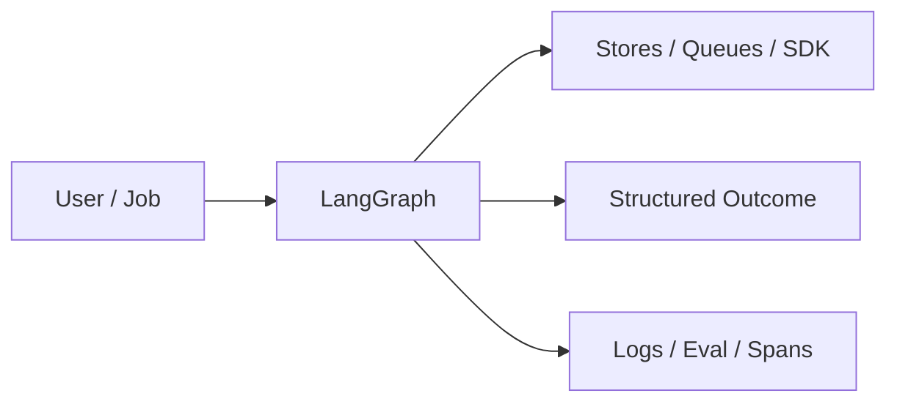

# Chapter 50: LangGraph

## Chapter Overview

Part VI — Frameworks — **LangGraph** — package `langgraphx`.

`StateGraph` + `CompiledGraph.invoke` adds nodes, edges, conditional routers, trace, and billing/general demo.

Part VI maps Part IV–V concepts onto mainstream frameworks. Chapter 50 teaches **LangGraph** via offline `langgraphx` so you can compare SDK shapes without cloud lock-in during learning.

**Code:** `code/chapter-050/langgraphx/`.

---

## Learning Objectives

After completing this chapter, you can:

- Explain **LangGraph** in a production agent platform
- Run and extend `langgraphx` offline with pytest
- Connect this module to Part IV building blocks and Part V operations
- Compare trade-offs and failure modes with structured traces
- Apply security, cost, and scaling concerns where relevant
- Complete exercises with tests passing

---

## Prerequisites

- Parts IV–V (agent modules + systems engineering)
- Prior framework chapters when `n > 49` (through Chapter 49)
- Read official SDK docs alongside this offline clone

---

## Motivation

Developers confuse ad-hoc if/else routing with maintainable graph execution.

---

## First Principles

### 1. Graph compiles to runner

`compile()` → `invoke`.

### 2. State dict merges node outputs

Immutable discipline in prod helpers.

### 3. Conditional edges

Router function picks next node.

### 4. max_steps prevents cycles

Safety on bad graphs.

---

## Mental Model

LangGraph = subway map with conditional transfers — compile once, invoke with state.



---

## Core Theory

### demo_graph

classify → conditional → billing|general → end.

Nodes mutate intent/result; trace lists visited nodes.

Returns `framework: langgraph`.

### Failure cases

Design for partial failure: budget exceeded, rejected approvals, eval failures, handler exceptions on the event bus, and tool authorization denials.

### Performance implications

Measure p95 end-to-end latency and cost per successful task; optimize cache hits and worker concurrency before bigger models.

### Security implications

Combine guards, HITL, least-privilege tools, and redaction — models are not security boundaries.

---

## Architecture

```text
code/chapter-050/
  langgraphx/
  tests/
  main.py
  pyproject.toml
```

---

## Internal Implementation

```bash
cd code/chapter-050 && pytest -q && python3 main.py
```

Add node; rewire conditional; assert trace order.

---

## Production Implementation

- Replace in-memory buses, telemetry, and pools with managed services (Kafka, OTel, Celery/K8s)
- Persist sessions, approvals, and checkpoints durably
- Wire real SDK clients in Part VI chapters while keeping adapter tests from this repo
- Connect observability export to your metrics backend
- Enforce org policy on mode selection and cost routing tables

---

## Framework Implementation

Official LangGraph StateGraph — this offline clone teaches invoke/trace semantics before cloud deps.

---

## Trade-offs

| Option A | Option B / notes |
|---|---|
| Compiled graph | Clear control flow; compile step. |
| Free-form agent | Flexible; opaque. |

---

## Debugging

- missing:node → edge points to unregistered node
- Early end → entry/edge typo

---

## Performance

Persist checkpoints for long graphs; avoid huge state payloads.

---

## Security

Validate router outputs against allowed node set.

---

## Best Practices

1. Keep `langgraphx` interfaces stable for tests and adapters
2. Emit structured traces (steps, spans, approvals, eval rows)
3. Enforce budgets before work starts, not after bills arrive
4. Default deny on risky tools and unapproved actions
5. Run regression eval suites on every prompt/model change
6. Map framework demos to your Part IV ports explicitly

---

## Anti-Patterns

- **Agent without harness** — No budgets, recovery, or eval hooks
- **Observability as printf** — Cannot slice latency or token metrics
- **Skipping HITL on financial actions** — Compliance and trust failures
- **Eval-free releases** — Silent regressions on model swaps
- **Framework-first design** — Vendor types leak into domain core
- **Opaque framework defaults** — Hidden control flow and untraceable tool calls

---

## Hands-on Exercise

1. `cd code/chapter-050 && pytest -q`
2. Change one policy knob (budget, guard, mode rule, eval case, worker count)
3. Add/adjust a test proving the behavior
4. Run `python3 main.py` and inspect structured output
5. Document which Part IV module this replaces or wraps

---

## Mini Project

**LangGraph-style state graph invoke demo.** Extend the demo or integrate with a Part IV package in notes (offline).

---

## Visual diagrams


---

## Chapter Deliverables

| Artifact | Location |
|---|---|
| Manuscript | `book/chapter-050.md` |
| Package | `code/chapter-050/langgraphx/` |
| Tests | `code/chapter-050/tests/` |

---

## Interview Questions

1. LangGraph vs FSM (Ch 41)?
2. Checkpoint storage options?
3. Conditional routing testing?

---

## Quiz

1. invoke returns framework:
   A) langgraph B) GPU C) DNS D) none
   **Answer:** A

2. Conditional router picks:
   A) Next node B) GPU C) DNS D) RAM
   **Answer:** A

3. StateGraph.compile yields:
   A) CompiledGraph B) nothing C) GPU D) TLS
   **Answer:** A

---

## Cheat Sheet

- `StateGraph.add_node/add_edge/add_conditional/compile`
- `invoke(state, max_steps=...)`

---

## Curated Free Resources

- [LangGraph docs](https://langchain-ai.github.io/langgraph/)

---

## Chapter Summary

**LangGraph** (`langgraphx`) — LangGraph-style state graph invoke demo. Use the offline runtime to learn ports; adopt the real SDK in production with the same trace mindset.

---

## What's Next

**Chapter 51: CrewAI.** Chapter 51 — CrewAI role/task crews.
