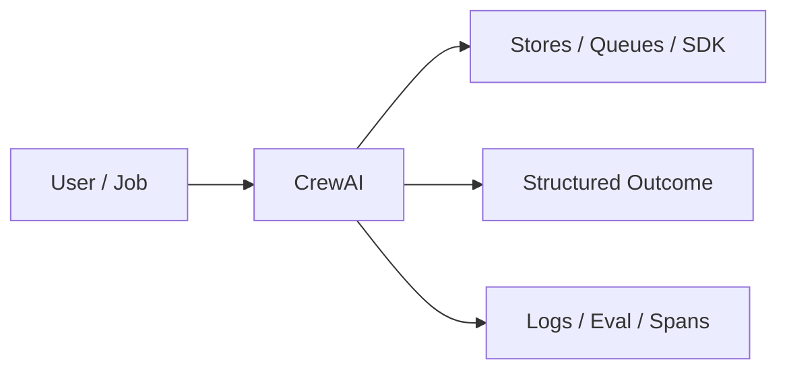
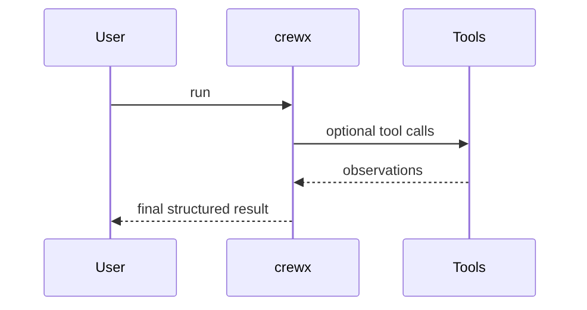
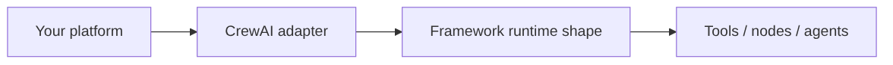

# Chapter 51: CrewAI

## Chapter Overview

Part VI — Frameworks — **CrewAI** — package `crewx`.

`Crew` with `Agent` roles and `Task` list runs `kickoff(inputs)` producing outputs trace and final string.

Part VI maps Part IV–V concepts onto mainstream frameworks. Chapter 51 teaches **CrewAI** via offline `crewx` so you can compare SDK shapes without cloud lock-in during learning.

**Code:** `code/chapter-051/crewx/`.

---

## Learning Objectives

After completing this chapter, you can:

- Explain **CrewAI** in a production agent platform
- Run and extend `crewx` offline with pytest
- Connect this module to Part IV building blocks and Part V operations
- Compare trade-offs and failure modes with structured traces
- Apply security, cost, and scaling concerns where relevant
- Complete exercises with tests passing

---

## Prerequisites

- Parts IV–V (agent modules + systems engineering)
- Prior framework chapters when `n > 49` (through Chapter 50)
- Read official SDK docs alongside this offline clone

---

## Motivation

Multi-step work is orchestrated with bespoke scripts instead of role/task abstractions.

---

## First Principles

### 1. Agents have role/goal/backstory

Prompt context in prod.

### 2. Tasks bind agent + description

Expected output documents intent.

### 3. Sequential process default

Parallel process extension in real CrewAI.

### 4. Context carries forward

ctx['last'] updated each task.

---

## Mental Model

CrewAI = film crew call sheet — roles, tasks, sequential process, shared context.



---

## Core Theory

### demo_crew

Researcher task with tool lambda appending notes; writer summarizes.

Returns framework crewai, outputs list, final ctx last.

### Failure cases

Design for partial failure: budget exceeded, rejected approvals, eval failures, handler exceptions on the event bus, and tool authorization denials.

### Performance implications

Measure p95 end-to-end latency and cost per successful task; optimize cache hits and worker concurrency before bigger models.

### Security implications

Combine guards, HITL, least-privilege tools, and redaction — models are not security boundaries.

---

## Architecture

```text
code/chapter-051/
  crewx/
  tests/
  main.py
  pyproject.toml
```

---

## Internal Implementation

```bash
cd code/chapter-051 && pytest -q && python3 main.py
```

Add third task; assert outputs length.

---

## Production Implementation

- Replace in-memory buses, telemetry, and pools with managed services (Kafka, OTel, Celery/K8s)
- Persist sessions, approvals, and checkpoints durably
- Wire real SDK clients in Part VI chapters while keeping adapter tests from this repo
- Connect observability export to your metrics backend
- Enforce org policy on mode selection and cost routing tables

---

## Framework Implementation

Official CrewAI Crew.kickoff — map Agent/Task fields directly.

---

## Trade-offs

| Option A | Option B / notes |
|---|---|
| Sequential crew | Easy traces; higher latency. |
| Hierarchical manager | Coordinator overhead. |

---

## Debugging

- Unknown agent on task → KeyError on kickoff
- Empty final → no tasks ran

---

## Performance

Parallelize independent tasks when process allows.

---

## Security

Scope tools per agent role; never share admin tools globally.

---

## Best Practices

1. Keep `crewx` interfaces stable for tests and adapters
2. Emit structured traces (steps, spans, approvals, eval rows)
3. Enforce budgets before work starts, not after bills arrive
4. Default deny on risky tools and unapproved actions
5. Run regression eval suites on every prompt/model change
6. Map framework demos to your Part IV ports explicitly

---

## Anti-Patterns

- **Agent without harness** — No budgets, recovery, or eval hooks
- **Observability as printf** — Cannot slice latency or token metrics
- **Skipping HITL on financial actions** — Compliance and trust failures
- **Eval-free releases** — Silent regressions on model swaps
- **Framework-first design** — Vendor types leak into domain core
- **Opaque framework defaults** — Hidden control flow and untraceable tool calls

---

## Hands-on Exercise

1. `cd code/chapter-051 && pytest -q`
2. Change one policy knob (budget, guard, mode rule, eval case, worker count)
3. Add/adjust a test proving the behavior
4. Run `python3 main.py` and inspect structured output
5. Document which Part IV module this replaces or wraps

---

## Mini Project

**CrewAI-shaped sequential crew demo.** Extend the demo or integrate with a Part IV package in notes (offline).

---

## Visual diagrams





---

## Chapter Deliverables

| Artifact | Location |
|---|---|
| Manuscript | `book/chapter-051.md` |
| Package | `code/chapter-051/crewx/` |
| Tests | `code/chapter-051/tests/` |

---

## Interview Questions

1. Crew vs multi-agent (Ch 37)?
2. When backstory helps vs bloats tokens?
3. Task expected_output usage?

---

## Quiz

1. kickoff returns framework:
   A) crewai B) GPU C) DNS D) none
   **Answer:** A

2. Task references:
   A) agent role key B) GPU C) DNS D) MAC
   **Answer:** A

3. process default:
   A) sequential B) never C) GPU D) random
   **Answer:** A

---

## Cheat Sheet

- `Crew(agents, tasks).kickoff(inputs)`
- `Agent(role, goal, tool=...)`

---

## Curated Free Resources

- [CrewAI docs](https://docs.crewai.com/)

---

## Chapter Summary

**CrewAI** (`crewx`) — CrewAI-shaped sequential crew demo. Use the offline runtime to learn ports; adopt the real SDK in production with the same trace mindset.

---

## What's Next

**Chapter 52: AutoGen.** Chapter 52 — AutoGen group chat.
