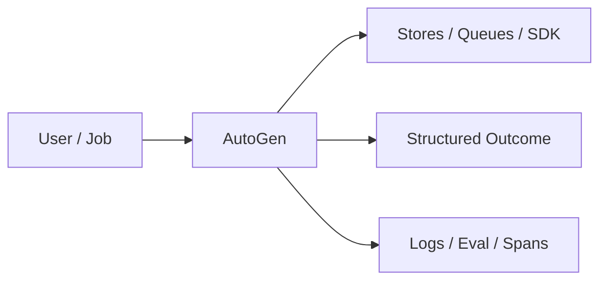
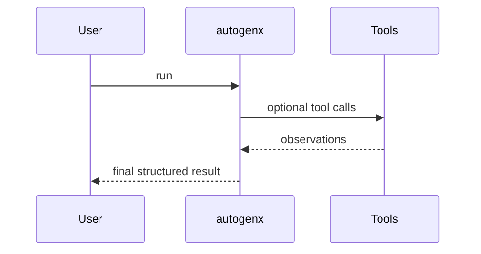
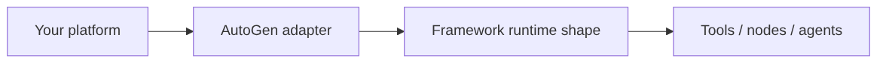

# Chapter 52: AutoGen

## Chapter Overview

Part VI — Frameworks — **AutoGen** — package `autogenx`.

`GroupChat` rotates `ConversableAgent` speakers with `generate_reply`, max_round, TERMINATE sentinel in demo executor.

Part VI maps Part IV–V concepts onto mainstream frameworks. Chapter 52 teaches **AutoGen** via offline `autogenx` so you can compare SDK shapes without cloud lock-in during learning.

**Code:** `code/chapter-052/autogenx/`.

---

## Learning Objectives

After completing this chapter, you can:

- Explain **AutoGen** in a production agent platform
- Run and extend `autogenx` offline with pytest
- Connect this module to Part IV building blocks and Part V operations
- Compare trade-offs and failure modes with structured traces
- Apply security, cost, and scaling concerns where relevant
- Complete exercises with tests passing

---

## Prerequisites

- Parts IV–V (agent modules + systems engineering)
- Prior framework chapters when `n > 49` (through Chapter 51)
- Read official SDK docs alongside this offline clone

---

## Motivation

Multi-agent chat devolves into infinite ping-pong without max_round and termination tokens.

---

## First Principles

### 1. ConversableAgent with system_message

Maps to AutoGen config.

### 2. human_input_mode documented

NEVER vs ALWAYS for HITL.

### 3. Round-robin speakers

Extend with manager models in prod.

### 4. TERMINATE ends chat

Explicit stop signal.

---

## Mental Model

AutoGen = round-table meeting — agents take turns until TERMINATE.



---

## Core Theory

### demo_chat

assistant plans; executor replies with TERMINATE.

Returns messages list and final content.

### Failure cases

Design for partial failure: budget exceeded, rejected approvals, eval failures, handler exceptions on the event bus, and tool authorization denials.

### Performance implications

Measure p95 end-to-end latency and cost per successful task; optimize cache hits and worker concurrency before bigger models.

### Security implications

Combine guards, HITL, least-privilege tools, and redaction — models are not security boundaries.

---

## Architecture

```text
code/chapter-052/
  autogenx/
  tests/
  main.py
  pyproject.toml
```

---

## Internal Implementation

```bash
cd code/chapter-052 && pytest -q && python3 main.py
```

Remove TERMINATE; observe max_round stop.

---

## Production Implementation

- Replace in-memory buses, telemetry, and pools with managed services (Kafka, OTel, Celery/K8s)
- Persist sessions, approvals, and checkpoints durably
- Wire real SDK clients in Part VI chapters while keeping adapter tests from this repo
- Connect observability export to your metrics backend
- Enforce org policy on mode selection and cost routing tables

---

## Framework Implementation

Microsoft AutoGen GroupChat — align message schema when integrating.

---

## Trade-offs

| Option A | Option B / notes |
|---|---|
| Fixed rotation | Predictable; may be suboptimal. |
| LLM speaker selection | Flexible; harder tests. |

---

## Debugging

- Too many rounds → TERMINATE missing
- Empty messages → prompt not appended

---

## Performance

Cap max_round low; summarize history between rounds.

---

## Security

Sanitize cross-agent messages; prevent prompt injection cascades.

---

## Best Practices

1. Keep `autogenx` interfaces stable for tests and adapters
2. Emit structured traces (steps, spans, approvals, eval rows)
3. Enforce budgets before work starts, not after bills arrive
4. Default deny on risky tools and unapproved actions
5. Run regression eval suites on every prompt/model change
6. Map framework demos to your Part IV ports explicitly

---

## Anti-Patterns

- **Agent without harness** — No budgets, recovery, or eval hooks
- **Observability as printf** — Cannot slice latency or token metrics
- **Skipping HITL on financial actions** — Compliance and trust failures
- **Eval-free releases** — Silent regressions on model swaps
- **Framework-first design** — Vendor types leak into domain core
- **Opaque framework defaults** — Hidden control flow and untraceable tool calls

---

## Hands-on Exercise

1. `cd code/chapter-052 && pytest -q`
2. Change one policy knob (budget, guard, mode rule, eval case, worker count)
3. Add/adjust a test proving the behavior
4. Run `python3 main.py` and inspect structured output
5. Document which Part IV module this replaces or wraps

---

## Mini Project

**AutoGen-style group chat demo.** Extend the demo or integrate with a Part IV package in notes (offline).

---

## Visual diagrams





---

## Chapter Deliverables

| Artifact | Location |
|---|---|
| Manuscript | `book/chapter-052.md` |
| Package | `code/chapter-052/autogenx/` |
| Tests | `code/chapter-052/tests/` |

---

## Interview Questions

1. AutoGen vs Crew task lists?
2. Human_input_mode patterns?
3. Termination conditions?

---

## Quiz

1. GroupChat stops on:
   A) TERMINATE or max_round B) GPU C) DNS D) never
   **Answer:** A

2. Messages include:
   A) role/name/content B) GPU only C) DNS D) none
   **Answer:** A

3. framework tag:
   A) autogen B) gpu C) dns D) tls
   **Answer:** A

---

## Cheat Sheet

- `GroupChat(agents, max_round).run(prompt)`
- `ConversableAgent.generate_reply`

---

## Curated Free Resources

- [AutoGen](https://microsoft.github.io/autogen/)

---

## Chapter Summary

**AutoGen** (`autogenx`) — AutoGen-style group chat demo. Use the offline runtime to learn ports; adopt the real SDK in production with the same trace mindset.

---

## What's Next

**Chapter 53: PydanticAI.** Chapter 53 — PydanticAI typed outputs.
