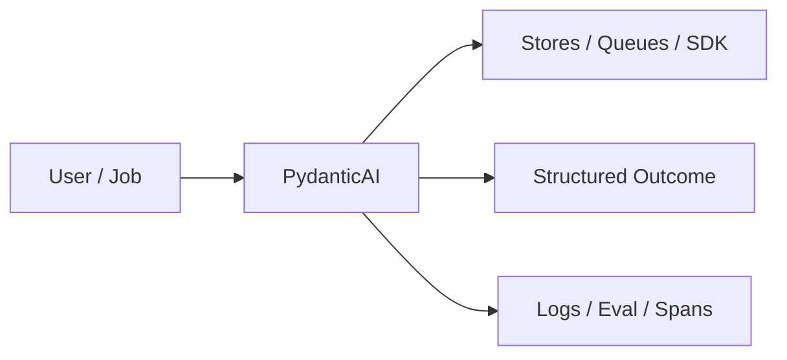
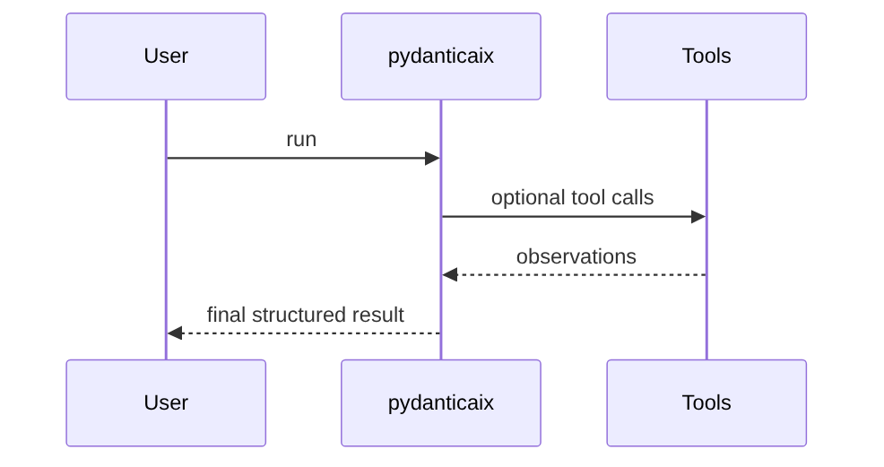

# Chapter 53: PydanticAI

## Chapter Overview

Part VI — Frameworks — **PydanticAI** — package `pydanticaix`.

`Agent[DepsT]` with `result_type: BaseModel`, tools receiving `RunContext`, `run_sync` → `model_dump()`.

Part VI maps Part IV–V concepts onto mainstream frameworks. Chapter 53 teaches **PydanticAI** via offline `pydanticaix` so you can compare SDK shapes without cloud lock-in during learning.

**Code:** `code/chapter-053/pydanticaix/`.

---

## Learning Objectives

After completing this chapter, you can:

- Explain **PydanticAI** in a production agent platform
- Run and extend `pydanticaix` offline with pytest
- Connect this module to Part IV building blocks and Part V operations
- Compare trade-offs and failure modes with structured traces
- Apply security, cost, and scaling concerns where relevant
- Complete exercises with tests passing

---

## Prerequisites

- Parts IV–V (agent modules + systems engineering)
- Prior framework chapters when `n > 49` (through Chapter 52)
- Read official SDK docs alongside this offline clone

---

## Motivation

Agents return ambiguous strings; downstream code parses JSON with try/except chaos.

---

## First Principles

### 1. Structured result types

SupportResult intent/answer/confidence.

### 2. Deps injected

SupportDeps.kb for tool context.

### 3. Tools see RunContext

Typed deps + prompt.

### 4. Validation is automatic

Pydantic enforces ranges.

---

## Mental Model

PydanticAI = customs form — deps + validated `SupportResult` instead of loose JSON.



---

## Core Theory

### demo_agent

Tool search_kb scans deps.kb; builds SupportResult with confidence heuristic.

Returns framework pydantic_ai and usage tool count.

### Failure cases

Design for partial failure: budget exceeded, rejected approvals, eval failures, handler exceptions on the event bus, and tool authorization denials.

### Performance implications

Measure p95 end-to-end latency and cost per successful task; optimize cache hits and worker concurrency before bigger models.

### Security implications

Combine guards, HITL, least-privilege tools, and redaction — models are not security boundaries.

---

## Architecture

```text
code/chapter-053/
  pydanticaix/
  tests/
  main.py
  pyproject.toml
```

---

## Internal Implementation

```bash
cd code/chapter-053 && pytest -q && python3 main.py
```

Break confidence bounds in test — expect ValidationError if you tighten model.

---

## Production Implementation

- Replace in-memory buses, telemetry, and pools with managed services (Kafka, OTel, Celery/K8s)
- Persist sessions, approvals, and checkpoints durably
- Wire real SDK clients in Part VI chapters while keeping adapter tests from this repo
- Connect observability export to your metrics backend
- Enforce org policy on mode selection and cost routing tables

---

## Framework Implementation

Official PydanticAI Agent — same deps/result_type split.

---

## Trade-offs

| Option A | Option B / notes |
|---|---|
| Strict models | Safer integrations; migration on schema change. |
| Free-form text | Flexible; brittle parsers. |

---

## Debugging

- Validation failures → field constraints
- Empty tools → check Tool list registration

---

## Performance

Model validation cheap vs LLM; still minimize tool count.

---

## Security

Validate tool outputs before merging into result model.

---

## Best Practices

1. Keep `pydanticaix` interfaces stable for tests and adapters
2. Emit structured traces (steps, spans, approvals, eval rows)
3. Enforce budgets before work starts, not after bills arrive
4. Default deny on risky tools and unapproved actions
5. Run regression eval suites on every prompt/model change
6. Map framework demos to your Part IV ports explicitly

---

## Anti-Patterns

- **Agent without harness** — No budgets, recovery, or eval hooks
- **Observability as printf** — Cannot slice latency or token metrics
- **Skipping HITL on financial actions** — Compliance and trust failures
- **Eval-free releases** — Silent regressions on model swaps
- **Framework-first design** — Vendor types leak into domain core
- **Opaque framework defaults** — Hidden control flow and untraceable tool calls

---

## Hands-on Exercise

1. `cd code/chapter-053 && pytest -q`
2. Change one policy knob (budget, guard, mode rule, eval case, worker count)
3. Add/adjust a test proving the behavior
4. Run `python3 main.py` and inspect structured output
5. Document which Part IV module this replaces or wraps

---

## Mini Project

**Typed agent with Pydantic result model.** Extend the demo or integrate with a Part IV package in notes (offline).

---

## Visual diagrams




---

## Chapter Deliverables

| Artifact | Location |
|---|---|
| Manuscript | `book/chapter-053.md` |
| Package | `code/chapter-053/pydanticaix/` |
| Tests | `code/chapter-053/tests/` |

---

## Interview Questions

1. When typed results beat JSON schema in prompt?
2. Deps vs context vars?
3. Versioning SupportResult?

---

## Quiz

1. SupportResult includes:
   A) intent, answer, confidence B) GPU C) DNS D) none
   **Answer:** A

2. RunContext carries:
   A) deps and prompt B) GPU only C) DNS D) TLS
   **Answer:** A

3. framework tag:
   A) pydantic_ai B) gpu C) dns D) tls
   **Answer:** A

---

## Cheat Sheet

- `Agent(name, result_type, deps_type, tools).run_sync`
- `RunContext(deps, prompt)`

---

## Curated Free Resources

- [PydanticAI](https://ai.pydantic.dev/)
- [Pydantic](https://docs.pydantic.dev/)

---

## Chapter Summary

**PydanticAI** (`pydanticaix`) — Typed agent with Pydantic result model. Use the offline runtime to learn ports; adopt the real SDK in production with the same trace mindset.

---

## What's Next

**Chapter 54: Semantic Kernel.** Chapter 54 — Semantic Kernel plugins/plans.
