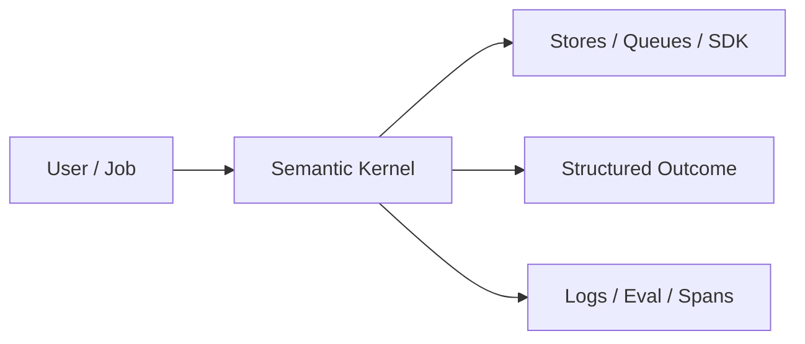
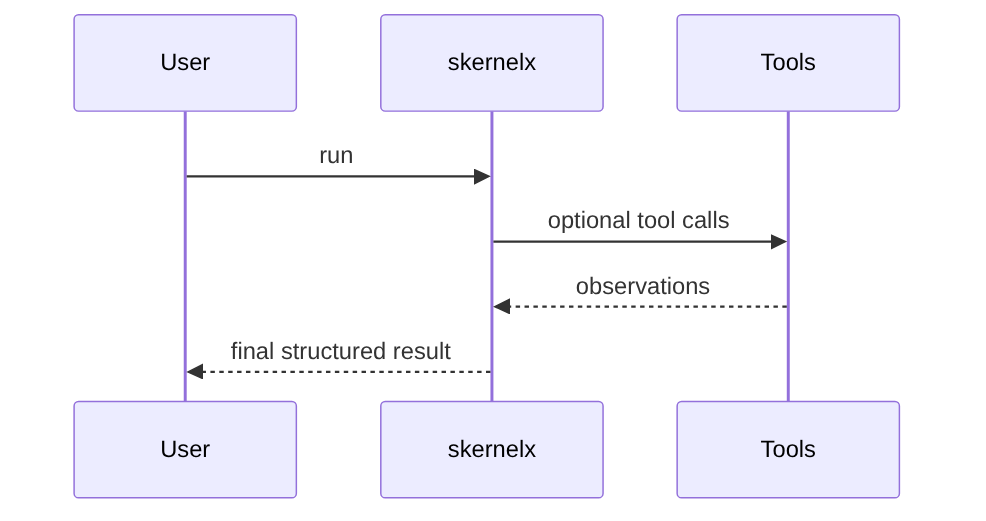

# Chapter 54: Semantic Kernel

## Chapter Overview

Part VI — Frameworks — **Semantic Kernel** — package `skernelx`.

`Kernel` registers `KernelFunction` under plugins; `plan` + `run_plan` executes steps with `$prev` chaining.

Part VI maps Part IV–V concepts onto mainstream frameworks. Chapter 54 teaches **Semantic Kernel** via offline `skernelx` so you can compare SDK shapes without cloud lock-in during learning.

**Code:** `code/chapter-054/skernelx/`.

---

## Learning Objectives

After completing this chapter, you can:

- Explain **Semantic Kernel** in a production agent platform
- Run and extend `skernelx` offline with pytest
- Connect this module to Part IV building blocks and Part V operations
- Compare trade-offs and failure modes with structured traces
- Apply security, cost, and scaling concerns where relevant
- Complete exercises with tests passing

---

## Prerequisites

- Parts IV–V (agent modules + systems engineering)
- Prior framework chapters when `n > 49` (through Chapter 53)
- Read official SDK docs alongside this offline clone

---

## Motivation

Ad-hoc function calling lacks plugin namespacing and plan traces.

---

## First Principles

### 1. Plugin namespaces

weather.get vs summary.wrap.

### 2. invoke(plugin, function, **kwargs)

Single entry for SK parity.

### 3. Plans are tuples

(plugin, fn, args) with prev substitution.

### 4. Trace each step output

Audit plan execution.

---

## Mental Model

Semantic Kernel = toolbox with labeled drawers — plugins group functions; plans chain invokes.



---

## Core Theory

### demo_kernel

Weather get → summary wrap with $prev placeholder replacement.

Returns framework semantic_kernel.

### Failure cases

Design for partial failure: budget exceeded, rejected approvals, eval failures, handler exceptions on the event bus, and tool authorization denials.

### Performance implications

Measure p95 end-to-end latency and cost per successful task; optimize cache hits and worker concurrency before bigger models.

### Security implications

Combine guards, HITL, least-privilege tools, and redaction — models are not security boundaries.

---

## Architecture

```text
code/chapter-054/
  skernelx/
  tests/
  main.py
  pyproject.toml
```

---

## Internal Implementation

```bash
cd code/chapter-054 && pytest -q && python3 main.py
```

Extend plan for refund goal; add plugin function.

---

## Production Implementation

- Replace in-memory buses, telemetry, and pools with managed services (Kafka, OTel, Celery/K8s)
- Persist sessions, approvals, and checkpoints durably
- Wire real SDK clients in Part VI chapters while keeping adapter tests from this repo
- Connect observability export to your metrics backend
- Enforce org policy on mode selection and cost routing tables

---

## Framework Implementation

Microsoft Semantic Kernel Python — map KernelFunction to SK plugins.

---

## Trade-offs

| Option A | Option B / notes |
|---|---|
| SK plans | Readable; less dynamic than full agents. |
| Autonomous agents | Flexible; harder audits. |

---

## Debugging

- KeyError on invoke → plugin/function typo
- $prev empty → prior step failed

---

## Performance

Cache plugin invokes when args repeat.

---

## Security

Register only signed plugins; limit plan depth.

---

## Best Practices

1. Keep `skernelx` interfaces stable for tests and adapters
2. Emit structured traces (steps, spans, approvals, eval rows)
3. Enforce budgets before work starts, not after bills arrive
4. Default deny on risky tools and unapproved actions
5. Run regression eval suites on every prompt/model change
6. Map framework demos to your Part IV ports explicitly

---

## Anti-Patterns

- **Agent without harness** — No budgets, recovery, or eval hooks
- **Observability as printf** — Cannot slice latency or token metrics
- **Skipping HITL on financial actions** — Compliance and trust failures
- **Eval-free releases** — Silent regressions on model swaps
- **Framework-first design** — Vendor types leak into domain core
- **Opaque framework defaults** — Hidden control flow and untraceable tool calls

---

## Hands-on Exercise

1. `cd code/chapter-054 && pytest -q`
2. Change one policy knob (budget, guard, mode rule, eval case, worker count)
3. Add/adjust a test proving the behavior
4. Run `python3 main.py` and inspect structured output
5. Document which Part IV module this replaces or wraps

---

## Mini Project

**SK-style kernel, plugins, and plan runner.** Extend the demo or integrate with a Part IV package in notes (offline).

---

## Visual diagrams




---

## Chapter Deliverables

| Artifact | Location |
|---|---|
| Manuscript | `book/chapter-054.md` |
| Package | `code/chapter-054/skernelx/` |
| Tests | `code/chapter-054/tests/` |

---

## Interview Questions

1. SK plugins vs MCP tools?
2. Plan generation manual vs AI?
3. Tracing plan steps?

---

## Quiz

1. Kernel.invoke needs:
   A) plugin and function B) GPU only C) DNS D) none
   **Answer:** A

2. $prev in plan args:
   A) prior step output B) GPU C) DNS D) TLS
   **Answer:** A

3. framework tag:
   A) semantic_kernel B) gpu C) dns D) tls
   **Answer:** A

---

## Cheat Sheet

- `Kernel.add_function/invoke/plan/run_plan`
- `KernelFunction(name, plugin, handler)`

---

## Curated Free Resources

- [Semantic Kernel](https://learn.microsoft.com/en-us/semantic-kernel/)

---

## Chapter Summary

**Semantic Kernel** (`skernelx`) — SK-style kernel, plugins, and plan runner. Use the offline runtime to learn ports; adopt the real SDK in production with the same trace mindset.

---

## What's Next

**Chapter 55: Google ADK.** Chapter 55 — Google ADK runner/sessions.
