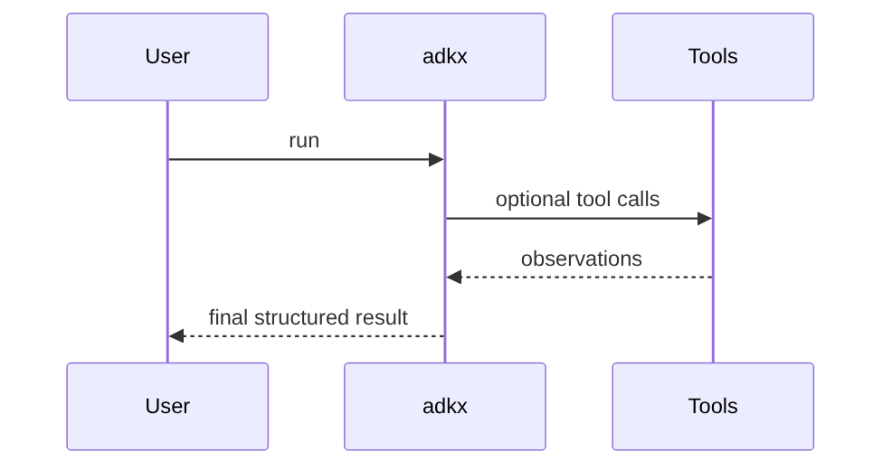
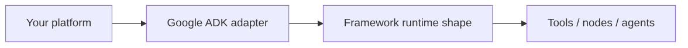

# Chapter 55: Google ADK

## Chapter Overview

Google ADK-style agent definition: tools, runners, session events.

Part VI compares **frameworks** after you built agents from first principles (Parts IV–V). This chapter teaches the **mental model and control surface** of Google ADK via an offline adapter in `code/chapter-055/adkx/` so you can map it onto your platform without treating the framework as architecture.

## Learning Objectives

- Explain core Google ADK primitives
- Map them to harness/tools/memory/graph ports from earlier chapters
- Run the offline adapter tests
- Know when adopting Google ADK helps vs hides critical control flow

## Prerequisites

- Parts IV–V (agents + systems engineering)
- Chapter 14 tools / 28 architecture / 39 harness

## Motivation

Frameworks accelerate demos—and can erase budgets, authz, and eval if used as a black box. Learn the shape, then wrap it.

## First Principles

### 1. Frameworks are adapters, not your domain model
### 2. Keep budgets, authz, and traces outside the vendor object graph
### 3. Prefer typed tools and explicit state
### 4. Prove behavior with offline tests before live keys

## Core Theory

See package docstrings and `main.py` for the canonical object graph of this framework family.

## Architecture

```text
code/chapter-055/adkx/runtime.py
```

## Internal Implementation

```bash
cd code/chapter-055 && pytest -q && python3 main.py
```

## Production Implementation

- Install the real SDK when you adopt it
- Inject your tool registry, memory, and harness
- Add eval + observability from Part V

## Trade-offs

| Use framework | Build yourself |
|---|---|
| Speed, ecosystem | Control, fewer surprises |

## Debugging

Map framework traces back to your step IDs and tool names.

## Security

Never grant frameworks ambient credentials; pass scoped tools only.

## Best Practices

1. Thin adapter layer  
2. Shared tool schemas  
3. External eval suite  
4. Explicit termination  

## Mini Project

Offline **Google ADK** adapter demonstrating the framework’s primary runtime loop.

## Visual diagrams






## Chapter Deliverables

| Artifact | Location |
|---|---|
| Manuscript | `book/chapter-055.md` |
| Package | `code/chapter-055/adkx/` |

## Chapter Summary

Google ADK-style agent definition: tools, runners, session events.

## What's Next

**Part VII — Production Engineering** (APIs, Docker, cloud, CI/CD).