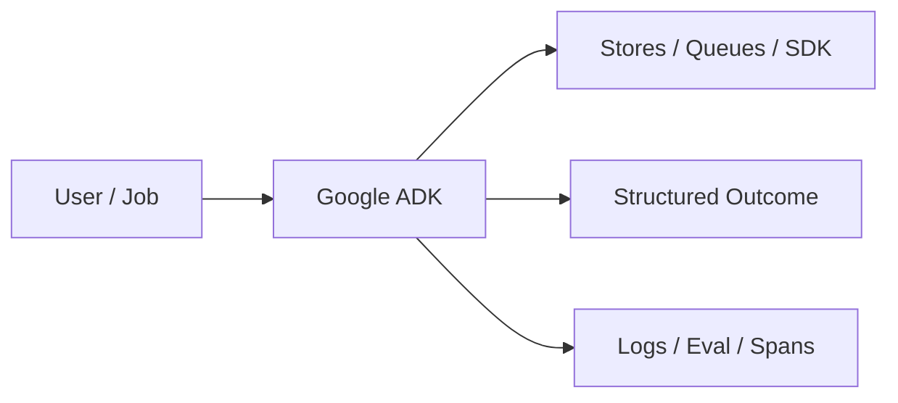

# Chapter 55: Google ADK

## Chapter Overview

Part VI — Frameworks — **Google ADK** — package `adkx`.

`Runner` + `LlmAgent.step` append typed session events; `stream` yields start/final generator events.

Part VI maps Part IV–V concepts onto mainstream frameworks. Chapter 55 teaches **Google ADK** via offline `adkx` so you can compare SDK shapes without cloud lock-in during learning.

**Code:** `code/chapter-055/adkx/`.

---

## Learning Objectives

After completing this chapter, you can:

- Explain **Google ADK** in a production agent platform
- Run and extend `adkx` offline with pytest
- Connect this module to Part IV building blocks and Part V operations
- Compare trade-offs and failure modes with structured traces
- Apply security, cost, and scaling concerns where relevant
- Complete exercises with tests passing

---

## Prerequisites

- Parts IV–V (agent modules + systems engineering)
- Prior framework chapters when `n > 49` (through Chapter 54)
- Read official SDK docs alongside this offline clone

---

## Motivation

Teams need session-scoped event history and streaming UX patterns ADK promotes.

---

## First Principles

### 1. Session carries user_id/session_id/events

Audit trail per conversation.

### 2. Tools optional on LlmAgent

search demo when message mentions search.

### 3. Runner.run orchestrates step

Returns output + session blob.

### 4. stream for UX

Yield incremental events (teaching pattern).

---

## Mental Model

Google ADK = helpdesk ticket with session timeline — each step appends session events.



---

## Core Theory

### demo_runner

Helpdesk agent with search tool; session.events records tool and text events.

`stream(message)` yields start + final with nested run result.

### Failure cases

Design for partial failure: budget exceeded, rejected approvals, eval failures, handler exceptions on the event bus, and tool authorization denials.

### Performance implications

Measure p95 end-to-end latency and cost per successful task; optimize cache hits and worker concurrency before bigger models.

### Security implications

Combine guards, HITL, least-privilege tools, and redaction — models are not security boundaries.

---

## Architecture

```text
code/chapter-055/
  adkx/
  tests/
  main.py
  pyproject.toml
```

---

## Internal Implementation

```bash
cd code/chapter-055 && pytest -q && python3 main.py
```

Inspect session.events length before/after tool-triggering message.

---

## Production Implementation

- Replace in-memory buses, telemetry, and pools with managed services (Kafka, OTel, Celery/K8s)
- Persist sessions, approvals, and checkpoints durably
- Wire real SDK clients in Part VI chapters while keeping adapter tests from this repo
- Connect observability export to your metrics backend
- Enforce org policy on mode selection and cost routing tables

---

## Framework Implementation

Google Agent Development Kit — align Runner/session with official ADK APIs when deploying.

---

## Trade-offs

| Option A | Option B / notes |
|---|---|
| Session in memory | Tests; persist to DB in prod. |
| Stream API | Better UX; more client complexity. |

---

## Debugging

- No tool event → message lacks search keyword
- Empty session.events → step not called

---

## Performance

Trim old session events; archive to cold storage.

---

## Security

Session isolation per user_id; auth on Runner entry.

---

## Best Practices

1. Keep `adkx` interfaces stable for tests and adapters
2. Emit structured traces (steps, spans, approvals, eval rows)
3. Enforce budgets before work starts, not after bills arrive
4. Default deny on risky tools and unapproved actions
5. Run regression eval suites on every prompt/model change
6. Map framework demos to your Part IV ports explicitly

---

## Anti-Patterns

- **Agent without harness** — No budgets, recovery, or eval hooks
- **Observability as printf** — Cannot slice latency or token metrics
- **Skipping HITL on financial actions** — Compliance and trust failures
- **Eval-free releases** — Silent regressions on model swaps
- **Framework-first design** — Vendor types leak into domain core
- **Opaque framework defaults** — Hidden control flow and untraceable tool calls

---

## Hands-on Exercise

1. `cd code/chapter-055 && pytest -q`
2. Change one policy knob (budget, guard, mode rule, eval case, worker count)
3. Add/adjust a test proving the behavior
4. Run `python3 main.py` and inspect structured output
5. Document which Part IV module this replaces or wraps

---

## Mini Project

**ADK-style runner with session events and stream.** Extend the demo or integrate with a Part IV package in notes (offline).

---

## Visual diagrams


---

## Chapter Deliverables

| Artifact | Location |
|---|---|
| Manuscript | `book/chapter-055.md` |
| Package | `code/chapter-055/adkx/` |
| Tests | `code/chapter-055/tests/` |

---

## Interview Questions

1. ADK session vs stateless HTTP?
2. Event log uses in debugging?
3. Streaming vs single response trade-offs?

---

## Quiz

1. session stores:
   A) events list B) GPU only C) DNS D) none
   **Answer:** A

2. framework tag:
   A) google_adk B) gpu C) dns D) tls
   **Answer:** A

3. Tool fires when message mentions:
   A) search B) GPU C) DNS D) never
   **Answer:** A

---

## Cheat Sheet

- `Runner(LlmAgent).run(user_id, session_id, message)`
- `Runner.stream(message)`

---

## Curated Free Resources

- [Google ADK docs](https://google.github.io/adk-docs/)

---

## Chapter Summary

**Google ADK** (`adkx`) — ADK-style runner with session events and stream. Use the offline runtime to learn ports; adopt the real SDK in production with the same trace mindset.

---

## What's Next

**Chapter 56: Production APIs for Agents.** Part VII — production APIs, workers, Docker, and persistence (Chapter 56+).
