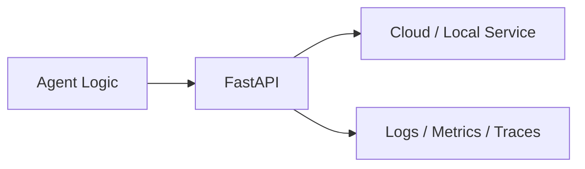
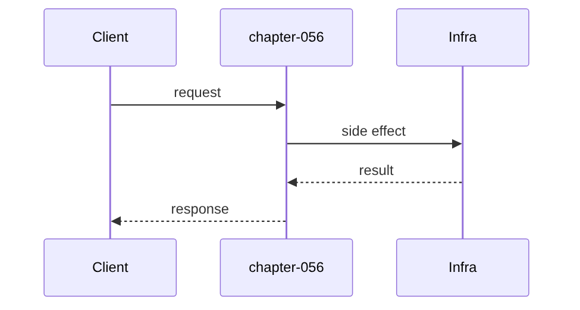

# Chapter 56: FastAPI

## Chapter Overview

Part VII — **Production Engineering** — **FastAPI** — package `apikit`.

`apikit.App` models FastAPI-style routing, `x-api-key` auth, JSON handlers, and SSE-style streaming without requiring uvicorn in tests.

Parts IV–VI taught agents, systems, and frameworks. Part VII makes the platform **operable**: HTTP surface, queues, containers, data stores, auth, deploy, CI, monitoring, logs, and traces. Chapter 56 implements **FastAPI** offline-testable so you can swap real infrastructure without rewriting product logic.

**Code:** `code/chapter-056/apikit/`.

---

## Learning Objectives

After completing this chapter, you can:

- Explain **FastAPI** in an agent production stack
- Run and extend `apikit` with pytest
- Connect this layer to API (Ch 56), workers (Ch 57), and observability (Ch 64–66)
- Describe failure modes and operational defaults
- Apply security and cost-aware patterns at this boundary
- Complete exercises with tests passing

---

## Prerequisites

- Parts IV–VI (agents through framework comparisons)
- Prior Part VII chapters when `n > 56` (through Chapter 55)
- Basic DevOps vocabulary (containers, env vars, CI)

---

## Motivation

Notebook agents cannot serve concurrent users, authenticate callers, or stream partial responses.

---

## First Principles

### 1. Routes are explicit

`get`/`post` decorators register `(method, path)` handlers.

### 2. Auth before /v1

Missing key on `/v1/*` → 401.

### 3. Streaming is a generator

Handler returns iterator → `content-type: text/event-stream`.

### 4. Handlers receive context

`{request, user}` dict — swap for Depends() in real FastAPI.

---

## Mental Model

Agent API = restaurant front door — health check for inspectors, menu routes for chat, kitchen streaming for long cooks.



---

## Core Theory

### Core types

- `Request` — path, method, headers, json_body, query
- `Response` — status, body, headers
- `App.handle(Request)` — dispatch pipeline

### build_app routes

- `GET /health` — public
- `POST /v1/chat` — echo reply with user id
- `POST /v1/chat/stream` — yields SSE chunks

Auth reads `x-api-key` or `Bearer` token mapped in `api_keys` dict.

### Failure cases

Plan for auth failures, queue poison messages, deploy misconfig, SLO burn, and expired sessions — return structured errors, alert, and fail closed.

### Performance implications

Cache and rate-limit at Redis; async workers for long runs; sample traces under load.

### Security implications

RBAC on tools, redact secrets in logs/traces, TLS to Postgres/Redis, rotate API keys.

---

## Architecture

```text
code/chapter-056/
  apikit/
  tests/
  main.py
  pyproject.toml
```

---

## Internal Implementation

```bash
cd code/chapter-056 && pytest -q && python3 main.py
```

Call handle with and without `dev-key`; assert 401 vs 200 on `/v1/chat`.

---

## Production Implementation

- Replace fakes with FastAPI, managed Postgres, Redis, OAuth, K8s, GitHub Actions, OTel exporters
- Connect Ch 56 API → Ch 57 workers → Ch 59 persistence
- Use Ch 61 auth on every `/v1` route; Ch 60 rate limits on public endpoints
- Feed Ch 64–66 from the same correlation and trace ids

---

## Framework Implementation

Real **FastAPI** + Uvicorn + Pydantic models — replace `App.handle` with ASGI app; keep the same route contracts in tests.

---

## Trade-offs

| Option A | Option B / notes |
|---|---|
| Stdlib apikit | Zero deps in CI; not HTTP-realistic. |
| Full FastAPI | Production-grade; heavier stack. |
| Sync handlers | Simple; use async for SSE at scale. |

---

## Debugging

- 404 → method/path not registered
- 401 → key not in api_keys
- 500 → handler exception caught

---

## Performance

Stream tokens; bound request size; use async I/O for LLM upstream.

---

## Security

Never log API keys; rotate keys; rate-limit /v1 (Ch 60 Redis).

---

## Best Practices

1. Treat `apikit` contracts as adapters to managed services
2. Fail closed on auth, deploy validation, and CI gates
3. Emit logs, metrics, and traces with shared correlation/trace ids
4. Keep secrets out of images and logs
5. Test production control plane offline in pytest
6. Wire Part IV–VI agent logic behind HTTP (Ch 56) and workers (Ch 57)

---

## Anti-Patterns

- **Notebook-only agents** — No API, auth, or persistence
- **Secrets in Dockerfile** — Leaked via registry history
- **Skipping eval CI gate** — Regressions reach prod
- **Unbounded job retries** — Poison messages amplify cost
- **Logging raw prompts** — PII and injection content exposure
- **Metrics without SLOs** — Dashboards with no action thresholds

---

## Hands-on Exercise

1. `cd code/chapter-056 && pytest -q`
2. Change one config/policy (retry, SLO target, rate limit, rollout strategy)
3. Add a test for the new behavior
4. Run `python3 main.py`
5. Note how this chapter connects to the capstone platform (API + worker + DB)

---

## Mini Project

**FastAPI-shaped agent HTTP API with auth and streaming.** Extend the package or document adapter points to real infrastructure.

---

## Visual diagrams




---

## Chapter Deliverables

| Artifact | Location |
|---|---|
| Manuscript | `book/chapter-056.md` |
| Package | `code/chapter-056/apikit/` |
| Tests | `code/chapter-056/tests/` |

---

## Interview Questions

1. How do you auth agent APIs?
2. Streaming vs polling for LLM?
3. Where validate JSON body?

---

## Quiz

1. /v1 without key returns:
   A) 401 B) 200 always C) GPU D) DNS
   **Answer:** A

2. Stream handler returns:
   A) Iterator B) GPU C) DNS D) PDF only
   **Answer:** A

3. health is:
   A) Public B) Admin only C) Never D) GPU
   **Answer:** A

---

## Cheat Sheet

- `App.get/post`
- `handle(Request)`
- `build_app()` routes

---

## Curated Free Resources

- [FastAPI docs](https://fastapi.tiangolo.com/)
- [SSE](https://html.spec.whatwg.org/multipage/server-sent-events.html)

---

## Chapter Summary

**FastAPI** (`apikit`) — FastAPI-shaped agent HTTP API with auth and streaming. Part VII building block toward a deployable agent platform.

---

## What's Next

**Chapter 57: Background Workers.** Chapter 57 offloads long agent runs to background workers.
