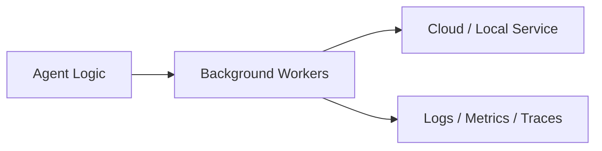
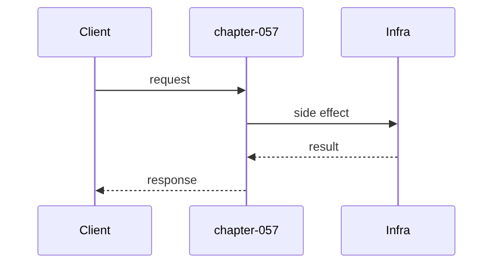

# Chapter 57: Background Workers

## Chapter Overview

Part VII — **Production Engineering** — **Background Workers** — package `workers`.

`JobQueue` enqueues payloads, `worker_once` processes with retries, `dead_letter` on exhaustion, `drain` for tests.

Parts IV–VI taught agents, systems, and frameworks. Part VII makes the platform **operable**: HTTP surface, queues, containers, data stores, auth, deploy, CI, monitoring, logs, and traces. Chapter 57 implements **Background Workers** offline-testable so you can swap real infrastructure without rewriting product logic.

**Code:** `code/chapter-057/workers/`.

---

## Learning Objectives

After completing this chapter, you can:

- Explain **Background Workers** in an agent production stack
- Run and extend `workers` with pytest
- Connect this layer to API (Ch 56), workers (Ch 57), and observability (Ch 64–66)
- Describe failure modes and operational defaults
- Apply security and cost-aware patterns at this boundary
- Complete exercises with tests passing

---

## Prerequisites

- Parts IV–VI (agents through framework comparisons)
- Prior Part VII chapters when `n > 56` (through Chapter 56)
- Basic DevOps vocabulary (containers, env vars, CI)

---

## Motivation

HTTP request threads block for minutes on agent runs; retries duplicate side effects without a queue.

---

## First Principles

### 1. Jobs have ids and attempt counts

Visibility for ops.

### 2. Retry re-enqueues to tail

Simple teaching queue; use visibility timeout in prod.

### 3. dead_letter preserves failures

Debug poison messages.

### 4. Handler is injected

Same agent fn online/offline.

---

## Mental Model

Job queue = ticket dispenser — take a number, worker calls when ready, dead letter if hopeless.



---

## Core Theory

### worker_once

Pop job → increment attempts → try handler → on success `done`, on fail retry if attempts < max_attempts else dead_letter.

### drain

Loop worker_until pending empty or max_loops.

### Failure cases

Plan for auth failures, queue poison messages, deploy misconfig, SLO burn, and expired sessions — return structured errors, alert, and fail closed.

### Performance implications

Cache and rate-limit at Redis; async workers for long runs; sample traces under load.

### Security implications

RBAC on tools, redact secrets in logs/traces, TLS to Postgres/Redis, rotate API keys.

---

## Architecture

```text
code/chapter-057/
  workers/
  tests/
  main.py
  pyproject.toml
```

---

## Internal Implementation

```bash
cd code/chapter-057 && pytest -q && python3 main.py
```

Handler fails twice then succeeds; assert attempts in row.

---

## Production Implementation

- Replace fakes with FastAPI, managed Postgres, Redis, OAuth, K8s, GitHub Actions, OTel exporters
- Connect Ch 56 API → Ch 57 workers → Ch 59 persistence
- Use Ch 61 auth on every `/v1` route; Ch 60 rate limits on public endpoints
- Feed Ch 64–66 from the same correlation and trace ids

---

## Framework Implementation

Celery, RQ, Dramatiq, SQS — same enqueue/worker/DLQ semantics.

---

## Trade-offs

| Option A | Option B / notes |
|---|---|
| In-memory queue | Tests only; not durable. |
| Redis/Rabbit queue | Durable; ops overhead. |
| Sync drain | Simple; workers async in prod. |

---

## Debugging

- Infinite pending → handler always throws
- No retries → max_attempts=1

---

## Performance

Scale workers horizontally; idempotent handlers for at-least-once delivery.

---

## Security

Job payload may contain PII — encrypt at rest; auth worker to tools.

---

## Best Practices

1. Treat `workers` contracts as adapters to managed services
2. Fail closed on auth, deploy validation, and CI gates
3. Emit logs, metrics, and traces with shared correlation/trace ids
4. Keep secrets out of images and logs
5. Test production control plane offline in pytest
6. Wire Part IV–VI agent logic behind HTTP (Ch 56) and workers (Ch 57)

---

## Anti-Patterns

- **Notebook-only agents** — No API, auth, or persistence
- **Secrets in Dockerfile** — Leaked via registry history
- **Skipping eval CI gate** — Regressions reach prod
- **Unbounded job retries** — Poison messages amplify cost
- **Logging raw prompts** — PII and injection content exposure
- **Metrics without SLOs** — Dashboards with no action thresholds

---

## Hands-on Exercise

1. `cd code/chapter-057 && pytest -q`
2. Change one config/policy (retry, SLO target, rate limit, rollout strategy)
3. Add a test for the new behavior
4. Run `python3 main.py`
5. Note how this chapter connects to the capstone platform (API + worker + DB)

---

## Mini Project

**Background queue with retries and dead letter.** Extend the package or document adapter points to real infrastructure.

---

## Visual diagrams




---

## Chapter Deliverables

| Artifact | Location |
|---|---|
| Manuscript | `book/chapter-057.md` |
| Package | `code/chapter-057/workers/` |
| Tests | `code/chapter-057/tests/` |

---

## Interview Questions

1. At-least-once vs exactly-once?
2. When DLQ mandatory?
3. Agent job idempotency keys?

---

## Quiz

1. dead_letter when:
   A) max attempts exhausted B) success C) never D) GPU
   **Answer:** A

2. enqueue returns:
   A) job id B) GPU C) DNS D) MAC
   **Answer:** A

3. worker_once processes:
   A) one job B) all jobs infinite C) DNS D) none
   **Answer:** A

---

## Cheat Sheet

- `JobQueue.enqueue/worker_once/drain`
- Job max_attempts

---

## Curated Free Resources

- [Celery](https://docs.celeryq.dev/)
- [Amazon SQS DLQ](https://docs.aws.amazon.com/AWSSimpleQueueService/latest/SQSDeveloperGuide/sqs-dead-letter-queues.html)

---

## Chapter Summary

**Background Workers** (`workers`) — Background queue with retries and dead letter. Part VII building block toward a deployable agent platform.

---

## What's Next

**Chapter 58: Docker.** Chapter 58 packages the platform with Docker assets.
