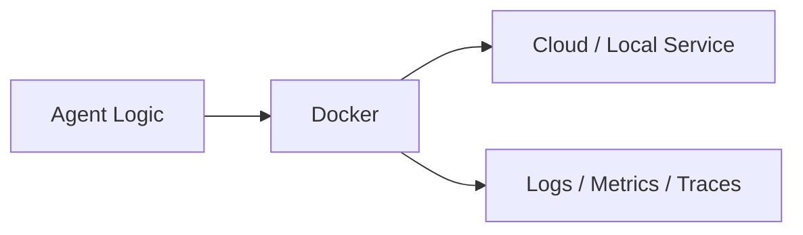
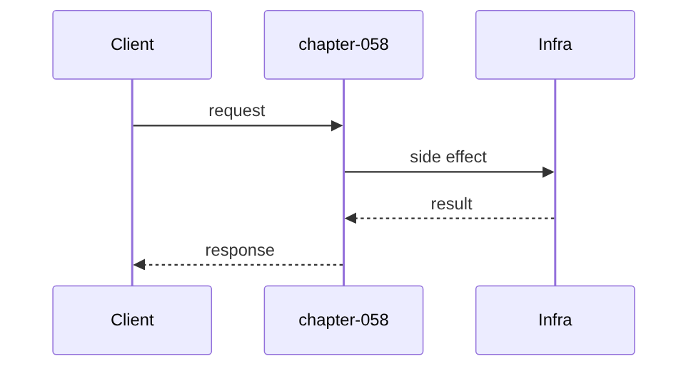
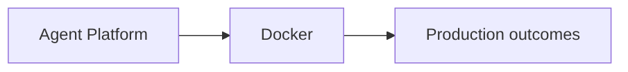

# Chapter 58: Docker

## Chapter Overview

Part VII — **Production Engineering** — **Docker** — package `dockerkit`.

`write_assets` emits Dockerfile (python slim), compose (api+postgres+redis), requirements; `validate_assets` checks structure.

Parts IV–VI taught agents, systems, and frameworks. Part VII makes the platform **operable**: HTTP surface, queues, containers, data stores, auth, deploy, CI, monitoring, logs, and traces. Chapter 58 implements **Docker** offline-testable so you can swap real infrastructure without rewriting product logic.

**Code:** `code/chapter-058/dockerkit/`.

---

## Learning Objectives

After completing this chapter, you can:

- Explain **Docker** in an agent production stack
- Run and extend `dockerkit` with pytest
- Connect this layer to API (Ch 56), workers (Ch 57), and observability (Ch 64–66)
- Describe failure modes and operational defaults
- Apply security and cost-aware patterns at this boundary
- Complete exercises with tests passing

---

## Prerequisites

- Parts IV–VI (agents through framework comparisons)
- Prior Part VII chapters when `n > 56` (through Chapter 57)
- Basic DevOps vocabulary (containers, env vars, CI)

---

## Motivation

Works on my machine fails in prod because dependencies and services differ.

---

## First Principles

### 1. Pin base images

python:3.11-slim not mutable latest.

### 2. Compose models dependencies

api waits on db/redis URLs.

### 3. Validate in CI

dockerfile_exists + compose_exists gates.

### 4. Non-root USER recommended

Check flagged in validate.

---

## Mental Model

Docker = shipping container — same agent platform runs on laptop and cloud if the manifest is correct.



---

## Core Theory

### Generated Dockerfile

Multi-line template: WORKDIR, ENV, pip install, EXPOSE 8000, uvicorn CMD.

### compose

Environment DATABASE_URL, REDIS_URL wired for agent API.

### Failure cases

Plan for auth failures, queue poison messages, deploy misconfig, SLO burn, and expired sessions — return structured errors, alert, and fail closed.

### Performance implications

Cache and rate-limit at Redis; async workers for long runs; sample traces under load.

### Security implications

RBAC on tools, redact secrets in logs/traces, TLS to Postgres/Redis, rotate API keys.

---

## Architecture

```text
code/chapter-058/
  dockerkit/
  tests/
  main.py
  pyproject.toml
```

---

## Internal Implementation

```bash
cd code/chapter-058 && pytest -q && python3 main.py
```

Run validate_assets on temp dir after write_assets.

---

## Production Implementation

- Replace fakes with FastAPI, managed Postgres, Redis, OAuth, K8s, GitHub Actions, OTel exporters
- Connect Ch 56 API → Ch 57 workers → Ch 59 persistence
- Use Ch 61 auth on every `/v1` route; Ch 60 rate limits on public endpoints
- Feed Ch 64–66 from the same correlation and trace ids

---

## Framework Implementation

Docker BuildKit, multi-stage builds, distroless images for hardened prod.

---

## Trade-offs

| Option A | Option B / notes |
|---|---|
| Single-stage slim | Simple; larger images. |
| Multi-stage | Smaller prod image; more complexity. |
| Compose dev only | K8s/Helm for prod clusters. |

---

## Debugging

- validate ok false → missing Dockerfile
- slim check fails → template edited wrong

---

## Performance

Layer cache ORDER: requirements before COPY source.

---

## Security

No secrets in image layers; use runtime env/secret mounts.

---

## Best Practices

1. Treat `dockerkit` contracts as adapters to managed services
2. Fail closed on auth, deploy validation, and CI gates
3. Emit logs, metrics, and traces with shared correlation/trace ids
4. Keep secrets out of images and logs
5. Test production control plane offline in pytest
6. Wire Part IV–VI agent logic behind HTTP (Ch 56) and workers (Ch 57)

---

## Anti-Patterns

- **Notebook-only agents** — No API, auth, or persistence
- **Secrets in Dockerfile** — Leaked via registry history
- **Skipping eval CI gate** — Regressions reach prod
- **Unbounded job retries** — Poison messages amplify cost
- **Logging raw prompts** — PII and injection content exposure
- **Metrics without SLOs** — Dashboards with no action thresholds

---

## Hands-on Exercise

1. `cd code/chapter-058 && pytest -q`
2. Change one config/policy (retry, SLO target, rate limit, rollout strategy)
3. Add a test for the new behavior
4. Run `python3 main.py`
5. Note how this chapter connects to the capstone platform (API + worker + DB)

---

## Mini Project

**Generated Dockerfile, compose, and validation checks.** Extend the package or document adapter points to real infrastructure.

---

## Visual diagrams





---

## Chapter Deliverables

| Artifact | Location |
|---|---|
| Manuscript | `book/chapter-058.md` |
| Package | `code/chapter-058/dockerkit/` |
| Tests | `code/chapter-058/tests/` |

---

## Interview Questions

1. Multi-stage purpose?
2. Secrets in compose?
3. Healthcheck in Dockerfile vs orchestrator?

---

## Quiz

1. validate checks:
   A) dockerfile and compose B) GPU only C) DNS D) none
   **Answer:** A

2. compose includes:
   A) db and redis B) only GPU C) DNS D) nothing
   **Answer:** A

3. EXPOSE documents:
   A) Port B) secret C) GPU D) MAC
   **Answer:** A

---

## Cheat Sheet

- `write_assets(dir)`
- `validate_assets(dir)`

---

## Curated Free Resources

- [Docker docs](https://docs.docker.com/)
- [Compose](https://docs.docker.com/compose/)

---

## Chapter Summary

**Docker** (`dockerkit`) — Generated Dockerfile, compose, and validation checks. Part VII building block toward a deployable agent platform.

---

## What's Next

**Chapter 59: PostgreSQL.** Chapter 59 persists agents and runs in SQL.
