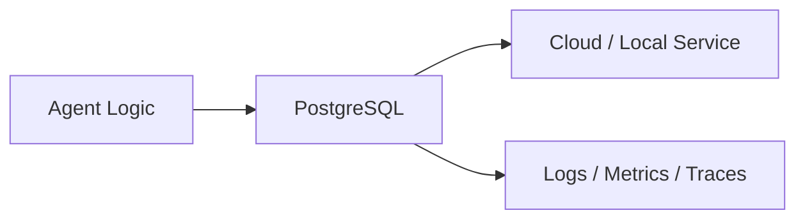
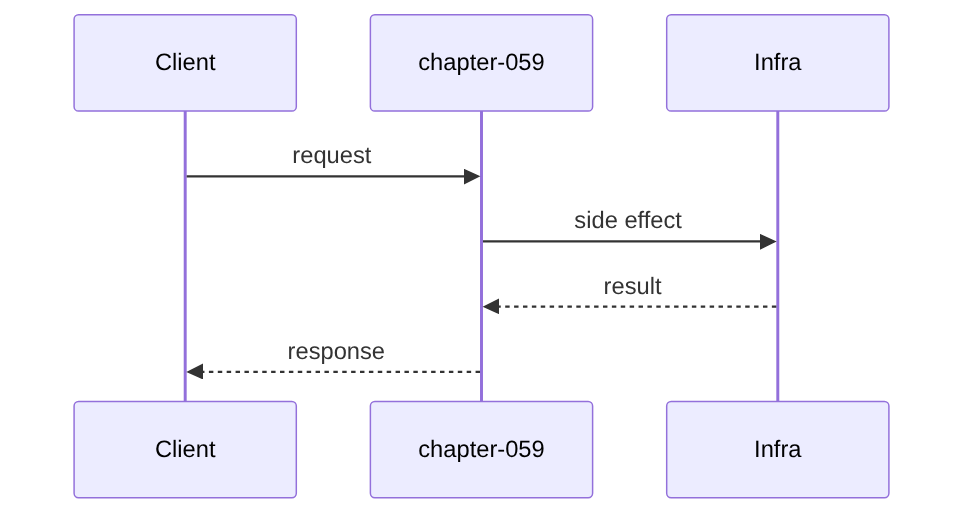

# Chapter 59: PostgreSQL

## Chapter Overview

Part VII — **Production Engineering** — **PostgreSQL** — package `pgkit`.

`AgentStore` uses sqlite offline with PostgreSQL-shaped schema: `agents`, `runs` with FK; upsert agent, create/finish run, list runs.

Parts IV–VI taught agents, systems, and frameworks. Part VII makes the platform **operable**: HTTP surface, queues, containers, data stores, auth, deploy, CI, monitoring, logs, and traces. Chapter 59 implements **PostgreSQL** offline-testable so you can swap real infrastructure without rewriting product logic.

**Code:** `code/chapter-059/pgkit/`.

---

## Learning Objectives

After completing this chapter, you can:

- Explain **PostgreSQL** in an agent production stack
- Run and extend `pgkit` with pytest
- Connect this layer to API (Ch 56), workers (Ch 57), and observability (Ch 64–66)
- Describe failure modes and operational defaults
- Apply security and cost-aware patterns at this boundary
- Complete exercises with tests passing

---

## Prerequisites

- Parts IV–VI (agents through framework comparisons)
- Prior Part VII chapters when `n > 56` (through Chapter 58)
- Basic DevOps vocabulary (containers, env vars, CI)

---

## Motivation

In-memory agent state dies on restart; you cannot audit past runs.

---

## First Principles

### 1. Schema first

Migrations in prod; script SCHEMA here.

### 2. Runs are first-class rows

status + result text.

### 3. Offline sqlite, prod Postgres

Same SQL dialect with minor tweaks.

### 4. Foreign keys enforce integrity

agent_id must exist.

---

## Mental Model

Postgres = ledger for agent runs — who ran, what goal, outcome status.



---

## Core Theory

### API

- upsert_agent(id, name)
- create_run(run_id, agent_id, goal) status running
- finish_run(run_id, status, result)
- get_run / list_runs

### Failure cases

Plan for auth failures, queue poison messages, deploy misconfig, SLO burn, and expired sessions — return structured errors, alert, and fail closed.

### Performance implications

Cache and rate-limit at Redis; async workers for long runs; sample traces under load.

### Security implications

RBAC on tools, redact secrets in logs/traces, TLS to Postgres/Redis, rotate API keys.

---

## Architecture

```text
code/chapter-059/
  pgkit/
  tests/
  main.py
  pyproject.toml
```

---

## Internal Implementation

```bash
cd code/chapter-059 && pytest -q && python3 main.py
```

Create agent, run lifecycle, list_runs length.

---

## Production Implementation

- Replace fakes with FastAPI, managed Postgres, Redis, OAuth, K8s, GitHub Actions, OTel exporters
- Connect Ch 56 API → Ch 57 workers → Ch 59 persistence
- Use Ch 61 auth on every `/v1` route; Ch 60 rate limits on public endpoints
- Feed Ch 64–66 from the same correlation and trace ids

---

## Framework Implementation

SQLAlchemy, asyncpg, Alembic migrations — replace sqlite connection in prod.

---

## Trade-offs

| Option A | Option B / notes |
|---|---|
| sqlite in tests | Fast CI; not concurrent-write realistic. |
| PostgreSQL prod | Durable; migrations and RLS. |

---

## Debugging

- FK errors → agent not upserted
- Empty list → wrong agent_id filter

---

## Performance

Index agent_id on runs; paginate list_runs.

---

## Security

Row-level security per tenant in prod Postgres.

---

## Best Practices

1. Treat `pgkit` contracts as adapters to managed services
2. Fail closed on auth, deploy validation, and CI gates
3. Emit logs, metrics, and traces with shared correlation/trace ids
4. Keep secrets out of images and logs
5. Test production control plane offline in pytest
6. Wire Part IV–VI agent logic behind HTTP (Ch 56) and workers (Ch 57)

---

## Anti-Patterns

- **Notebook-only agents** — No API, auth, or persistence
- **Secrets in Dockerfile** — Leaked via registry history
- **Skipping eval CI gate** — Regressions reach prod
- **Unbounded job retries** — Poison messages amplify cost
- **Logging raw prompts** — PII and injection content exposure
- **Metrics without SLOs** — Dashboards with no action thresholds

---

## Hands-on Exercise

1. `cd code/chapter-059 && pytest -q`
2. Change one config/policy (retry, SLO target, rate limit, rollout strategy)
3. Add a test for the new behavior
4. Run `python3 main.py`
5. Note how this chapter connects to the capstone platform (API + worker + DB)

---

## Mini Project

**SQL persistence for agents and runs.** Extend the package or document adapter points to real infrastructure.

---

## Visual diagrams




---

## Chapter Deliverables

| Artifact | Location |
|---|---|
| Manuscript | `book/chapter-059.md` |
| Package | `code/chapter-059/pgkit/` |
| Tests | `code/chapter-059/tests/` |

---

## Interview Questions

1. agents vs runs table design?
2. Migration strategy?
3. Tenant isolation in SQL?

---

## Quiz

1. finish_run updates:
   A) status and result B) GPU C) DNS D) nothing
   **Answer:** A

2. offline store uses:
   A) sqlite B) fax C) GPU only D) none
   **Answer:** A

3. runs reference:
   A) agents via FK B) random C) GPU D) DNS
   **Answer:** A

---

## Cheat Sheet

- `AgentStore` CRUD
- SCHEMA agents + runs

---

## Curated Free Resources

- [PostgreSQL docs](https://www.postgresql.org/docs/)
- [SQLite](https://www.sqlite.org/docs.html)

---

## Chapter Summary

**PostgreSQL** (`pgkit`) — SQL persistence for agents and runs. Part VII building block toward a deployable agent platform.

---

## What's Next

**Chapter 60: Redis.** Chapter 60 adds Redis cache, rate limits, sessions.
