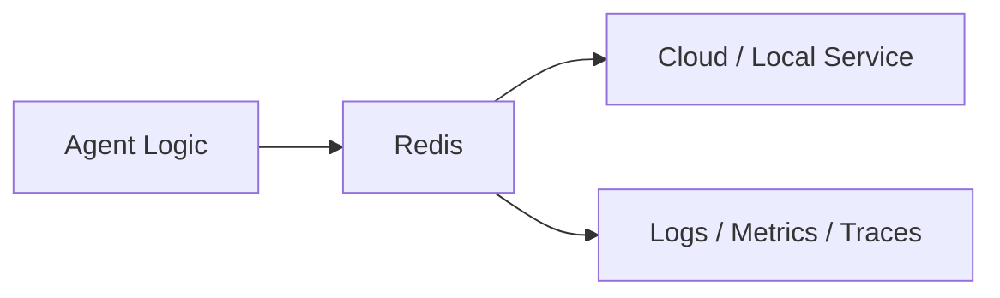
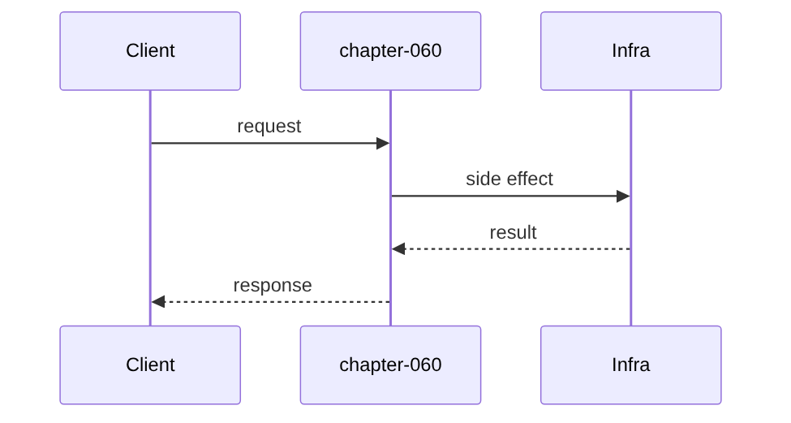
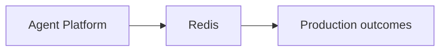

# Chapter 60: Redis

## Chapter Overview

Part VII — **Production Engineering** — **Redis** — package `rediskit`.

`RedisLite` implements TTL kv, incr, fixed-window `allow_rate`, `session_set/get`.

Parts IV–VI taught agents, systems, and frameworks. Part VII makes the platform **operable**: HTTP surface, queues, containers, data stores, auth, deploy, CI, monitoring, logs, and traces. Chapter 60 implements **Redis** offline-testable so you can swap real infrastructure without rewriting product logic.

**Code:** `code/chapter-060/rediskit/`.

---

## Learning Objectives

After completing this chapter, you can:

- Explain **Redis** in an agent production stack
- Run and extend `rediskit` with pytest
- Connect this layer to API (Ch 56), workers (Ch 57), and observability (Ch 64–66)
- Describe failure modes and operational defaults
- Apply security and cost-aware patterns at this boundary
- Complete exercises with tests passing

---

## Prerequisites

- Parts IV–VI (agents through framework comparisons)
- Prior Part VII chapters when `n > 56` (through Chapter 59)
- Basic DevOps vocabulary (containers, env vars, CI)

---

## Motivation

Repeated LLM calls for same prompt burn cash; APIs get hammered; sessions lost between workers.

---

## First Principles

### 1. TTL on cache keys

set(key, val, ex=seconds).

### 2. Rate limit per window bucket

rl:key:window_index.

### 3. Sessions are dict blobs

sess:{sid} prefix.

### 4. Expired keys lazy-delete on get

Teaching pattern; Redis uses passive/active expire.

---

## Mental Model

Redis = sticky notes with expiry — cache answers, count rate limits, hold session sticky notes.



---

## Core Theory

### allow_rate(key, limit, window_s)

Increments bucket counter; returns n <= limit.

### session_set/get

JSON-serializable dict with default ttl 3600s.

### Failure cases

Plan for auth failures, queue poison messages, deploy misconfig, SLO burn, and expired sessions — return structured errors, alert, and fail closed.

### Performance implications

Cache and rate-limit at Redis; async workers for long runs; sample traces under load.

### Security implications

RBAC on tools, redact secrets in logs/traces, TLS to Postgres/Redis, rotate API keys.

---

## Architecture

```text
code/chapter-060/
  rediskit/
  tests/
  main.py
  pyproject.toml
```

---

## Internal Implementation

```bash
cd code/chapter-060 && pytest -q && python3 main.py
```

Exceed rate limit in loop; assert allow_rate False.

---

## Production Implementation

- Replace fakes with FastAPI, managed Postgres, Redis, OAuth, K8s, GitHub Actions, OTel exporters
- Connect Ch 56 API → Ch 57 workers → Ch 59 persistence
- Use Ch 61 auth on every `/v1` route; Ch 60 rate limits on public endpoints
- Feed Ch 64–66 from the same correlation and trace ids

---

## Framework Implementation

redis-py, Redis Cluster, ElastiCache — swap RedisLite for real server.

---

## Trade-offs

| Option A | Option B / notes |
|---|---|
| Fixed window rate limit | Simple; boundary burst risk. |
| Token bucket | Smoother; more state. |

---

## Debugging

- Cache always miss → TTL too short
- Rate limit always true → window math

---

## Performance

Don't cache huge payloads; use hash tags in cluster.

---

## Security

No secrets in Redis without TLS; namespaced keys per tenant.

---

## Best Practices

1. Treat `rediskit` contracts as adapters to managed services
2. Fail closed on auth, deploy validation, and CI gates
3. Emit logs, metrics, and traces with shared correlation/trace ids
4. Keep secrets out of images and logs
5. Test production control plane offline in pytest
6. Wire Part IV–VI agent logic behind HTTP (Ch 56) and workers (Ch 57)

---

## Anti-Patterns

- **Notebook-only agents** — No API, auth, or persistence
- **Secrets in Dockerfile** — Leaked via registry history
- **Skipping eval CI gate** — Regressions reach prod
- **Unbounded job retries** — Poison messages amplify cost
- **Logging raw prompts** — PII and injection content exposure
- **Metrics without SLOs** — Dashboards with no action thresholds

---

## Hands-on Exercise

1. `cd code/chapter-060 && pytest -q`
2. Change one config/policy (retry, SLO target, rate limit, rollout strategy)
3. Add a test for the new behavior
4. Run `python3 main.py`
5. Note how this chapter connects to the capstone platform (API + worker + DB)

---

## Mini Project

**Cache, rate limit, and session primitives.** Extend the package or document adapter points to real infrastructure.

---

## Visual diagrams





---

## Chapter Deliverables

| Artifact | Location |
|---|---|
| Manuscript | `book/chapter-060.md` |
| Package | `code/chapter-060/rediskit/` |
| Tests | `code/chapter-060/tests/` |

---

## Interview Questions

1. Cache invalidation for agents?
2. RL at edge vs app?
3. Session stickiness?

---

## Quiz

1. allow_rate uses:
   A) incr bucket B) GPU C) DNS D) never
   **Answer:** A

2. session key prefix:
   A) sess: B) gpu: C) dns: D) none
   **Answer:** A

3. get removes expired:
   A) yes B) never C) GPU D) DNS
   **Answer:** A

---

## Cheat Sheet

- `RedisLite.set/get/incr/allow_rate/session_*`

---

## Curated Free Resources

- [Redis docs](https://redis.io/docs/)
- [Rate limiting patterns](https://cloud.google.com/architecture/rate-limiting-strategies-techniques)

---

## Chapter Summary

**Redis** (`rediskit`) — Cache, rate limit, and session primitives. Part VII building block toward a deployable agent platform.

---

## What's Next

**Chapter 61: Authentication.** Chapter 61 issues API keys, tokens, RBAC.
