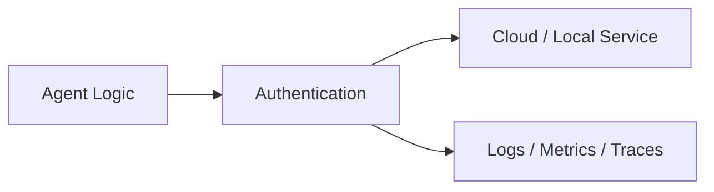
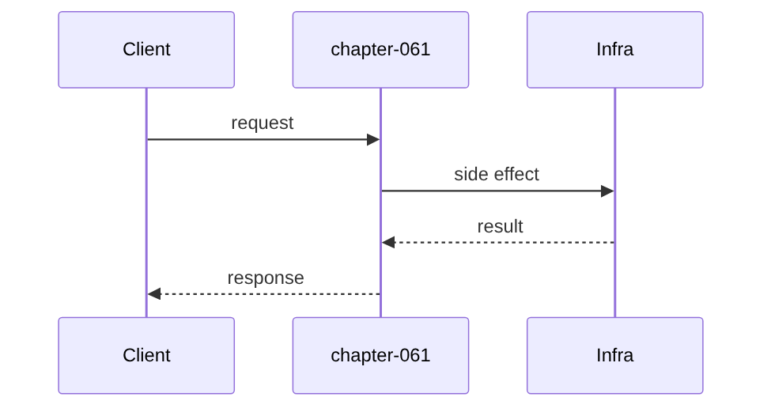

# Chapter 61: Authentication

## Chapter Overview

Part VII — **Production Engineering** — **Authentication** — package `authkit`.

`AuthService` issues api keys and TTL tokens, `authenticate`, `authorize` against role→permission map (admin *, support chat, viewer read_kb).

Parts IV–VI taught agents, systems, and frameworks. Part VII makes the platform **operable**: HTTP surface, queues, containers, data stores, auth, deploy, CI, monitoring, logs, and traces. Chapter 61 implements **Authentication** offline-testable so you can swap real infrastructure without rewriting product logic.

**Code:** `code/chapter-061/authkit/`.

---

## Learning Objectives

After completing this chapter, you can:

- Explain **Authentication** in an agent production stack
- Run and extend `authkit` with pytest
- Connect this layer to API (Ch 56), workers (Ch 57), and observability (Ch 64–66)
- Describe failure modes and operational defaults
- Apply security and cost-aware patterns at this boundary
- Complete exercises with tests passing

---

## Prerequisites

- Parts IV–VI (agents through framework comparisons)
- Prior Part VII chapters when `n > 56` (through Chapter 60)
- Basic DevOps vocabulary (containers, env vars, CI)

---

## Motivation

Every agent endpoint exposed without roles leads to refund tools callable by anonymous users.

---

## First Principles

### 1. Principals carry roles

subject + role set.

### 2. Separate issue vs authenticate

Keys/tokens stored hashed in prod — plaintext here for tests.

### 3. authorize checks permission strings

chat, read_kb, refund_read, *.

### 4. Token expiry enforced

Expired tokens removed.

---

## Mental Model

Auth = badge system — API keys for machines, bearer tokens for sessions, RBAC for room access.



---

## Core Theory

### issue_api_key / issue_token

Returns ak_* / tok_* strings mapped to Principal.

### authorize(principal, permission)

Any role granting permission or * → True.

### Failure cases

Plan for auth failures, queue poison messages, deploy misconfig, SLO burn, and expired sessions — return structured errors, alert, and fail closed.

### Performance implications

Cache and rate-limit at Redis; async workers for long runs; sample traces under load.

### Security implications

RBAC on tools, redact secrets in logs/traces, TLS to Postgres/Redis, rotate API keys.

---

## Architecture

```text
code/chapter-061/
  authkit/
  tests/
  main.py
  pyproject.toml
```

---

## Internal Implementation

```bash
cd code/chapter-061 && pytest -q && python3 main.py
```

Viewer denied chat; admin allowed *.

---

## Production Implementation

- Replace fakes with FastAPI, managed Postgres, Redis, OAuth, K8s, GitHub Actions, OTel exporters
- Connect Ch 56 API → Ch 57 workers → Ch 59 persistence
- Use Ch 61 auth on every `/v1` route; Ch 60 rate limits on public endpoints
- Feed Ch 64–66 from the same correlation and trace ids

---

## Framework Implementation

OAuth2/OIDC (Auth0, Keycloak), JWT middleware — map claims to Principal.

---

## Trade-offs

| Option A | Option B / notes |
|---|---|
| API keys | Simple; leak risk if mishandled. |
| OAuth/OIDC | Standard; integration cost. |

---

## Debugging

- Always deny → wrong permission string
- Token null → expired

---

## Performance

Cache authorize decisions briefly; don't hit DB each tool call.

---

## Security

Rotate keys; short TTL tokens; never commit secrets.

---

## Best Practices

1. Treat `authkit` contracts as adapters to managed services
2. Fail closed on auth, deploy validation, and CI gates
3. Emit logs, metrics, and traces with shared correlation/trace ids
4. Keep secrets out of images and logs
5. Test production control plane offline in pytest
6. Wire Part IV–VI agent logic behind HTTP (Ch 56) and workers (Ch 57)

---

## Anti-Patterns

- **Notebook-only agents** — No API, auth, or persistence
- **Secrets in Dockerfile** — Leaked via registry history
- **Skipping eval CI gate** — Regressions reach prod
- **Unbounded job retries** — Poison messages amplify cost
- **Logging raw prompts** — PII and injection content exposure
- **Metrics without SLOs** — Dashboards with no action thresholds

---

## Hands-on Exercise

1. `cd code/chapter-061 && pytest -q`
2. Change one config/policy (retry, SLO target, rate limit, rollout strategy)
3. Add a test for the new behavior
4. Run `python3 main.py`
5. Note how this chapter connects to the capstone platform (API + worker + DB)

---

## Mini Project

**API keys, bearer tokens, RBAC.** Extend the package or document adapter points to real infrastructure.

---

## Visual diagrams




---

## Chapter Deliverables

| Artifact | Location |
|---|---|
| Manuscript | `book/chapter-061.md` |
| Package | `code/chapter-061/authkit/` |
| Tests | `code/chapter-061/tests/` |

---

## Interview Questions

1. API key vs JWT?
2. RBAC vs ABAC for agents?
3. Service-to-service auth?

---

## Quiz

1. admin role has:
   A) * permission B) none C) GPU D) DNS
   **Answer:** A

2. authenticate returns:
   A) Principal or None B) GPU C) always admin D) DNS
   **Answer:** A

3. expired token:
   A) removed B) forever C) GPU D) DNS
   **Answer:** A

---

## Cheat Sheet

- `AuthService.issue_*/authenticate/authorize`
- role_perms map

---

## Curated Free Resources

- [OAuth 2.0](https://oauth.net/2/)
- [OWASP Authentication](https://cheatsheetseries.owasp.org/cheatsheets/Authentication_Cheat_Sheet.html)

---

## Chapter Summary

**Authentication** (`authkit`) — API keys, bearer tokens, RBAC. Part VII building block toward a deployable agent platform.

---

## What's Next

**Chapter 62: Deployment.** Chapter 62 plans deploy rollouts.
