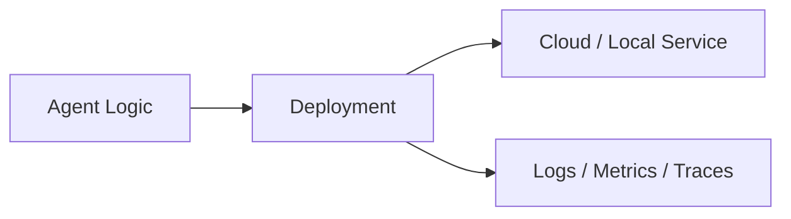
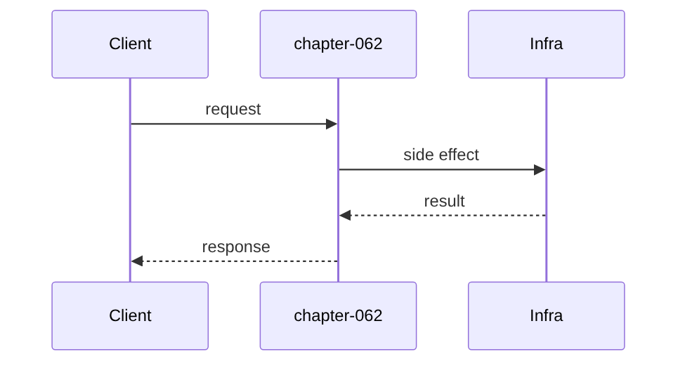

# Chapter 62: Deployment

## Chapter Overview

Part VII — **Production Engineering** — **Deployment** — package `deploykit`.

`EnvConfig.validate` catches image/replicas/env; `Rollout.plan` emits steps for rolling, canary, blue_green.

Parts IV–VI taught agents, systems, and frameworks. Part VII makes the platform **operable**: HTTP surface, queues, containers, data stores, auth, deploy, CI, monitoring, logs, and traces. Chapter 62 implements **Deployment** offline-testable so you can swap real infrastructure without rewriting product logic.

**Code:** `code/chapter-062/deploykit/`.

---

## Learning Objectives

After completing this chapter, you can:

- Explain **Deployment** in an agent production stack
- Run and extend `deploykit` with pytest
- Connect this layer to API (Ch 56), workers (Ch 57), and observability (Ch 64–66)
- Describe failure modes and operational defaults
- Apply security and cost-aware patterns at this boundary
- Complete exercises with tests passing

---

## Prerequisites

- Parts IV–VI (agents through framework comparisons)
- Prior Part VII chapters when `n > 56` (through Chapter 61)
- Basic DevOps vocabulary (containers, env vars, CI)

---

## Motivation

kubectl apply yolo breaks prod; missing DATABASE_URL only discovered at runtime.

---

## First Principles

### 1. Validate before deploy

missing_image, replicas, DATABASE_URL.

### 2. Strategy is explicit

rolling default; canary observes; blue_green switches traffic.

### 3. render_env_file for 12-factor

Env vars not baked in code.

### 4. Plans are auditable lists

action dicts for CI/simulation.

---

## Mental Model

Deploy = changing airplane engines mid-flight — rolling, canary, or blue-green with a checklist.



---

## Core Theory

### Rollout.plan(current, target)

Returns list of `{action: ...}` steps per strategy.

canary: deploy_canary percent → observe → promote 100.

### Failure cases

Plan for auth failures, queue poison messages, deploy misconfig, SLO burn, and expired sessions — return structured errors, alert, and fail closed.

### Performance implications

Cache and rate-limit at Redis; async workers for long runs; sample traces under load.

### Security implications

RBAC on tools, redact secrets in logs/traces, TLS to Postgres/Redis, rotate API keys.

---

## Architecture

```text
code/chapter-062/
  deploykit/
  tests/
  main.py
  pyproject.toml
```

---

## Internal Implementation

```bash
cd code/chapter-062 && pytest -q && python3 main.py
```

Invalid EnvConfig returns errs list; snapshot canary plan.

---

## Production Implementation

- Replace fakes with FastAPI, managed Postgres, Redis, OAuth, K8s, GitHub Actions, OTel exporters
- Connect Ch 56 API → Ch 57 workers → Ch 59 persistence
- Use Ch 61 auth on every `/v1` route; Ch 60 rate limits on public endpoints
- Feed Ch 64–66 from the same correlation and trace ids

---

## Framework Implementation

Kubernetes Deployments, Argo Rollouts, Fly.io, Render — implement same plan actions.

---

## Trade-offs

| Option A | Option B / notes |
|---|---|
| Rolling update | Default K8s behavior. |
| Blue-green | Fast rollback; needs double capacity. |

---

## Debugging

- validate errs → empty env dict
- Canary stuck → observe gate never promotes

---

## Performance

Tune maxUnavailable; readiness probes before promote.

---

## Security

Separate staging/prod credentials; signed images.

---

## Best Practices

1. Treat `deploykit` contracts as adapters to managed services
2. Fail closed on auth, deploy validation, and CI gates
3. Emit logs, metrics, and traces with shared correlation/trace ids
4. Keep secrets out of images and logs
5. Test production control plane offline in pytest
6. Wire Part IV–VI agent logic behind HTTP (Ch 56) and workers (Ch 57)

---

## Anti-Patterns

- **Notebook-only agents** — No API, auth, or persistence
- **Secrets in Dockerfile** — Leaked via registry history
- **Skipping eval CI gate** — Regressions reach prod
- **Unbounded job retries** — Poison messages amplify cost
- **Logging raw prompts** — PII and injection content exposure
- **Metrics without SLOs** — Dashboards with no action thresholds

---

## Hands-on Exercise

1. `cd code/chapter-062 && pytest -q`
2. Change one config/policy (retry, SLO target, rate limit, rollout strategy)
3. Add a test for the new behavior
4. Run `python3 main.py`
5. Note how this chapter connects to the capstone platform (API + worker + DB)

---

## Mini Project

**Env validation and rollout plan generator.** Extend the package or document adapter points to real infrastructure.

---

## Visual diagrams




---

## Chapter Deliverables

| Artifact | Location |
|---|---|
| Manuscript | `book/chapter-062.md` |
| Package | `code/chapter-062/deploykit/` |
| Tests | `code/chapter-062/tests/` |

---

## Interview Questions

1. Canary vs blue-green?
2. Env validation in pipeline?
3. Rollback triggers?

---

## Quiz

1. EnvConfig requires:
   A) DATABASE_URL B) GPU serial C) DNS only D) nothing
   **Answer:** A

2. blue_green includes:
   A) switch_traffic B) GPU only C) DNS D) none
   **Answer:** A

3. canary observes before:
   A) promote B) delete repo C) GPU D) never
   **Answer:** A

---

## Cheat Sheet

- `EnvConfig.validate()`
- `Rollout(strategy).plan()`

---

## Curated Free Resources

- [K8s rollouts](https://kubernetes.io/docs/concepts/workloads/controllers/deployment/)
- [12-factor config](https://12factor.net/config)

---

## Chapter Summary

**Deployment** (`deploykit`) — Env validation and rollout plan generator. Part VII building block toward a deployable agent platform.

---

## What's Next

**Chapter 63: CI/CD.** Chapter 63 automates lint/test/eval gates in CI.
