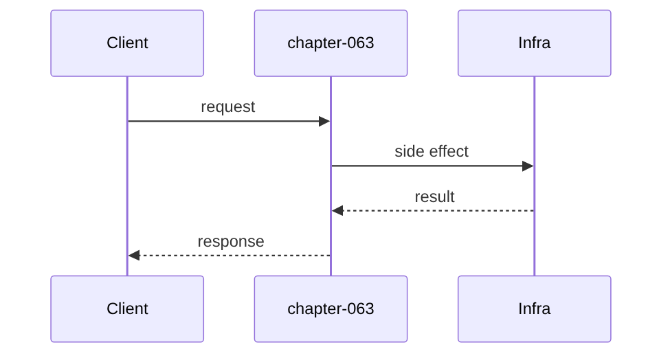

# Chapter 63: CI/CD

## Chapter Overview

Production engineering for the AI agent platform: **CI/CD**. This chapter provides an offline-testable package that models the production control surface so you can integrate real infrastructure without losing architecture discipline.

## Learning Objectives

- Apply CI/CD patterns to agent systems
- Run the chapter package tests and CLI
- Know failure modes and operational defaults

## Prerequisites

- Parts IV–VI
- Prior Part VII chapters

## Motivation

Agents that only work in notebooks are not products. CI/CD is how they become operable services.

## First Principles

### 1. Explicit interfaces over ambient infrastructure
### 2. Fail closed on auth, budgets, and deploys
### 3. Everything emits logs/metrics/traces
### 4. Test the control plane without live cloud accounts

## Architecture

```text
code/chapter-063/
```

## Internal Implementation

```bash
cd code/chapter-063 && pytest -q && python3 main.py
```

## Production Implementation

Swap offline fakes for managed services while keeping the same contracts and tests as behavioral specs.

## Best Practices

1. Infrastructure as code  
2. Secrets outside images  
3. Health checks and rollbacks  
4. Correlation IDs end-to-end  

## Mini Project

CI/CD control-plane package for the platform.

## Visual diagrams




## Chapter Deliverables

| Artifact | Location |
|---|---|
| Manuscript | `book/chapter-063.md` |
| Code | `code/chapter-063/` |

## Chapter Summary

CI/CD as a production building block for the agent platform.

## What's Next

**Chapter 64** continues Part VII.
