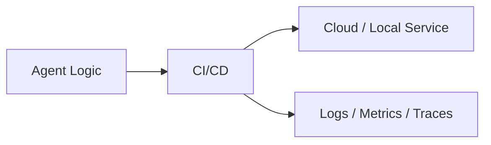

# Chapter 63: CI/CD

## Chapter Overview

Part VII — **Production Engineering** — **CI/CD** — package `cicdkit`.

`Pipeline` runs ordered Steps; `gate=True` stops on failure; demo includes unit+eval gates before deploy_staging.

Parts IV–VI taught agents, systems, and frameworks. Part VII makes the platform **operable**: HTTP surface, queues, containers, data stores, auth, deploy, CI, monitoring, logs, and traces. Chapter 63 implements **CI/CD** offline-testable so you can swap real infrastructure without rewriting product logic.

**Code:** `code/chapter-063/cicdkit/`.

---

## Learning Objectives

After completing this chapter, you can:

- Explain **CI/CD** in an agent production stack
- Run and extend `cicdkit` with pytest
- Connect this layer to API (Ch 56), workers (Ch 57), and observability (Ch 64–66)
- Describe failure modes and operational defaults
- Apply security and cost-aware patterns at this boundary
- Complete exercises with tests passing

---

## Prerequisites

- Parts IV–VI (agents through framework comparisons)
- Prior Part VII chapters when `n > 56` (through Chapter 62)
- Basic DevOps vocabulary (containers, env vars, CI)

---

## Motivation

Broken agents deploy because eval never ran in pipeline.

---

## First Principles

### 1. Gates block release

unit and eval must ok.

### 2. Steps return {ok: ...}

Uniform contract.

### 3. Local runner mirrors CI

Same Pipeline in dev.

### 4. Extend with consistency gate

Book repo runs check_consistency.py here.

---

## Mental Model

CI/CD = factory line QA — lint, unit, eval gates before ship.



---

## Core Theory

### demo_pipeline

lint → unit (gate) → eval (gate) → build_image → deploy_staging

Failure on gate returns failed_gate step name.

### Failure cases

Plan for auth failures, queue poison messages, deploy misconfig, SLO burn, and expired sessions — return structured errors, alert, and fail closed.

### Performance implications

Cache and rate-limit at Redis; async workers for long runs; sample traces under load.

### Security implications

RBAC on tools, redact secrets in logs/traces, TLS to Postgres/Redis, rotate API keys.

---

## Architecture

```text
code/chapter-063/
  cicdkit/
  tests/
  main.py
  pyproject.toml
```

---

## Internal Implementation

```bash
cd code/chapter-063 && pytest -q && python3 main.py
```

Add failing gate step; assert ok False and failed_gate set.

---

## Production Implementation

- Replace fakes with FastAPI, managed Postgres, Redis, OAuth, K8s, GitHub Actions, OTel exporters
- Connect Ch 56 API → Ch 57 workers → Ch 59 persistence
- Use Ch 61 auth on every `/v1` route; Ch 60 rate limits on public endpoints
- Feed Ch 64–66 from the same correlation and trace ids

---

## Framework Implementation

GitHub Actions, GitLab CI, Buildkite — translate Step list to YAML jobs.

---

## Trade-offs

| Option A | Option B / notes |
|---|---|
| Linear pipeline | Simple to reason about. |
| DAG pipelines | Parallel jobs; more setup. |

---

## Debugging

- False ok default → step raised without ok key
- Gate skipped → gate=False

---

## Performance

Parallelize lint/unit; cache deps.

---

## Security

Secrets in CI vault; signed artifacts.

---

## Best Practices

1. Treat `cicdkit` contracts as adapters to managed services
2. Fail closed on auth, deploy validation, and CI gates
3. Emit logs, metrics, and traces with shared correlation/trace ids
4. Keep secrets out of images and logs
5. Test production control plane offline in pytest
6. Wire Part IV–VI agent logic behind HTTP (Ch 56) and workers (Ch 57)

---

## Anti-Patterns

- **Notebook-only agents** — No API, auth, or persistence
- **Secrets in Dockerfile** — Leaked via registry history
- **Skipping eval CI gate** — Regressions reach prod
- **Unbounded job retries** — Poison messages amplify cost
- **Logging raw prompts** — PII and injection content exposure
- **Metrics without SLOs** — Dashboards with no action thresholds

---

## Hands-on Exercise

1. `cd code/chapter-063 && pytest -q`
2. Change one config/policy (retry, SLO target, rate limit, rollout strategy)
3. Add a test for the new behavior
4. Run `python3 main.py`
5. Note how this chapter connects to the capstone platform (API + worker + DB)

---

## Mini Project

**CI pipeline with eval gates.** Extend the package or document adapter points to real infrastructure.

---

## Visual diagrams


---

## Chapter Deliverables

| Artifact | Location |
|---|---|
| Manuscript | `book/chapter-063.md` |
| Package | `code/chapter-063/cicdkit/` |
| Tests | `code/chapter-063/tests/` |

---

## Interview Questions

1. Which agent tests are release gates?
2. Eval pass_rate threshold?
3. Deploy vs release?

---

## Quiz

1. gate step failing:
   A) stops pipeline B) ignored C) GPU D) DNS
   **Answer:** A

2. demo_pipeline gates:
   A) unit and eval B) none C) GPU D) DNS
   **Answer:** A

3. Pipeline.run returns:
   A) ok and results B) GPU C) DNS D) nothing
   **Answer:** A

---

## Cheat Sheet

- `Pipeline.add(Step(..., gate=True))`
- `demo_pipeline()`

---

## Curated Free Resources

- [GitHub Actions](https://docs.github.com/en/actions)
- [Trunk-based development](https://trunkbaseddevelopment.com/)

---

## Chapter Summary

**CI/CD** (`cicdkit`) — CI pipeline with eval gates. Part VII building block toward a deployable agent platform.

---

## What's Next

**Chapter 64: Monitoring.** Chapter 64 tracks SLOs and error budgets.
