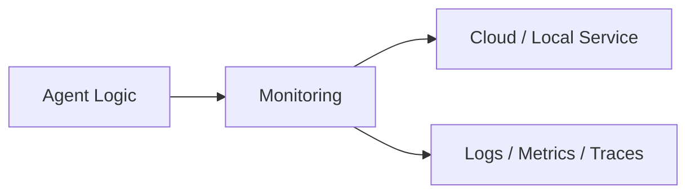
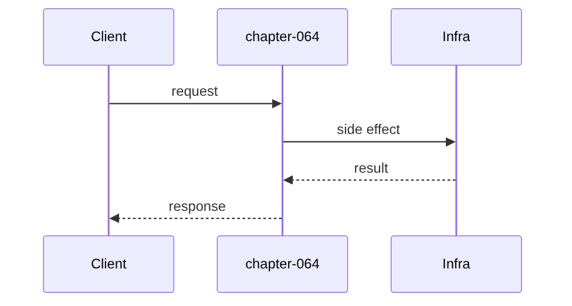

# Chapter 64: Monitoring

## Chapter Overview

Part VII — **Production Engineering** — **Monitoring** — package `monkit`.

`SLO` records ok/fail requests, computes availability and error_budget_remaining; `Monitor.evaluate` pages or tickets on burn.

Parts IV–VI taught agents, systems, and frameworks. Part VII makes the platform **operable**: HTTP surface, queues, containers, data stores, auth, deploy, CI, monitoring, logs, and traces. Chapter 64 implements **Monitoring** offline-testable so you can swap real infrastructure without rewriting product logic.

**Code:** `code/chapter-064/monkit/`.

---

## Learning Objectives

After completing this chapter, you can:

- Explain **Monitoring** in an agent production stack
- Run and extend `monkit` with pytest
- Connect this layer to API (Ch 56), workers (Ch 57), and observability (Ch 64–66)
- Describe failure modes and operational defaults
- Apply security and cost-aware patterns at this boundary
- Complete exercises with tests passing

---

## Prerequisites

- Parts IV–VI (agents through framework comparisons)
- Prior Part VII chapters when `n > 56` (through Chapter 63)
- Basic DevOps vocabulary (containers, env vars, CI)

---

## Motivation

You only learn availability collapsed from angry users, not metrics.

---

## First Principles

### 1. SLO has numeric target

e.g. 0.99 availability.

### 2. record(ok) drives windows

Teaching counter; use histograms in prod.

### 3. Alerts on burn and low budget

page vs ticket severities.

### 4. dashboard() exports JSON

Grafana consumes similar shape.

---

## Mental Model

Monitoring = car dashboard — SLO speedometer, error budget fuel light.



---

## Core Theory

### error_budget_remaining

Compares used errors vs allowed (1-target).

Alerts when availability < target or budget_remaining < 20%.

### Failure cases

Plan for auth failures, queue poison messages, deploy misconfig, SLO burn, and expired sessions — return structured errors, alert, and fail closed.

### Performance implications

Cache and rate-limit at Redis; async workers for long runs; sample traces under load.

### Security implications

RBAC on tools, redact secrets in logs/traces, TLS to Postgres/Redis, rotate API keys.

---

## Architecture

```text
code/chapter-064/
  monkit/
  tests/
  main.py
  pyproject.toml
```

---

## Internal Implementation

```bash
cd code/chapter-064 && pytest -q && python3 main.py
```

Record failures until SLO alerts fire.

---

## Production Implementation

- Replace fakes with FastAPI, managed Postgres, Redis, OAuth, K8s, GitHub Actions, OTel exporters
- Connect Ch 56 API → Ch 57 workers → Ch 59 persistence
- Use Ch 61 auth on every `/v1` route; Ch 60 rate limits on public endpoints
- Feed Ch 64–66 from the same correlation and trace ids

---

## Framework Implementation

Prometheus + Alertmanager, Datadog SLOs, Google Cloud Monitoring.

---

## Trade-offs

| Option A | Option B / notes |
|---|---|
| Availability SLO | Simple request ok/fail counting. |
| Latency SLO | User-centric; needs histograms. |

---

## Debugging

- No alerts → insufficient requests recorded
- NaN availability → zero requests guard

---

## Performance

Aggregate metrics; avoid high-cardinality labels on tool_name.

---

## Security

Metrics must not include prompt content.

---

## Best Practices

1. Treat `monkit` contracts as adapters to managed services
2. Fail closed on auth, deploy validation, and CI gates
3. Emit logs, metrics, and traces with shared correlation/trace ids
4. Keep secrets out of images and logs
5. Test production control plane offline in pytest
6. Wire Part IV–VI agent logic behind HTTP (Ch 56) and workers (Ch 57)

---

## Anti-Patterns

- **Notebook-only agents** — No API, auth, or persistence
- **Secrets in Dockerfile** — Leaked via registry history
- **Skipping eval CI gate** — Regressions reach prod
- **Unbounded job retries** — Poison messages amplify cost
- **Logging raw prompts** — PII and injection content exposure
- **Metrics without SLOs** — Dashboards with no action thresholds

---

## Hands-on Exercise

1. `cd code/chapter-064 && pytest -q`
2. Change one config/policy (retry, SLO target, rate limit, rollout strategy)
3. Add a test for the new behavior
4. Run `python3 main.py`
5. Note how this chapter connects to the capstone platform (API + worker + DB)

---

## Mini Project

**SLO tracking with alerts and dashboard JSON.** Extend the package or document adapter points to real infrastructure.

---

## Visual diagrams




---

## Chapter Deliverables

| Artifact | Location |
|---|---|
| Manuscript | `book/chapter-064.md` |
| Package | `code/chapter-064/monkit/` |
| Tests | `code/chapter-064/tests/` |

---

## Interview Questions

1. SLI vs SLO vs SLA?
2. Error budget policy?
3. Alert fatigue controls?

---

## Quiz

1. SLO.record takes:
   A) ok bool B) GPU C) DNS D) nothing
   **Answer:** A

2. error budget low triggers:
   A) ticket alert B) always page C) GPU D) never
   **Answer:** A

3. availability derived from:
   A) errors/requests B) GPU C) DNS D) MAC
   **Answer:** A

---

## Cheat Sheet

- `SLO.target/record/availability`
- `Monitor.dashboard()`

---

## Curated Free Resources

- [Google SRE SLO](https://sre.google/sre-book/service-level-objectives/)
- [Prometheus](https://prometheus.io/docs/)

---

## Chapter Summary

**Monitoring** (`monkit`) — SLO tracking with alerts and dashboard JSON. Part VII building block toward a deployable agent platform.

---

## What's Next

**Chapter 65: Logging.** Chapter 65 structures logs with correlation IDs.
