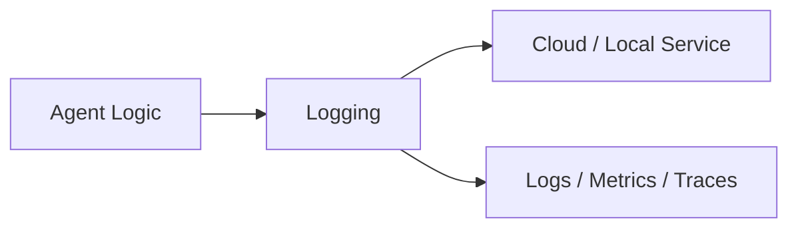
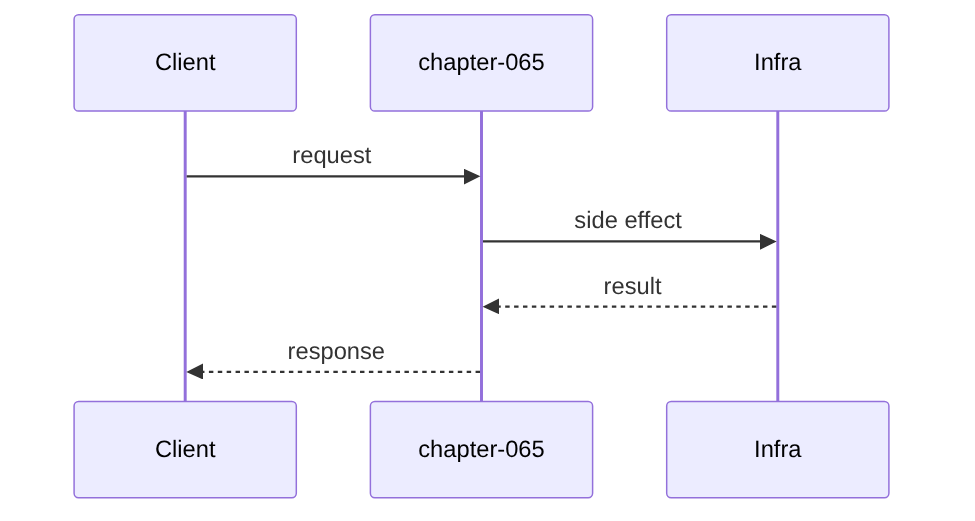

# Chapter 65: Logging

## Chapter Overview

Part VII — **Production Engineering** — **Logging** — package `logkit`.

`Logger` emits JSON records with ts, level, service, correlation_id, msg; `bind` adds fields; `dump` for tests.

Parts IV–VI taught agents, systems, and frameworks. Part VII makes the platform **operable**: HTTP surface, queues, containers, data stores, auth, deploy, CI, monitoring, logs, and traces. Chapter 65 implements **Logging** offline-testable so you can swap real infrastructure without rewriting product logic.

**Code:** `code/chapter-065/logkit/`.

---

## Learning Objectives

After completing this chapter, you can:

- Explain **Logging** in an agent production stack
- Run and extend `logkit` with pytest
- Connect this layer to API (Ch 56), workers (Ch 57), and observability (Ch 64–66)
- Describe failure modes and operational defaults
- Apply security and cost-aware patterns at this boundary
- Complete exercises with tests passing

---

## Prerequisites

- Parts IV–VI (agents through framework comparisons)
- Prior Part VII chapters when `n > 56` (through Chapter 64)
- Basic DevOps vocabulary (containers, env vars, CI)

---

## Motivation

grep 'Error' across 50 pods cannot tell which user request failed.

---

## First Principles

### 1. JSON not strings

Machine parseable.

### 2. correlation_id per request

Propagate from API gateway.

### 3. bind creates child context

tenant_id, run_id fields.

### 4. Levels INFO/ERROR

Extend DEBUG in prod configs.

---

## Mental Model

Structured logs = JSON receipts — same fields every time, correlation_id ties the stack.



---

## Core Theory

### _emit builds record dict appended to records list.

dump() joins json.dumps lines for snapshot assertions.

### Failure cases

Plan for auth failures, queue poison messages, deploy misconfig, SLO burn, and expired sessions — return structured errors, alert, and fail closed.

### Performance implications

Cache and rate-limit at Redis; async workers for long runs; sample traces under load.

### Security implications

RBAC on tools, redact secrets in logs/traces, TLS to Postgres/Redis, rotate API keys.

---

## Architecture

```text
code/chapter-065/
  logkit/
  tests/
  main.py
  pyproject.toml
```

---

## Internal Implementation

```bash
cd code/chapter-065 && pytest -q && python3 main.py
```

Bind run_id; assert appears in all subsequent records.

---

## Production Implementation

- Replace fakes with FastAPI, managed Postgres, Redis, OAuth, K8s, GitHub Actions, OTel exporters
- Connect Ch 56 API → Ch 57 workers → Ch 59 persistence
- Use Ch 61 auth on every `/v1` route; Ch 60 rate limits on public endpoints
- Feed Ch 64–66 from the same correlation and trace ids

---

## Framework Implementation

structlog, python-json-logger, OpenTelemetry log bridge.

---

## Trade-offs

| Option A | Option B / notes |
|---|---|
| In-memory log buffer | Great for tests. |
| Centralized log store | ELK/Loki; operational cost. |

---

## Debugging

- Missing correlation → new Logger per request wrongly
- Empty dump → no emit calls

---

## Performance

Sample DEBUG; async ship to collector.

---

## Security

Redact PII fields at bind time.

---

## Best Practices

1. Treat `logkit` contracts as adapters to managed services
2. Fail closed on auth, deploy validation, and CI gates
3. Emit logs, metrics, and traces with shared correlation/trace ids
4. Keep secrets out of images and logs
5. Test production control plane offline in pytest
6. Wire Part IV–VI agent logic behind HTTP (Ch 56) and workers (Ch 57)

---

## Anti-Patterns

- **Notebook-only agents** — No API, auth, or persistence
- **Secrets in Dockerfile** — Leaked via registry history
- **Skipping eval CI gate** — Regressions reach prod
- **Unbounded job retries** — Poison messages amplify cost
- **Logging raw prompts** — PII and injection content exposure
- **Metrics without SLOs** — Dashboards with no action thresholds

---

## Hands-on Exercise

1. `cd code/chapter-065 && pytest -q`
2. Change one config/policy (retry, SLO target, rate limit, rollout strategy)
3. Add a test for the new behavior
4. Run `python3 main.py`
5. Note how this chapter connects to the capstone platform (API + worker + DB)

---

## Mini Project

**Structured JSON logging with correlation IDs.** Extend the package or document adapter points to real infrastructure.

---

## Visual diagrams




---

## Chapter Deliverables

| Artifact | Location |
|---|---|
| Manuscript | `book/chapter-065.md` |
| Package | `code/chapter-065/logkit/` |
| Tests | `code/chapter-065/tests/` |

---

## Interview Questions

1. correlation vs trace id?
2. What to log from LLM calls?
3. Log volume controls?

---

## Quiz

1. Logger uses correlation_id for:
   A) request tying B) GPU C) DNS D) MAC
   **Answer:** A

2. bind adds:
   A) base fields B) GPU C) DNS D) nothing
   **Answer:** A

3. dump outputs:
   A) JSON lines B) binary C) GPU D) DNS
   **Answer:** A

---

## Cheat Sheet

- `Logger(service).info/error/bind/dump`

---

## Curated Free Resources

- [Structured logging](https://www.structlog.org/)
- [OpenTelemetry logs](https://opentelemetry.io/docs/specs/otel/logs/)

---

## Chapter Summary

**Logging** (`logkit`) — Structured JSON logging with correlation IDs. Part VII building block toward a deployable agent platform.

---

## What's Next

**Chapter 66: Tracing.** Chapter 66 adds nested distributed traces.
