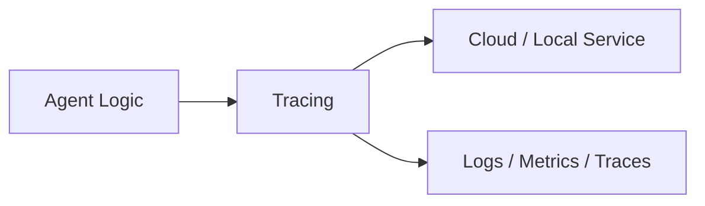
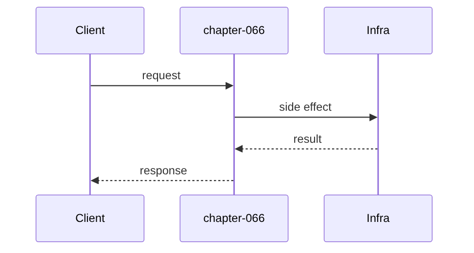
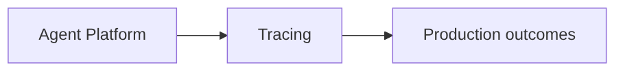

# Chapter 66: Tracing

## Chapter Overview

Part VII — **Production Engineering** — **Tracing** — package `tracekit`.

`Tracer.start_span` nested context managers build parent/child spans with trace_id, span_id, duration_ms, export JSON.

Parts IV–VI taught agents, systems, and frameworks. Part VII makes the platform **operable**: HTTP surface, queues, containers, data stores, auth, deploy, CI, monitoring, logs, and traces. Chapter 66 implements **Tracing** offline-testable so you can swap real infrastructure without rewriting product logic.

**Code:** `code/chapter-066/tracekit/`.

---

## Learning Objectives

After completing this chapter, you can:

- Explain **Tracing** in an agent production stack
- Run and extend `tracekit` with pytest
- Connect this layer to API (Ch 56), workers (Ch 57), and observability (Ch 64–66)
- Describe failure modes and operational defaults
- Apply security and cost-aware patterns at this boundary
- Complete exercises with tests passing

---

## Prerequisites

- Parts IV–VI (agents through framework comparisons)
- Prior Part VII chapters when `n > 56` (through Chapter 65)
- Basic DevOps vocabulary (containers, env vars, CI)

---

## Motivation

Logs show slow request but not whether retrieve or generate caused it.

---

## First Principles

### 1. One trace_id per request

Root span creates it; children inherit.

### 2. parent_id links tree

Enables critical path analysis.

### 3. Events on spans

tokens, exceptions.

### 4. export for OTel collectors

Same shape as Ch 45 telemetry spans.

---

## Mental Model

Tracing = film slate on each scene — trace_id for the movie, span_id per shot, parent links cuts.



---

## Core Theory

### demo_trace

handle_request → retrieve + generate children; generate logs tokens event.

Span status error on exception.

### Failure cases

Plan for auth failures, queue poison messages, deploy misconfig, SLO burn, and expired sessions — return structured errors, alert, and fail closed.

### Performance implications

Cache and rate-limit at Redis; async workers for long runs; sample traces under load.

### Security implications

RBAC on tools, redact secrets in logs/traces, TLS to Postgres/Redis, rotate API keys.

---

## Architecture

```text
code/chapter-066/
  tracekit/
  tests/
  main.py
  pyproject.toml
```

---

## Internal Implementation

```bash
cd code/chapter-066 && pytest -q && python3 main.py
```

Assert export spans count and parent_id chain.

---

## Production Implementation

- Replace fakes with FastAPI, managed Postgres, Redis, OAuth, K8s, GitHub Actions, OTel exporters
- Connect Ch 56 API → Ch 57 workers → Ch 59 persistence
- Use Ch 61 auth on every `/v1` route; Ch 60 rate limits on public endpoints
- Feed Ch 64–66 from the same correlation and trace ids

---

## Framework Implementation

OpenTelemetry SDK, Jaeger, Tempo, Honeycomb.

---

## Trade-offs

| Option A | Option B / notes |
|---|---|
| Manual spans | Precise; more code. |
| Auto-instrumentation | Fast; can be noisy. |

---

## Debugging

- Flat spans → forgot to pass parent
- Zero duration → context manager misuse

---

## Performance

Sample traces; tail-based sampling for errors.

---

## Security

No prompt text in span attributes.

---

## Best Practices

1. Treat `tracekit` contracts as adapters to managed services
2. Fail closed on auth, deploy validation, and CI gates
3. Emit logs, metrics, and traces with shared correlation/trace ids
4. Keep secrets out of images and logs
5. Test production control plane offline in pytest
6. Wire Part IV–VI agent logic behind HTTP (Ch 56) and workers (Ch 57)

---

## Anti-Patterns

- **Notebook-only agents** — No API, auth, or persistence
- **Secrets in Dockerfile** — Leaked via registry history
- **Skipping eval CI gate** — Regressions reach prod
- **Unbounded job retries** — Poison messages amplify cost
- **Logging raw prompts** — PII and injection content exposure
- **Metrics without SLOs** — Dashboards with no action thresholds

---

## Hands-on Exercise

1. `cd code/chapter-066 && pytest -q`
2. Change one config/policy (retry, SLO target, rate limit, rollout strategy)
3. Add a test for the new behavior
4. Run `python3 main.py`
5. Note how this chapter connects to the capstone platform (API + worker + DB)

---

## Mini Project

**Nested spans with trace export.** Extend the package or document adapter points to real infrastructure.

---

## Visual diagrams





---

## Chapter Deliverables

| Artifact | Location |
|---|---|
| Manuscript | `book/chapter-066.md` |
| Package | `code/chapter-066/tracekit/` |
| Tests | `code/chapter-066/tests/` |

---

## Interview Questions

1. Trace vs log vs metric?
2. Span attributes for LLM?
3. Sampling strategies?

---

## Quiz

1. child span parent_id:
   A) parent span_id B) GPU C) DNS D) random
   **Answer:** A

2. trace_id set on:
   A) root span B) GPU only C) DNS D) never
   **Answer:** A

3. export includes:
   A) spans list B) cookies C) GPU D) none
   **Answer:** A

---

## Cheat Sheet

- `Tracer.start_span(name, parent=...)`
- `demo_trace()`

---

## Curated Free Resources

- [OpenTelemetry tracing](https://opentelemetry.io/docs/concepts/signals/traces/)
- [Dapper paper](https://research.google/pubs/pub36356/)

---

## Chapter Summary

**Tracing** (`tracekit`) — Nested spans with trace export. Part VII building block toward a deployable agent platform.

---

## What's Next

**Chapter 67: Build an LLM Client.** Part VIII builds your own framework starting with the LLM client (Chapter 67).
