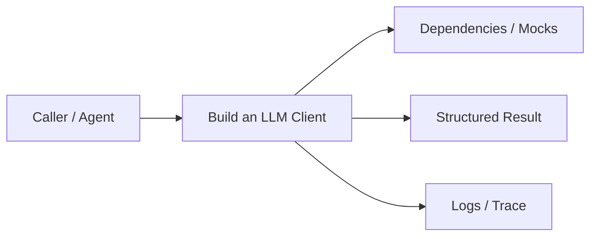
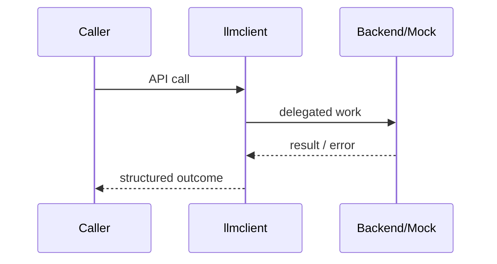
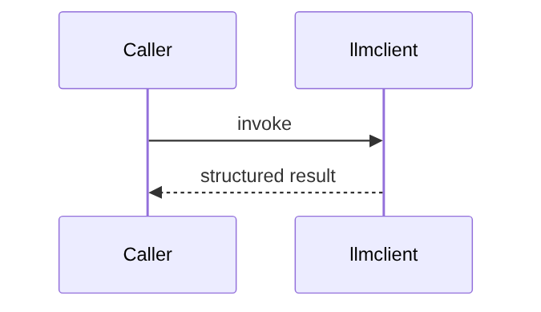

# Chapter 67: Build an LLM Client

## Chapter Overview

Part VIII — **Build Your Own Framework** — implements **Build an LLM Client** as package `llmclient`.

A thin provider protocol plus client orchestration is the first framework boundary. Own retries, timeouts, streaming collection, and usage metadata before you build planners or tools.

Earlier parts taught agents, retrieval, APIs, and production concerns using ad-hoc modules. Part VIII **owns the seams**: LLM I/O, prompts, tools, skills, planning, loops, memory, workflows, graphs, reflection, scheduling, harness, evaluation, and plugins. Chapter 67 focuses on **Build an LLM Client** so you can replace vendor frameworks without losing control of behavior, tests, or safety.

**Code:** `code/chapter-067/llmclient/` (offline-testable). **Diagrams:** lifecycle and overview under `diagrams/png/chapter-067/`.

---

## Learning Objectives

After completing this chapter, you can:

- Explain why **Build an LLM Client** is a first-class framework boundary
- Use and extend the `llmclient` package offline
- Wire build an llm client into adjacent Part VIII modules
- Apply production concerns: failure modes, budgets, observability
- Compare this design to popular frameworks without vendor lock-in
- Debug common integration failures with structured traces
- Describe security defaults (deny-by-default, validation, isolation)
- Complete the mini project and exercises with tests green

---

## Prerequisites

- Parts I–VII (platform, agents, systems, APIs, production engineering)
- Earlier Part VIII chapters when `n > 67` (especially client, tools, and loop concepts)
- Comfort with Python protocols, dataclasses, and pytest

---

## Motivation

Every agent import talks to OpenAI directly. You cannot unit-test offline, cannot fail over to another vendor, and retries are copy-pasted in twelve places.

Shipping “just call the SDK” works in a demo and collapses under multi-provider needs, CI, multi-tenant safety, and incident response. Framework modules exist so **product teams share one correct implementation** of retries, registries, budgets, and gates—then compose them into agents (Part IX).

---

## First Principles

### 1. Protocol over SDK

Depend on `Provider.complete` / `stream`, not a vendor package. MockProvider proves CI without keys.

### 2. Retries are policy

max_retries and backoff live in the client, not in every call site. Transient timeouts retry; auth errors should not (production extension).

### 3. Usage is first-class

Return token/usage dicts even from mocks so cost dashboards never special-case providers.

### 4. Streaming is chunks, not opaque SDK behavior

Stream yields text pieces; non-stream complete returns the joined contract with attempts counted.

### 5. Fail closed after budget

Exhausted retries raise; callers decide degrade vs abort.

---

## Mental Model

LLM client = HTTP SDK for models — retries, streaming, and provider swap without rewriting agents.



| Piece | Responsibility |
|---|---|
| Public API | Stable types other chapters import |
| Policy | Retries, permissions, budgets, gates |
| Adapters | Mocks in CI; real backends in prod |
| Observability | Attempts, steps, scores, plugin names |

---

## Core Theory

### Provider protocol

```python
class Provider(Protocol):
    name: str
    def complete(self, messages: list[dict[str, str]], **kwargs) -> dict: ...
    def stream(self, messages: list[dict[str, str]], **kwargs) -> Iterator[str]: ...
```

`LLMClient` wraps any provider:

1. Loop `attempt = 1..max_retries`
2. Call `provider.complete`
3. On success attach `attempts` and return
4. On failure optionally sleep `backoff_s`, then retry
5. Raise `RuntimeError` if all attempts fail

`MockProvider` can inject `fail_times` transient `TimeoutError`s so tests assert retry counts without network.

### Message shape

Messages are OpenAI-style `{role, content}` dicts. Keep this stable so prompt managers (Ch 68) and loops (Ch 72) stay interoperable.

### Streaming

Teaching implementation collects stream into a list of chunks for offline asserts. Production would yield async generators to SSE endpoints.

### Failure cases

Expect partial failure as normal: timeouts, forbidden tools, max steps, failed gates. Prefer structured outcomes over ambient exceptions across agent boundaries.

### Performance implications

Every extra LLM hop multiplies latency and cost. Framework defaults should make budgets obvious (`max_retries`, `max_steps`, `gate`).

### Security implications

Side effects and extensibility are the danger zones (tools, plugins, memory). Validate inputs; allowlist capabilities; never execute model-authored code.

---

## Architecture

```text
code/chapter-067/
  llmclient/           # framework module
  tests/           # offline unit tests
  main.py          # demo entrypoint
  pyproject.toml
  README.md
```



Folder and lifecycle diagrams also render as PNGs in **Visual diagrams**.

---

## Internal Implementation

Key types in `code/chapter-067/llmclient/client.py`:

| Type | Role |
|---|---|
| `Provider` | Protocol for complete/stream |
| `MockProvider` | Deterministic offline backend |
| `LLMClient` | Retry + stream collection |

```bash
cd code/chapter-067 && pytest -q && python3 main.py
```

Exercise the retry path: `MockProvider(fail_times=2)` with `max_retries=3` should succeed on attempt 3.

Read the package source; prefer extending via new registrations and injected callables rather than editing core conditionals for each product.

---

## Production Implementation

- **Scaling:** Stateless module instances behind request workers; shared stores for memory/schedules
- **Caching:** Prompt renders, embeddings, and idempotent tool results where safe
- **Monitoring:** Counters for retries, forbidden tools, max_steps, eval pass rate
- **Configuration:** max_retries, max_steps, gates, allowlists via env/config
- **Retries:** Transient-only at LLM and HTTP edges
- **Security:** Tenant isolation, secret redaction, plugin allowlists
- **Cost:** Token accounting from client usage fields; budget middleware
- **Concurrency:** Safe registries (locks) if hot-reloading plugins

---

## Framework Implementation

Compare to OpenAI Python SDK (client per vendor), LiteLLM/instructor (routing layers), and Anthropic/Google SDKs. Your framework should sit *above* one SDK or *beside* a multi-provider gateway—never import three SDKs into every agent file.

Do not treat any single framework as universally best. Own interfaces; adopt vendor runtimes when they reduce undifferentiated heavy lifting.

---

## Trade-offs

| Option A | Option B / notes |
|---|---|
| Thin client vs full gateway | Thin: easy to own. Gateway: centralized auth, budgets, routing—more ops. |
| Sync retries vs queues | In-process backoff is simple; queue+worker survives process death. |
| Stream collect vs true stream | Collect simplifies tests; true stream cuts TTFB for UX. |

---

## Debugging

Common issues:

- Retries infinite on non-transient errors → classify exceptions
- Usage always zero → mock/provider not returning usage
- Stream empty → provider stream not implemented
- Different providers different message schemas → normalize at the boundary

**Workflow:** reproduce offline with mocks → assert structured fields → add one log line per policy decision → fix at the boundary (schema, allowlist, budget) not with prompt superstition.

---

## Performance

Cap max_retries; use short backoff in interactive paths; batch embeddings elsewhere (Ch 15). Log latency per attempt. Prefer connection pools in real HTTP providers.

Track p95 latency and cost per successful task, not only happy-path demos.

---

## Security

Never log full prompts with secrets. Redact API keys. Pin model ids. Treat provider responses as untrusted text until policy layers run.

Threat model always includes prompt injection driving tool/plugin misuse. Defense is registry policy + harness isolation + eval gates—not model promises.

---

## Best Practices

1. Keep `llmclient` interfaces stable; swap internals freely
2. Test offline with mocks at every I/O boundary
3. Log structured events (step, tool, plan version)
4. Budget steps, tokens, and wall time
5. Default deny on tools, plugins, and memory tenants
6. Gate releases with evaluators before promoting prompts

---

## Anti-Patterns

- **God module** — One file owns client, tools, memory, and HTTP
- **Hidden retries** — Call sites each invent backoff
- **Stringly tools** — Model output executed without registry
- **Unversioned prompts** — No rollback when quality drops
- **Infinite loops** — No max_steps / max_replans
- **Trustful plugins** — Load arbitrary code from disk/URL

---

## Hands-on Exercise

1. Open `code/chapter-067/` and run `pytest -q`.
2. Modify one policy knob (retry, permission, max_steps, gate, allowlist—whichever fits this module).
3. Add or adjust a unit test that fails before the change and passes after.
4. Run `python3 main.py` and note the structured JSON/fields in output.
5. Write three bullets: what would break in multi-tenant production if this module vanished.

---

## Mini Project

Ship a small demo that composes **Build an LLM Client** with at least one adjacent concept (client, tools, loop, or eval). Keep it offline-testable. Document the composition in five lines in your notes.

---

## Visual diagrams




---

## Chapter Deliverables

| Artifact | Location |
|---|---|
| Manuscript | `book/chapter-067.md` |
| Package | `code/chapter-067/llmclient/` |
| Tests | `code/chapter-067/tests/` |
| Diagrams | `diagrams/mermaid/chapter-067/` |

---

## Interview Questions

1. How do you design a multi-provider LLM client?
2. Which errors are safe to retry and which are not?
3. How do you test LLM-dependent code in CI without keys?
4. Where should token usage and cost be recorded?

---

## Quiz

1. The Provider protocol exists to:
   A) Speed up GPUs B) Abstract vendors for tests and failover C) Store vectors D) Train models
   **Answer:** B

2. After max_retries exhausted, LLMClient should:
   A) Return empty string B) Hang C) Raise D) Call a different chapter
   **Answer:** C

3. MockProvider.fail_times is for:
   A) Load tests B) Injecting transient failures C) Billing D) Embeddings
   **Answer:** B

---

## Cheat Sheet

- `LLMClient(provider, max_retries, backoff_s)`
- `complete(messages) -> {text, usage, attempts, ...}`
- `stream(messages) -> list[str]` chunks
- Always mock at Provider boundary in unit tests

---

## Curated Free Resources

- [OpenAI API reference](https://platform.openai.com/docs/api-reference)
- [Twelve-Factor Config](https://12factor.net/config)
- [AWS architecture: retries](https://aws.amazon.com/builders-library/timeouts-retries-and-backoff-with-jitter/)

---

## Chapter Summary

**Build an LLM Client** (`llmclient`) is a Part VIII framework building block: explicit interfaces, offline tests, and production policy hooks. Master it in isolation, then compose with the rest of the harness to build replaceable agent platforms.

---

## What's Next

**Chapter 68: Prompt Manager.** Chapter 68 adds versioned prompt templates so the client receives controlled strings, not ad-hoc f-strings.
