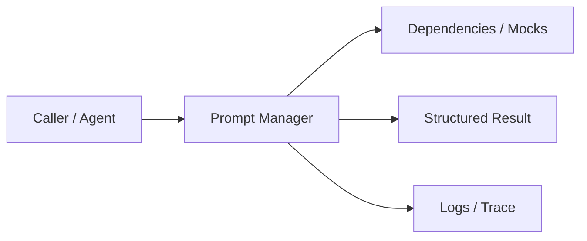
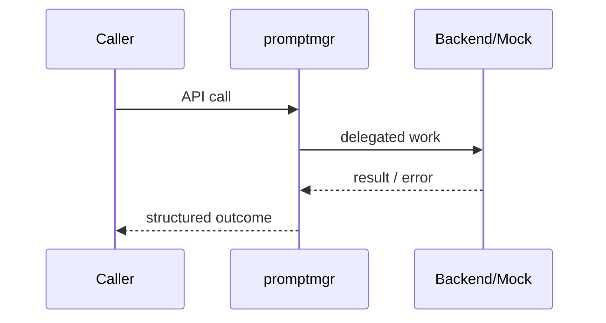
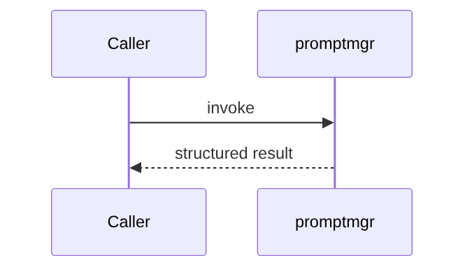

# Chapter 68: Prompt Manager

## Chapter Overview

Part VIII — **Build Your Own Framework** — implements **Prompt Manager** as package `promptmgr`.

Prompts are product code. Version them, validate variables, and render explicitly—same discipline as feature flags and migrations.

Earlier parts taught agents, retrieval, APIs, and production concerns using ad-hoc modules. Part VIII **owns the seams**: LLM I/O, prompts, tools, skills, planning, loops, memory, workflows, graphs, reflection, scheduling, harness, evaluation, and plugins. Chapter 68 focuses on **Prompt Manager** so you can replace vendor frameworks without losing control of behavior, tests, or safety.

**Code:** `code/chapter-068/promptmgr/` (offline-testable). **Diagrams:** lifecycle and overview under `diagrams/png/chapter-068/`.

---

## Learning Objectives

After completing this chapter, you can:

- Explain why **Prompt Manager** is a first-class framework boundary
- Use and extend the `promptmgr` package offline
- Wire prompt manager into adjacent Part VIII modules
- Apply production concerns: failure modes, budgets, observability
- Compare this design to popular frameworks without vendor lock-in
- Debug common integration failures with structured traces
- Describe security defaults (deny-by-default, validation, isolation)
- Complete the mini project and exercises with tests green

---

## Prerequisites

- Parts I–VII (platform, agents, systems, APIs, production engineering)
- Earlier Part VIII chapters when `n > 67` (especially client, tools, and loop concepts)
- Comfort with Python protocols, dataclasses, and pytest

---

## Motivation

Prompts live in random Python strings. A one-line change breaks production; you cannot A/B version 1.0 vs 1.1; missing `{issue}` becomes a silent wrong prompt.

Shipping “just call the SDK” works in a demo and collapses under multi-provider needs, CI, multi-tenant safety, and incident response. Framework modules exist so **product teams share one correct implementation** of retries, registries, budgets, and gates—then compose them into agents (Part IX).

---

## First Principles

### 1. Name + version identity

Keys like `support@1.1.0` plus latest alias `support`.

### 2. Fail on missing vars

Missing `{product}` raises `KeyError` before the LLM call.

### 3. Templates are data

Store YAML/JSON in prod; chapter uses in-memory registry.

### 4. Render ≠ complete

Manager only builds strings; LLMClient (Ch 67) sends them.

### 5. Pin versions in prod paths

Pin critical flows; float latest only in experiments.

---

## Mental Model

Prompt manager = i18n string catalog for LLMs — named, versioned templates with required variables.



| Piece | Responsibility |
|---|---|
| Public API | Stable types other chapters import |
| Policy | Retries, permissions, budgets, gates |
| Adapters | Mocks in CI; real backends in prod |
| Observability | Attempts, steps, scores, plugin names |

---

## Core Theory

### Template model

`PromptTemplate(name, version, body)` with `{var}` placeholders. Render replaces each placeholder after verifying all declared vars are provided.

### Registry

`PromptManager.register` stores both `name@version` and bare `name` (last registered wins for alias). `get` / `render` resolve version optionally.

### Default catalog

`default_manager()` registers support 1.0.0 and 1.1.0 to demonstrate additive variables (`product`) across versions.

### Relation to earlier chapters

Chapter 11 covered prompt engineering craft. This chapter is the **framework control plane**: lifecycle, versioning, and safe render—not wordsmithing tips.

### Failure cases

Expect partial failure as normal: timeouts, forbidden tools, max steps, failed gates. Prefer structured outcomes over ambient exceptions across agent boundaries.

### Performance implications

Every extra LLM hop multiplies latency and cost. Framework defaults should make budgets obvious (`max_retries`, `max_steps`, `gate`).

### Security implications

Side effects and extensibility are the danger zones (tools, plugins, memory). Validate inputs; allowlist capabilities; never execute model-authored code.

---

## Architecture

```text
code/chapter-068/
  promptmgr/           # framework module
  tests/           # offline unit tests
  main.py          # demo entrypoint
  pyproject.toml
  README.md
```



Folder and lifecycle diagrams also render as PNGs in **Visual diagrams**.

---

## Internal Implementation

```bash
cd code/chapter-068 && pytest -q && python3 main.py
```

Register a template, render with variables, assert missing vars raise. Promote 1.1.0 only after eval (Ch 79) passes.

Read the package source; prefer extending via new registrations and injected callables rather than editing core conditionals for each product.

---

## Production Implementation

- **Scaling:** Stateless module instances behind request workers; shared stores for memory/schedules
- **Caching:** Prompt renders, embeddings, and idempotent tool results where safe
- **Monitoring:** Counters for retries, forbidden tools, max_steps, eval pass rate
- **Configuration:** max_retries, max_steps, gates, allowlists via env/config
- **Retries:** Transient-only at LLM and HTTP edges
- **Security:** Tenant isolation, secret redaction, plugin allowlists
- **Cost:** Token accounting from client usage fields; budget middleware
- **Concurrency:** Safe registries (locks) if hot-reloading plugins

---

## Framework Implementation

LangChain PromptTemplate, LlamaIndex Prompt, and raw f-strings all exist. Prefer your manager for version pins and audit; use vendor templates only at the edge if needed.

Do not treat any single framework as universally best. Own interfaces; adopt vendor runtimes when they reduce undifferentiated heavy lifting.

---

## Trade-offs

| Option A | Option B / notes |
|---|---|
| String replace vs Jinja | Simple replace is safe and limited; Jinja is powerful but injection-prone. |
| In-memory vs DB catalog | Memory for tests; DB/CMS for multi-team prompt ops. |
| Alias latest vs pin | Alias is convenient; pins are releasable. |

---

## Debugging

Common issues:

- KeyError on render → missing variable or wrong version key
- Wrong tone in prod → unpinned alias moved under you
- Double braces left in output → escape policy unclear

**Workflow:** reproduce offline with mocks → assert structured fields → add one log line per policy decision → fix at the boundary (schema, allowlist, budget) not with prompt superstition.

---

## Performance

Render is CPU-cheap vs LLM. Cache rendered system prompts when variables are tenant-static.

Track p95 latency and cost per successful task, not only happy-path demos.

---

## Security

Never let user input define template bodies. Escape or strip if you later add expressions. Treat rendered prompts as containing untrusted user fields.

Threat model always includes prompt injection driving tool/plugin misuse. Defense is registry policy + harness isolation + eval gates—not model promises.

---

## Best Practices

1. Keep `promptmgr` interfaces stable; swap internals freely
2. Test offline with mocks at every I/O boundary
3. Log structured events (step, tool, plan version)
4. Budget steps, tokens, and wall time
5. Default deny on tools, plugins, and memory tenants
6. Gate releases with evaluators before promoting prompts

---

## Anti-Patterns

- **God module** — One file owns client, tools, memory, and HTTP
- **Hidden retries** — Call sites each invent backoff
- **Stringly tools** — Model output executed without registry
- **Unversioned prompts** — No rollback when quality drops
- **Infinite loops** — No max_steps / max_replans
- **Trustful plugins** — Load arbitrary code from disk/URL

---

## Hands-on Exercise

1. Open `code/chapter-068/` and run `pytest -q`.
2. Modify one policy knob (retry, permission, max_steps, gate, allowlist—whichever fits this module).
3. Add or adjust a unit test that fails before the change and passes after.
4. Run `python3 main.py` and note the structured JSON/fields in output.
5. Write three bullets: what would break in multi-tenant production if this module vanished.

---

## Mini Project

Ship a small demo that composes **Prompt Manager** with at least one adjacent concept (client, tools, loop, or eval). Keep it offline-testable. Document the composition in five lines in your notes.

---

## Visual diagrams




---

## Chapter Deliverables

| Artifact | Location |
|---|---|
| Manuscript | `book/chapter-068.md` |
| Package | `code/chapter-068/promptmgr/` |
| Tests | `code/chapter-068/tests/` |
| Diagrams | `diagrams/mermaid/chapter-068/` |

---

## Interview Questions

1. How do you version prompts for rollback?
2. Why fail closed on missing template variables?
3. How do prompt evals interact with template versions?

---

## Quiz

1. PromptManager.render missing a variable should:
   A) Leave braces B) Raise C) Call LLM anyway D) Delete template
   **Answer:** B

2. support@1.1.0 identity enables:
   A) GPU speed B) Pin/rollback C) Vector search D) Cron
   **Answer:** B

---

## Cheat Sheet

- `PromptTemplate(name, version, body)`
- `manager.register(tmpl)`
- `manager.render(name, version=None, **vars)`
- Pin versions on critical paths

---

## Curated Free Resources

- [OWASP LLM Prompt Injection](https://owasp.org/www-project-top-10-for-large-language-model-applications/)
- [12-factor config](https://12factor.net/config)

---

## Chapter Summary

**Prompt Manager** (`promptmgr`) is a Part VIII framework building block: explicit interfaces, offline tests, and production policy hooks. Master it in isolation, then compose with the rest of the harness to build replaceable agent platforms.

---

## What's Next

**Chapter 69: Tool Registry.** Chapter 69 registers tools the model may call—prompts declare intent; tools perform side effects.
