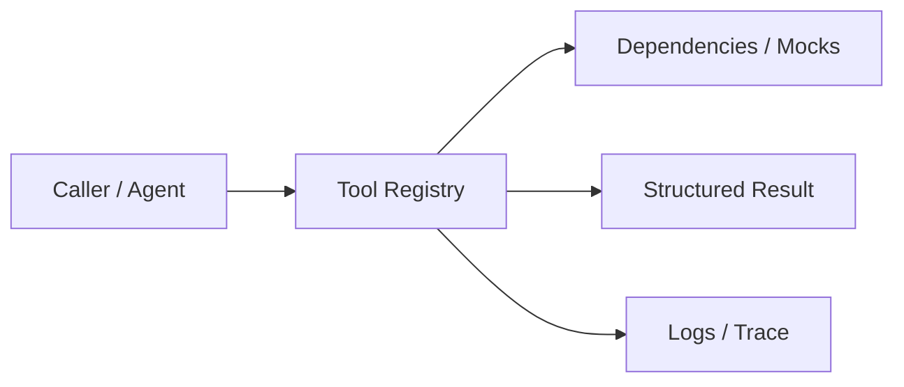
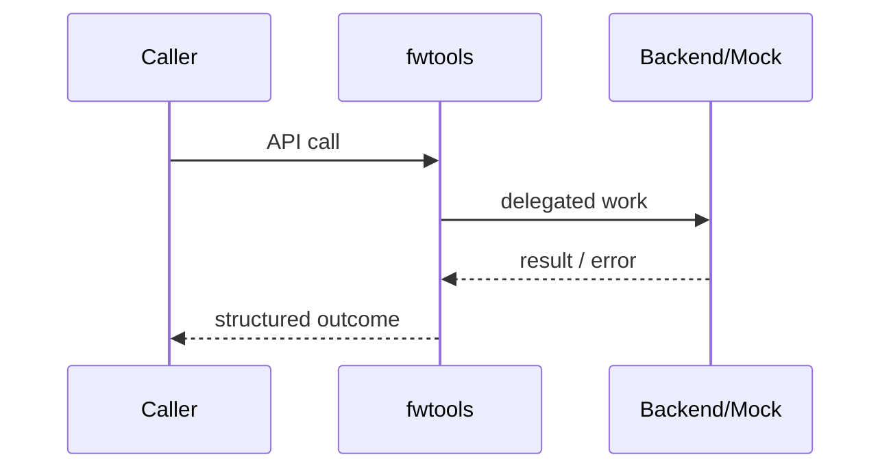

# Chapter 69: Tool Registry

## Chapter Overview

Part VIII — **Build Your Own Framework** — implements **Tool Registry** as package `fwtools`.

Tools are the side-effect boundary. Register name, description, schema, permissions; validate before invoke; return structured ok/error.

Earlier parts taught agents, retrieval, APIs, and production concerns using ad-hoc modules. Part VIII **owns the seams**: LLM I/O, prompts, tools, skills, planning, loops, memory, workflows, graphs, reflection, scheduling, harness, evaluation, and plugins. Chapter 69 focuses on **Tool Registry** so you can replace vendor frameworks without losing control of behavior, tests, or safety.

**Code:** `code/chapter-069/fwtools/` (offline-testable). **Diagrams:** lifecycle and overview under `diagrams/png/chapter-069/`.

---

## Learning Objectives

After completing this chapter, you can:

- Explain why **Tool Registry** is a first-class framework boundary
- Use and extend the `fwtools` package offline
- Wire tool registry into adjacent Part VIII modules
- Apply production concerns: failure modes, budgets, observability
- Compare this design to popular frameworks without vendor lock-in
- Debug common integration failures with structured traces
- Describe security defaults (deny-by-default, validation, isolation)
- Complete the mini project and exercises with tests green

---

## Prerequisites

- Parts I–VII (platform, agents, systems, APIs, production engineering)
- Earlier Part VIII chapters when `n > 67` (especially client, tools, and loop concepts)
- Comfort with Python protocols, dataclasses, and pytest

---

## Motivation

The model invents tool names; handlers accept any kwargs; billing tool is callable by every role. Incidents follow.

Shipping “just call the SDK” works in a demo and collapses under multi-provider needs, CI, multi-tenant safety, and incident response. Framework modules exist so **product teams share one correct implementation** of retries, registries, budgets, and gates—then compose them into agents (Part IX).

---

## First Principles

### 1. Explicit registration

No dynamic import of arbitrary callables from model output.

### 2. Schema before call

Type-check required args; reject invalid.

### 3. Permissions intersect roles

Tool runs only if role overlap or admin.

### 4. Structured errors

`{ok: false, error: ...}` not exceptions across the agent boundary (handler exceptions become ok false).

### 5. List for planners

Export list metadata without handlers for LLM tool schemas.

---

## Mental Model

Tool registry = capability firewall — named functions with schemas and permission tags.



| Piece | Responsibility |
|---|---|
| Public API | Stable types other chapters import |
| Policy | Retries, permissions, budgets, gates |
| Adapters | Mocks in CI; real backends in prod |
| Observability | Attempts, steps, scores, plugin names |

---

## Core Theory

### Tool record

`Tool(name, description, handler, schema, permissions)`.

### Call path

1. Lookup name → unknown_tool  
2. Permission check → forbidden  
3. Schema check → invalid_arg:k  
4. handler(**args) → ok/result or ok/error  

### Default tools

`echo` and `add` demonstrate string vs typed int schemas and optional `math` permission.

This continues Chapter 14 tools with a **framework-owned** registry other modules import.

### Failure cases

Expect partial failure as normal: timeouts, forbidden tools, max steps, failed gates. Prefer structured outcomes over ambient exceptions across agent boundaries.

### Performance implications

Every extra LLM hop multiplies latency and cost. Framework defaults should make budgets obvious (`max_retries`, `max_steps`, `gate`).

### Security implications

Side effects and extensibility are the danger zones (tools, plugins, memory). Validate inputs; allowlist capabilities; never execute model-authored code.

---

## Architecture

```text
code/chapter-069/
  fwtools/           # framework module
  tests/           # offline unit tests
  main.py          # demo entrypoint
  pyproject.toml
  README.md
```



Folder and lifecycle diagrams also render as PNGs in **Visual diagrams**.

---

## Internal Implementation

```bash
cd code/chapter-069 && pytest -q && python3 main.py
```

Try `call("add", {"a": 1, "b": 2})` vs missing role for restricted tools.

Read the package source; prefer extending via new registrations and injected callables rather than editing core conditionals for each product.

---

## Production Implementation

- **Scaling:** Stateless module instances behind request workers; shared stores for memory/schedules
- **Caching:** Prompt renders, embeddings, and idempotent tool results where safe
- **Monitoring:** Counters for retries, forbidden tools, max_steps, eval pass rate
- **Configuration:** max_retries, max_steps, gates, allowlists via env/config
- **Retries:** Transient-only at LLM and HTTP edges
- **Security:** Tenant isolation, secret redaction, plugin allowlists
- **Cost:** Token accounting from client usage fields; budget middleware
- **Concurrency:** Safe registries (locks) if hot-reloading plugins

---

## Framework Implementation

OpenAI tool/function calling, LangChain tools, and MCP servers all need a host-side allowlist. Your registry is that host policy even when schemas are JSON Schema from vendors.

Do not treat any single framework as universally best. Own interfaces; adopt vendor runtimes when they reduce undifferentiated heavy lifting.

---

## Trade-offs

| Option A | Option B / notes |
|---|---|
| Typed dict schema vs JSON Schema | Types are simple offline; JSON Schema is interoperable. |
| Exceptions vs result objects | Result objects compose in loops; exceptions need adapters. |
| Fine-grained perms vs admin-only | Fine-grained scales multi-tenant; admin-only is a footgun. |

---

## Debugging

Common issues:

- forbidden storms → role mapping wrong
- invalid_arg → LLM produced strings for ints
- unknown_tool → planner/tool list drift

**Workflow:** reproduce offline with mocks → assert structured fields → add one log line per policy decision → fix at the boundary (schema, allowlist, budget) not with prompt superstition.

---

## Performance

Keep handlers fast or async off-thread. Cache `list()` for prompt injection of tool catalogs.

Track p95 latency and cost per successful task, not only happy-path demos.

---

## Security

Default deny. Never `eval` tool names. Sandbox filesystem/network tools. Audit every call with args redacted.

Threat model always includes prompt injection driving tool/plugin misuse. Defense is registry policy + harness isolation + eval gates—not model promises.

---

## Best Practices

1. Keep `fwtools` interfaces stable; swap internals freely
2. Test offline with mocks at every I/O boundary
3. Log structured events (step, tool, plan version)
4. Budget steps, tokens, and wall time
5. Default deny on tools, plugins, and memory tenants
6. Gate releases with evaluators before promoting prompts

---

## Anti-Patterns

- **God module** — One file owns client, tools, memory, and HTTP
- **Hidden retries** — Call sites each invent backoff
- **Stringly tools** — Model output executed without registry
- **Unversioned prompts** — No rollback when quality drops
- **Infinite loops** — No max_steps / max_replans
- **Trustful plugins** — Load arbitrary code from disk/URL

---

## Hands-on Exercise

1. Open `code/chapter-069/` and run `pytest -q`.
2. Modify one policy knob (retry, permission, max_steps, gate, allowlist—whichever fits this module).
3. Add or adjust a unit test that fails before the change and passes after.
4. Run `python3 main.py` and note the structured JSON/fields in output.
5. Write three bullets: what would break in multi-tenant production if this module vanished.

---

## Mini Project

Ship a small demo that composes **Tool Registry** with at least one adjacent concept (client, tools, loop, or eval). Keep it offline-testable. Document the composition in five lines in your notes.

---

## Visual diagrams


---

## Chapter Deliverables

| Artifact | Location |
|---|---|
| Manuscript | `book/chapter-069.md` |
| Package | `code/chapter-069/fwtools/` |
| Tests | `code/chapter-069/tests/` |
| Diagrams | `diagrams/mermaid/chapter-069/` |

---

## Interview Questions

1. How do you prevent a model from calling destructive tools?
2. Where do you validate tool arguments?
3. How do tool permissions map to product roles?

---

## Quiz

1. ToolRegistry.call returns ok false on unknown tools rather than throwing because:
   A) Speed B) Agent loops handle structured outcomes C) Python limit D) Embeddings
   **Answer:** B

2. Permissions should default to:
   A) Allow all B) Deny unless role matches C) Admin for everyone D) Random
   **Answer:** B

---

## Cheat Sheet

- `Tool(name, description, handler, schema, permissions)`
- `registry.call(name, args, roles=(...))`
- Validate schema before handler
- Export list() for LLM tool schemas

---

## Curated Free Resources

- [MCP specification](https://modelcontextprotocol.io/)
- [OWASP LLM Top 10](https://owasp.org/www-project-top-10-for-large-language-model-applications/)

---

## Chapter Summary

**Tool Registry** (`fwtools`) is a Part VIII framework building block: explicit interfaces, offline tests, and production policy hooks. Master it in isolation, then compose with the rest of the harness to build replaceable agent platforms.

---

## What's Next

**Chapter 70: Skill Registry.** Chapter 70 elevates multi-step capabilities into skills composed from tools and pure transforms.
