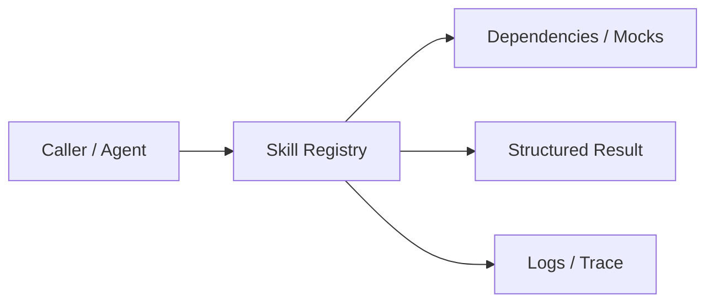
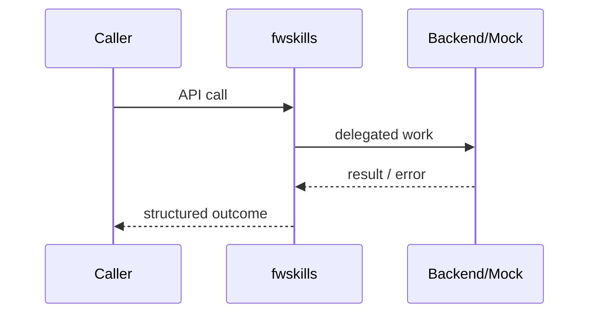

# Chapter 70: Skill Registry

## Chapter Overview

Part VIII — **Build Your Own Framework** — implements **Skill Registry** as package `fwskills`.

Skills package multi-step or domain behaviors above raw tools—discoverable, taggable, composable pure-ish transforms for teaching; richer skills call tools in production.

Earlier parts taught agents, retrieval, APIs, and production concerns using ad-hoc modules. Part VIII **owns the seams**: LLM I/O, prompts, tools, skills, planning, loops, memory, workflows, graphs, reflection, scheduling, harness, evaluation, and plugins. Chapter 70 focuses on **Skill Registry** so you can replace vendor frameworks without losing control of behavior, tests, or safety.

**Code:** `code/chapter-070/fwskills/` (offline-testable). **Diagrams:** lifecycle and overview under `diagrams/png/chapter-070/`.

---

## Learning Objectives

After completing this chapter, you can:

- Explain why **Skill Registry** is a first-class framework boundary
- Use and extend the `fwskills` package offline
- Wire skill registry into adjacent Part VIII modules
- Apply production concerns: failure modes, budgets, observability
- Compare this design to popular frameworks without vendor lock-in
- Debug common integration failures with structured traces
- Describe security defaults (deny-by-default, validation, isolation)
- Complete the mini project and exercises with tests green

---

## Prerequisites

- Parts I–VII (platform, agents, systems, APIs, production engineering)
- Earlier Part VIII chapters when `n > 67` (especially client, tools, and loop concepts)
- Comfort with Python protocols, dataclasses, and pytest

---

## Motivation

Agents re-implement “normalize text then summarize” in five places. There is no discovery by tag and no safe composition order.

Shipping “just call the SDK” works in a demo and collapses under multi-provider needs, CI, multi-tenant safety, and incident response. Framework modules exist so **product teams share one correct implementation** of retries, registries, budgets, and gates—then compose them into agents (Part IX).

---

## First Principles

### 1. Skills are named capabilities

Not hidden closures inside one agent file.

### 2. Tags enable discovery

`discover("text")` lists candidates for planners.

### 3. Compose is left-to-right pipeline

`compose([a,b], text)` applies a then b.

### 4. Skills ≠ tools

Tools are side-effecting ops; skills may orchestrate tools + prompts.

### 5. Keep handlers testable

Pure string transforms in the chapter package; inject tool registry in prod skills.

---

## Mental Model

Skill = reusable playbook step; registry = library catalog with tags and composition.



| Piece | Responsibility |
|---|---|
| Public API | Stable types other chapters import |
| Policy | Retries, permissions, budgets, gates |
| Adapters | Mocks in CI; real backends in prod |
| Observability | Attempts, steps, scores, plugin names |

---

## Core Theory

### Skill record

`Skill(name, description, handler, tags)`.

### Operations

- `register` / `get`
- `discover(tag)`
- `compose(names, text)` sequential pipeline

### Teaching default

`lower` and `exclaim` show composition: `Hello` → `hello` → `hello!`.

In production skills: “refund_workflow” might call tools + prompts + memory.

### Failure cases

Expect partial failure as normal: timeouts, forbidden tools, max steps, failed gates. Prefer structured outcomes over ambient exceptions across agent boundaries.

### Performance implications

Every extra LLM hop multiplies latency and cost. Framework defaults should make budgets obvious (`max_retries`, `max_steps`, `gate`).

### Security implications

Side effects and extensibility are the danger zones (tools, plugins, memory). Validate inputs; allowlist capabilities; never execute model-authored code.

---

## Architecture

```text
code/chapter-070/
  fwskills/           # framework module
  tests/           # offline unit tests
  main.py          # demo entrypoint
  pyproject.toml
  README.md
```



Folder and lifecycle diagrams also render as PNGs in **Visual diagrams**.

---

## Internal Implementation

```bash
cd code/chapter-070 && pytest -q && python3 main.py
```

Compose two skills; discover by tag; assert order matters.

Read the package source; prefer extending via new registrations and injected callables rather than editing core conditionals for each product.

---

## Production Implementation

- **Scaling:** Stateless module instances behind request workers; shared stores for memory/schedules
- **Caching:** Prompt renders, embeddings, and idempotent tool results where safe
- **Monitoring:** Counters for retries, forbidden tools, max_steps, eval pass rate
- **Configuration:** max_retries, max_steps, gates, allowlists via env/config
- **Retries:** Transient-only at LLM and HTTP edges
- **Security:** Tenant isolation, secret redaction, plugin allowlists
- **Cost:** Token accounting from client usage fields; budget middleware
- **Concurrency:** Safe registries (locks) if hot-reloading plugins

---

## Framework Implementation

Anthropic-style skills packs, LangChain chains, and CrewAI “tools as skills” blur lines. Keep your vocabulary: **tool** = atomic side effect, **skill** = packaged capability.

Do not treat any single framework as universally best. Own interfaces; adopt vendor runtimes when they reduce undifferentiated heavy lifting.

---

## Trade-offs

| Option A | Option B / notes |
|---|---|
| Many small skills vs few mega-skills | Small compose well; mega hide complexity. |
| Tag discovery vs explicit plan | Tags help search; explicit plans are auditable. |

---

## Debugging

Common issues:

- KeyError on compose → missing skill name
- Wrong order → compose list inverted
- discover empty → tags not set on register

**Workflow:** reproduce offline with mocks → assert structured fields → add one log line per policy decision → fix at the boundary (schema, allowlist, budget) not with prompt superstition.

---

## Performance

Composition is O(steps). Avoid huge skill chains without budgets (Ch 72).

Track p95 latency and cost per successful task, not only happy-path demos.

---

## Security

A skill that wraps tools inherits tool permissions. Do not auto-run all discovered skills from model output without allowlist.

Threat model always includes prompt injection driving tool/plugin misuse. Defense is registry policy + harness isolation + eval gates—not model promises.

---

## Best Practices

1. Keep `fwskills` interfaces stable; swap internals freely
2. Test offline with mocks at every I/O boundary
3. Log structured events (step, tool, plan version)
4. Budget steps, tokens, and wall time
5. Default deny on tools, plugins, and memory tenants
6. Gate releases with evaluators before promoting prompts

---

## Anti-Patterns

- **God module** — One file owns client, tools, memory, and HTTP
- **Hidden retries** — Call sites each invent backoff
- **Stringly tools** — Model output executed without registry
- **Unversioned prompts** — No rollback when quality drops
- **Infinite loops** — No max_steps / max_replans
- **Trustful plugins** — Load arbitrary code from disk/URL

---

## Hands-on Exercise

1. Open `code/chapter-070/` and run `pytest -q`.
2. Modify one policy knob (retry, permission, max_steps, gate, allowlist—whichever fits this module).
3. Add or adjust a unit test that fails before the change and passes after.
4. Run `python3 main.py` and note the structured JSON/fields in output.
5. Write three bullets: what would break in multi-tenant production if this module vanished.

---

## Mini Project

Ship a small demo that composes **Skill Registry** with at least one adjacent concept (client, tools, loop, or eval). Keep it offline-testable. Document the composition in five lines in your notes.

---

## Visual diagrams


---

## Chapter Deliverables

| Artifact | Location |
|---|---|
| Manuscript | `book/chapter-070.md` |
| Package | `code/chapter-070/fwskills/` |
| Tests | `code/chapter-070/tests/` |
| Diagrams | `diagrams/mermaid/chapter-070/` |

---

## Interview Questions

1. Difference between a tool and a skill in an agent platform?
2. How would you version skills in production?

---

## Quiz

1. compose([lower, exclaim], 'Hi') yields:
   A) HI! B) hi! C) Hi! D) error
   **Answer:** B

2. discover(tag) is for:
   A) Billing B) Finding candidate skills C) Training D) DNS
   **Answer:** B

---

## Cheat Sheet

- `Skill(name, description, handler, tags)`
- `discover(tag)`, `compose(names, text)`
- Skills package capabilities; tools do side effects

---

## Curated Free Resources

- [Unix philosophy (pipelines)](https://en.wikipedia.org/wiki/Unix_philosophy)

---

## Chapter Summary

**Skill Registry** (`fwskills`) is a Part VIII framework building block: explicit interfaces, offline tests, and production policy hooks. Master it in isolation, then compose with the rest of the harness to build replaceable agent platforms.

---

## What's Next

**Chapter 71: Planner.** Chapter 71 plans ordered steps that may invoke skills and tools.
