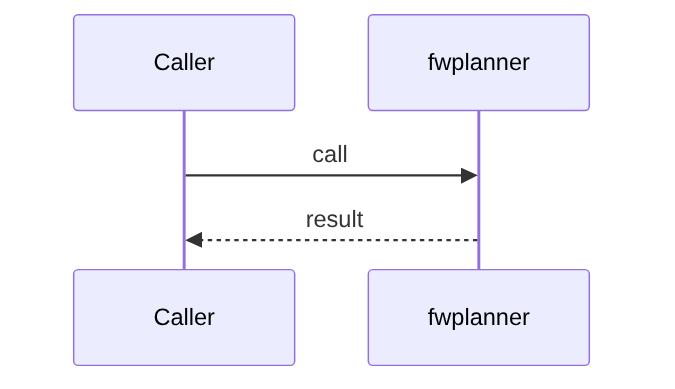

# Chapter 71: Planner

## Chapter Overview

Part VIII module **Planner** (`fwplanner`) — a composable piece of the in-house agent framework.

## Learning Objectives

- Use and extend the `fwplanner` module
- Test it offline
- Wire it into the harness/loop later chapters assemble

## Prerequisites

Parts IV–VII; earlier Part VIII modules.

## Motivation

Own planner so product code does not depend on a single vendor abstraction.

## Architecture

`code/chapter-071/fwplanner/`

## Internal Implementation

```bash
cd code/chapter-071 && pytest -q && python3 main.py
```

## Production Implementation

Replace mocks with real backends; keep interfaces stable.

## Mini Project

Planner framework module.

## Visual diagrams




## Chapter Deliverables

| Artifact | Location |
|---|---|
| Manuscript | `book/chapter-071.md` |
| Package | `code/chapter-071/fwplanner/` |

## Chapter Summary

Planner implemented as a first-class framework component.

## What's Next

**Chapter 72** continues Part VIII.
