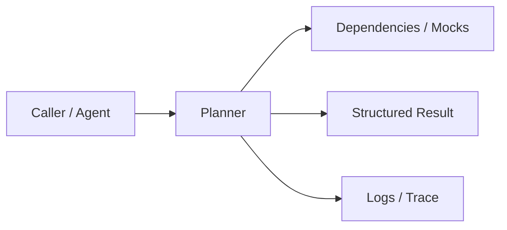
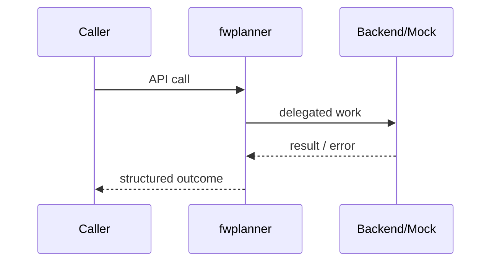

# Chapter 71: Planner

## Chapter Overview

Part VIII — **Build Your Own Framework** — implements **Planner** as package `fwplanner`.

Planning separates *what* from *how it runs*. Explicit `Plan(goal, steps, version)` enables logging, HITL approval, and replan-on-failure.

Earlier parts taught agents, retrieval, APIs, and production concerns using ad-hoc modules. Part VIII **owns the seams**: LLM I/O, prompts, tools, skills, planning, loops, memory, workflows, graphs, reflection, scheduling, harness, evaluation, and plugins. Chapter 71 focuses on **Planner** so you can replace vendor frameworks without losing control of behavior, tests, or safety.

**Code:** `code/chapter-071/fwplanner/` (offline-testable). **Diagrams:** lifecycle and overview under `diagrams/png/chapter-071/`.

---

## Learning Objectives

After completing this chapter, you can:

- Explain why **Planner** is a first-class framework boundary
- Use and extend the `fwplanner` package offline
- Wire planner into adjacent Part VIII modules
- Apply production concerns: failure modes, budgets, observability
- Compare this design to popular frameworks without vendor lock-in
- Debug common integration failures with structured traces
- Describe security defaults (deny-by-default, validation, isolation)
- Complete the mini project and exercises with tests green

---

## Prerequisites

- Parts I–VII (platform, agents, systems, APIs, production engineering)
- Earlier Part VIII chapters when `n > 67` (especially client, tools, and loop concepts)
- Comfort with Python protocols, dataclasses, and pytest

---

## Motivation

The agent freestyle-chats until tokens die. There is no explicit plan to inspect, no version when recovery changes steps.

Shipping “just call the SDK” works in a demo and collapses under multi-provider needs, CI, multi-tenant safety, and incident response. Framework modules exist so **product teams share one correct implementation** of retries, registries, budgets, and gates—then compose them into agents (Part IX).

---

## First Principles

### 1. Plans are data

Serializable steps, not only hidden chain-of-thought.

### 2. Heuristic then LLM

Chapter uses keyword heuristics; production swaps LLM planner behind same interface.

### 3. Replan increments version

Audit trail of recovery.

### 4. Verify is a step

Close the loop with explicit verification intent.

### 5. Planner ≠ executor

Execution loop (Ch 72) runs steps.

---

## Mental Model

Planner = trip itinerary generator — goal in, ordered steps out, replan when a step fails.



| Piece | Responsibility |
|---|---|
| Public API | Stable types other chapters import |
| Policy | Retries, permissions, budgets, gates |
| Adapters | Mocks in CI; real backends in prod |
| Observability | Attempts, steps, scores, plugin names |

---

## Core Theory

### Plan object

`Plan(goal, steps, version)` with `to_dict()` for logs.

### make(goal)

Heuristic:

- Always start `understand`, end `verify`
- If goal mentions search/research/find → `search`, `synthesize`
- Else → `draft`

### replan(plan, failure)

Insert `search` if missing; append `recover:<failure>`; bump version.

Production planners: LLM emits JSON steps validated against skill/tool catalogs.

### Failure cases

Expect partial failure as normal: timeouts, forbidden tools, max steps, failed gates. Prefer structured outcomes over ambient exceptions across agent boundaries.

### Performance implications

Every extra LLM hop multiplies latency and cost. Framework defaults should make budgets obvious (`max_retries`, `max_steps`, `gate`).

### Security implications

Side effects and extensibility are the danger zones (tools, plugins, memory). Validate inputs; allowlist capabilities; never execute model-authored code.

---

## Architecture

```text
code/chapter-071/
  fwplanner/           # framework module
  tests/           # offline unit tests
  main.py          # demo entrypoint
  pyproject.toml
  README.md
```



Folder and lifecycle diagrams also render as PNGs in **Visual diagrams**.

---

## Internal Implementation

```bash
cd code/chapter-071 && pytest -q && python3 main.py
```

Compare plans for “research X” vs “write blurb”; force replan on simulated failure.

Read the package source; prefer extending via new registrations and injected callables rather than editing core conditionals for each product.

---

## Production Implementation

- **Scaling:** Stateless module instances behind request workers; shared stores for memory/schedules
- **Caching:** Prompt renders, embeddings, and idempotent tool results where safe
- **Monitoring:** Counters for retries, forbidden tools, max_steps, eval pass rate
- **Configuration:** max_retries, max_steps, gates, allowlists via env/config
- **Retries:** Transient-only at LLM and HTTP edges
- **Security:** Tenant isolation, secret redaction, plugin allowlists
- **Cost:** Token accounting from client usage fields; budget middleware
- **Concurrency:** Safe registries (locks) if hot-reloading plugins

---

## Framework Implementation

ReAct interleaves plan/act; plan-and-execute separates them (LangGraph, Guidance, classic planners). Own the Plan schema even if an LLM fills it.

Do not treat any single framework as universally best. Own interfaces; adopt vendor runtimes when they reduce undifferentiated heavy lifting.

---

## Trade-offs

| Option A | Option B / notes |
|---|---|
| Up-front plan vs ReAct | Up-front is inspectable; ReAct adapts faster mid-flight. |
| Heuristic vs LLM planner | Heuristic tests offline; LLM handles novelty at cost/latency. |

---

## Debugging

Common issues:

- Empty steps → planner bug
- Replan loops → no max replan budget
- Steps name tools that do not exist → validate against registry

**Workflow:** reproduce offline with mocks → assert structured fields → add one log line per policy decision → fix at the boundary (schema, allowlist, budget) not with prompt superstition.

---

## Performance

Cache plans for repeated goals carefully (staleness). LLM planners dominate latency—budget tokens.

Track p95 latency and cost per successful task, not only happy-path demos.

---

## Security

Do not let plans include arbitrary shell. Validate step vocabulary. HITL for high-risk plans.

Threat model always includes prompt injection driving tool/plugin misuse. Defense is registry policy + harness isolation + eval gates—not model promises.

---

## Best Practices

1. Keep `fwplanner` interfaces stable; swap internals freely
2. Test offline with mocks at every I/O boundary
3. Log structured events (step, tool, plan version)
4. Budget steps, tokens, and wall time
5. Default deny on tools, plugins, and memory tenants
6. Gate releases with evaluators before promoting prompts

---

## Anti-Patterns

- **God module** — One file owns client, tools, memory, and HTTP
- **Hidden retries** — Call sites each invent backoff
- **Stringly tools** — Model output executed without registry
- **Unversioned prompts** — No rollback when quality drops
- **Infinite loops** — No max_steps / max_replans
- **Trustful plugins** — Load arbitrary code from disk/URL

---

## Hands-on Exercise

1. Open `code/chapter-071/` and run `pytest -q`.
2. Modify one policy knob (retry, permission, max_steps, gate, allowlist—whichever fits this module).
3. Add or adjust a unit test that fails before the change and passes after.
4. Run `python3 main.py` and note the structured JSON/fields in output.
5. Write three bullets: what would break in multi-tenant production if this module vanished.

---

## Mini Project

Ship a small demo that composes **Planner** with at least one adjacent concept (client, tools, loop, or eval). Keep it offline-testable. Document the composition in five lines in your notes.

---

## Visual diagrams


---

## Chapter Deliverables

| Artifact | Location |
|---|---|
| Manuscript | `book/chapter-071.md` |
| Package | `code/chapter-071/fwplanner/` |
| Tests | `code/chapter-071/tests/` |
| Diagrams | `diagrams/mermaid/chapter-071/` |

---

## Interview Questions

1. When prefer plan-and-execute over pure ReAct?
2. How do you prevent infinite replan loops?

---

## Quiz

1. Plan.version increments on:
   A) Every token B) replan C) deploy D) embedding
   **Answer:** B

2. Planner should:
   A) Execute tools itself B) Emit steps for an executor C) Train models D) Store vectors
   **Answer:** B

---

## Cheat Sheet

- `Plan(goal, steps, version)`
- `make(goal)`, `replan(plan, failure)`
- Validate steps against skill/tool catalogs

---

## Curated Free Resources

- [ReAct paper](https://arxiv.org/abs/2210.03629)

---

## Chapter Summary

**Planner** (`fwplanner`) is a Part VIII framework building block: explicit interfaces, offline tests, and production policy hooks. Master it in isolation, then compose with the rest of the harness to build replaceable agent platforms.

---

## What's Next

**Chapter 72: Execution Loop.** Chapter 72 executes decide/act loops with step budgets until stop or max_steps.
