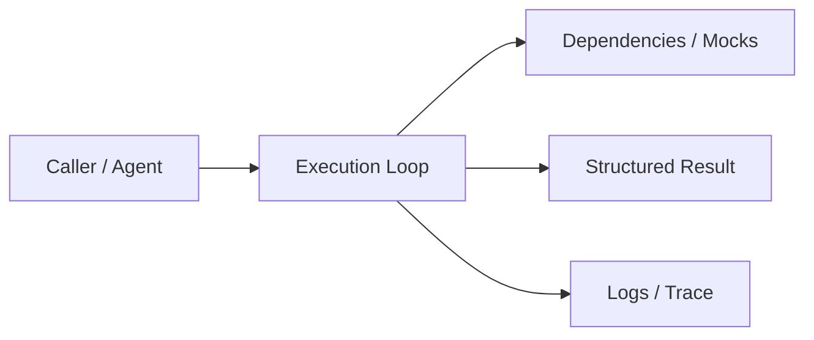
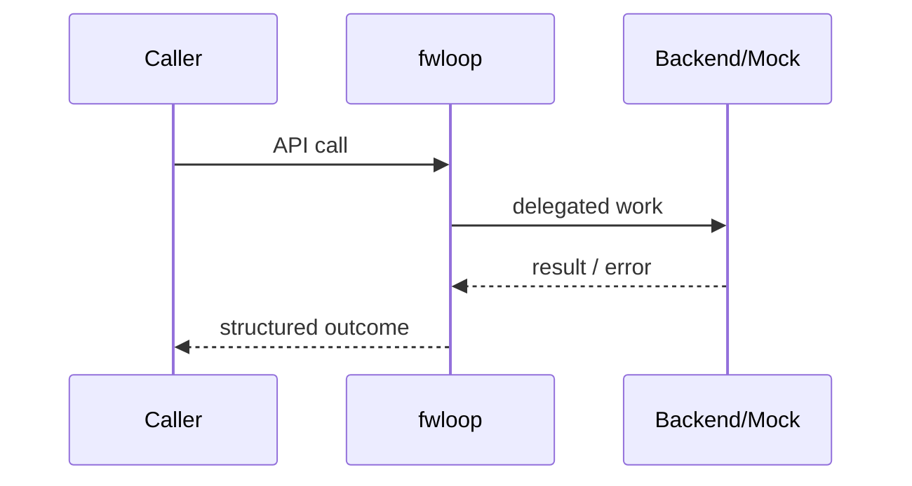

# Chapter 72: Execution Loop

## Chapter Overview

Part VIII — **Build Your Own Framework** — implements **Execution Loop** as package `fwloop`.

The loop is the runtime heart: budgets, history, termination reasons (`stop`, `done`, `max_steps`).

Earlier parts taught agents, retrieval, APIs, and production concerns using ad-hoc modules. Part VIII **owns the seams**: LLM I/O, prompts, tools, skills, planning, loops, memory, workflows, graphs, reflection, scheduling, harness, evaluation, and plugins. Chapter 72 focuses on **Execution Loop** so you can replace vendor frameworks without losing control of behavior, tests, or safety.

**Code:** `code/chapter-072/fwloop/` (offline-testable). **Diagrams:** lifecycle and overview under `diagrams/png/chapter-072/`.

---

## Learning Objectives

After completing this chapter, you can:

- Explain why **Execution Loop** is a first-class framework boundary
- Use and extend the `fwloop` package offline
- Wire execution loop into adjacent Part VIII modules
- Apply production concerns: failure modes, budgets, observability
- Compare this design to popular frameworks without vendor lock-in
- Debug common integration failures with structured traces
- Describe security defaults (deny-by-default, validation, isolation)
- Complete the mini project and exercises with tests green

---

## Prerequisites

- Parts I–VII (platform, agents, systems, APIs, production engineering)
- Earlier Part VIII chapters when `n > 67` (especially client, tools, and loop concepts)
- Comfort with Python protocols, dataclasses, and pytest

---

## Motivation

Agents recurse without a max step counter, never record history, and cannot distinguish stop vs timeout.

Shipping “just call the SDK” works in a demo and collapses under multi-provider needs, CI, multi-tenant safety, and incident response. Framework modules exist so **product teams share one correct implementation** of retries, registries, budgets, and gates—then compose them into agents (Part IX).

---

## First Principles

### 1. Inject decide and act

Loop is policy-agnostic orchestration.

### 2. Hard max_steps

Safety and cost bound.

### 3. History is append-only

Decisions and observations for debug/eval.

### 4. Two success paths

decide stop vs act done.

### 5. Failure is explicit

`ok: false, reason: max_steps`.

---

## Mental Model

Execution loop = game loop — decide, act, observe, until done or budget exhausted.



| Piece | Responsibility |
|---|---|
| Public API | Stable types other chapters import |
| Policy | Retries, permissions, budgets, gates |
| Adapters | Mocks in CI; real backends in prod |
| Observability | Attempts, steps, scores, plugin names |

---

## Core Theory

### API

```text
decide(goal, history) -> {stop?, result?, action?}
act(action) -> {done?, result?, ...}
```

Each iteration:

1. `decision = decide(...)`; record
2. If `stop` → success with result
3. `obs = act(action)`; record
4. If `obs.done` → success
5. Else continue until max_steps

`demo_loop()` shows a one-tick agent for tests.

### Failure cases

Expect partial failure as normal: timeouts, forbidden tools, max steps, failed gates. Prefer structured outcomes over ambient exceptions across agent boundaries.

### Performance implications

Every extra LLM hop multiplies latency and cost. Framework defaults should make budgets obvious (`max_retries`, `max_steps`, `gate`).

### Security implications

Side effects and extensibility are the danger zones (tools, plugins, memory). Validate inputs; allowlist capabilities; never execute model-authored code.

---

## Architecture

```text
code/chapter-072/
  fwloop/           # framework module
  tests/           # offline unit tests
  main.py          # demo entrypoint
  pyproject.toml
  README.md
```



Folder and lifecycle diagrams also render as PNGs in **Visual diagrams**.

---

## Internal Implementation

```bash
cd code/chapter-072 && pytest -q && python3 main.py
```

Assert max_steps failure when decide never stops and act never done.

Read the package source; prefer extending via new registrations and injected callables rather than editing core conditionals for each product.

---

## Production Implementation

- **Scaling:** Stateless module instances behind request workers; shared stores for memory/schedules
- **Caching:** Prompt renders, embeddings, and idempotent tool results where safe
- **Monitoring:** Counters for retries, forbidden tools, max_steps, eval pass rate
- **Configuration:** max_retries, max_steps, gates, allowlists via env/config
- **Retries:** Transient-only at LLM and HTTP edges
- **Security:** Tenant isolation, secret redaction, plugin allowlists
- **Cost:** Token accounting from client usage fields; budget middleware
- **Concurrency:** Safe registries (locks) if hot-reloading plugins

---

## Framework Implementation

LangGraph cycles, AutoGen chat loops, OpenAI Agents runner—all are execution loops with different state models. Own max_steps and trace format.

Do not treat any single framework as universally best. Own interfaces; adopt vendor runtimes when they reduce undifferentiated heavy lifting.

---

## Trade-offs

| Option A | Option B / notes |
|---|---|
| Single loop vs graph (Ch 75) | Loop is simple; graphs express branches clearly. |
| Strict budgets vs long research | Product SLAs may need async jobs (Ch 77). |

---

## Debugging

Common issues:

- Immediate max_steps → decide never stops
- Empty history → not recording
- Non-deterministic flaky tests → unseeded LLM decide

**Workflow:** reproduce offline with mocks → assert structured fields → add one log line per policy decision → fix at the boundary (schema, allowlist, budget) not with prompt superstition.

---

## Performance

max_steps is a cost dial. Parallelize independent acts only with care for state races.

Track p95 latency and cost per successful task, not only happy-path demos.

---

## Security

Budget is a safety control. Combine with tool permissions. Kill switch hook in harness (Ch 78).

Threat model always includes prompt injection driving tool/plugin misuse. Defense is registry policy + harness isolation + eval gates—not model promises.

---

## Best Practices

1. Keep `fwloop` interfaces stable; swap internals freely
2. Test offline with mocks at every I/O boundary
3. Log structured events (step, tool, plan version)
4. Budget steps, tokens, and wall time
5. Default deny on tools, plugins, and memory tenants
6. Gate releases with evaluators before promoting prompts

---

## Anti-Patterns

- **God module** — One file owns client, tools, memory, and HTTP
- **Hidden retries** — Call sites each invent backoff
- **Stringly tools** — Model output executed without registry
- **Unversioned prompts** — No rollback when quality drops
- **Infinite loops** — No max_steps / max_replans
- **Trustful plugins** — Load arbitrary code from disk/URL

---

## Hands-on Exercise

1. Open `code/chapter-072/` and run `pytest -q`.
2. Modify one policy knob (retry, permission, max_steps, gate, allowlist—whichever fits this module).
3. Add or adjust a unit test that fails before the change and passes after.
4. Run `python3 main.py` and note the structured JSON/fields in output.
5. Write three bullets: what would break in multi-tenant production if this module vanished.

---

## Mini Project

Ship a small demo that composes **Execution Loop** with at least one adjacent concept (client, tools, loop, or eval). Keep it offline-testable. Document the composition in five lines in your notes.

---

## Visual diagrams


---

## Chapter Deliverables

| Artifact | Location |
|---|---|
| Manuscript | `book/chapter-072.md` |
| Package | `code/chapter-072/fwloop/` |
| Tests | `code/chapter-072/tests/` |
| Diagrams | `diagrams/mermaid/chapter-072/` |

---

## Interview Questions

1. What termination conditions should an agent loop support?
2. How do you test loops without live LLMs?

---

## Quiz

1. max_steps exceeded returns:
   A) ok true B) ok false reason max_steps C) exception only D) hang
   **Answer:** B

2. History should include:
   A) Only final answer B) Decisions and observations C) GPU temps D) DNS
   **Answer:** B

---

## Cheat Sheet

- `ExecutionLoop(decide, act, max_steps)`
- Termination: stop | done | max_steps
- Inject mocks for decide/act in tests

---

## Curated Free Resources

- [ReAct](https://arxiv.org/abs/2210.03629)

---

## Chapter Summary

**Execution Loop** (`fwloop`) is a Part VIII framework building block: explicit interfaces, offline tests, and production policy hooks. Master it in isolation, then compose with the rest of the harness to build replaceable agent platforms.

---

## What's Next

**Chapter 73: Memory Engine.** Chapter 73 adds memory so loops are not amnesiac across turns.
