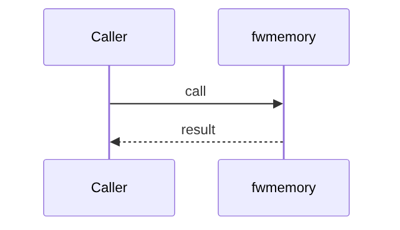
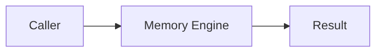

# Chapter 73: Memory Engine

## Chapter Overview

Part VIII framework module **Memory Engine** in `fwmemory`.

## Learning Objectives

- Implement/use `fwmemory`
- Test offline
- Compose with adjacent modules

## Prerequisites

Earlier Part VIII chapters.

## Architecture

`code/chapter-073/fwmemory/`

## Internal Implementation

```bash
cd code/chapter-073 && pytest -q && python3 main.py
```

## Mini Project

Memory Engine module.

## Visual diagrams






## Chapter Deliverables

| Artifact | Location |
|---|---|
| Manuscript | `book/chapter-073.md` |
| Package | `code/chapter-073/fwmemory/` |

## Chapter Summary

Memory Engine as a framework building block.

## What's Next

**Chapter 74** continues Part VIII.
