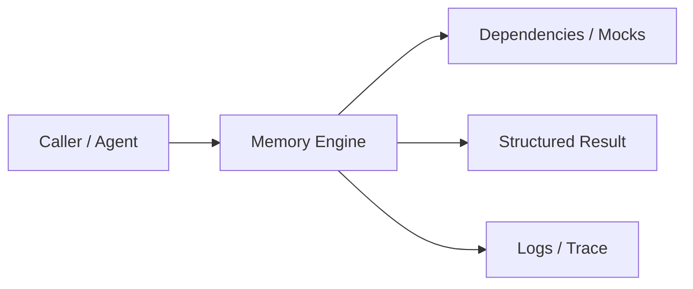
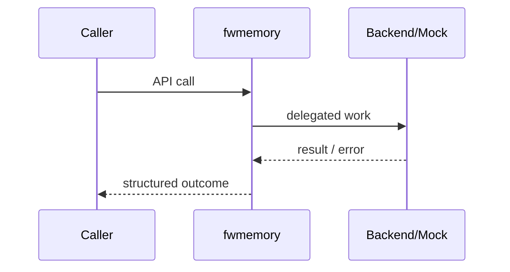

# Chapter 73: Memory Engine

## Chapter Overview

Part VIII — **Build Your Own Framework** — implements **Memory Engine** as package `fwmemory`.

Separate short-term buffers from long-term factual memory; retrieve only relevant facts into context packs.

Earlier parts taught agents, retrieval, APIs, and production concerns using ad-hoc modules. Part VIII **owns the seams**: LLM I/O, prompts, tools, skills, planning, loops, memory, workflows, graphs, reflection, scheduling, harness, evaluation, and plugins. Chapter 73 focuses on **Memory Engine** so you can replace vendor frameworks without losing control of behavior, tests, or safety.

**Code:** `code/chapter-073/fwmemory/` (offline-testable). **Diagrams:** lifecycle and overview under `diagrams/png/chapter-073/`.

---

## Learning Objectives

After completing this chapter, you can:

- Explain why **Memory Engine** is a first-class framework boundary
- Use and extend the `fwmemory` package offline
- Wire memory engine into adjacent Part VIII modules
- Apply production concerns: failure modes, budgets, observability
- Compare this design to popular frameworks without vendor lock-in
- Debug common integration failures with structured traces
- Describe security defaults (deny-by-default, validation, isolation)
- Complete the mini project and exercises with tests green

---

## Prerequisites

- Parts I–VII (platform, agents, systems, APIs, production engineering)
- Earlier Part VIII chapters when `n > 67` (especially client, tools, and loop concepts)
- Comfort with Python protocols, dataclasses, and pytest

---

## Motivation

Multi-turn chat forgets user constraints; long-term facts are pasted into every prompt until context explodes.

Shipping “just call the SDK” works in a demo and collapses under multi-provider needs, CI, multi-tenant safety, and incident response. Framework modules exist so **product teams share one correct implementation** of retries, registries, budgets, and gates—then compose them into agents (Part IX).

---

## First Principles

### 1. Short vs long

Ephemeral dialogue vs durable facts.

### 2. Explicit write

remember(fact) is intentional, not silent.

### 3. Lexical search teaching stand-in

Production uses embeddings (Ch 15+) for semantic memory.

### 4. context(query) packs views

short_term + semantic_hits + summary.

### 5. Summarize for operators

Human-readable state for debug.

---

## Mental Model

Memory engine = working RAM + notebook — short-term turns plus long-term facts you can search.



| Piece | Responsibility |
|---|---|
| Public API | Stable types other chapters import |
| Policy | Retries, permissions, budgets, gates |
| Adapters | Mocks in CI; real backends in prod |
| Observability | Attempts, steps, scores, plugin names |

---

## Core Theory

### Engine operations

- Append short-term messages
- `remember(fact)` long-term
- `search(query, k)` token-overlap rank
- `summarize()` / `context(query)`

### Why not only RAG?

Conversation state is not the same as document RAG. Memory engines track **session + user** state; RAG tracks **corpus** knowledge. Platforms need both.

### Failure cases

Expect partial failure as normal: timeouts, forbidden tools, max steps, failed gates. Prefer structured outcomes over ambient exceptions across agent boundaries.

### Performance implications

Every extra LLM hop multiplies latency and cost. Framework defaults should make budgets obvious (`max_retries`, `max_steps`, `gate`).

### Security implications

Side effects and extensibility are the danger zones (tools, plugins, memory). Validate inputs; allowlist capabilities; never execute model-authored code.

---

## Architecture

```text
code/chapter-073/
  fwmemory/           # framework module
  tests/           # offline unit tests
  main.py          # demo entrypoint
  pyproject.toml
  README.md
```



Folder and lifecycle diagrams also render as PNGs in **Visual diagrams**.

---

## Internal Implementation

```bash
cd code/chapter-073 && pytest -q && python3 main.py
```

Remember facts; search; build context for a query.

Read the package source; prefer extending via new registrations and injected callables rather than editing core conditionals for each product.

---

## Production Implementation

- **Scaling:** Stateless module instances behind request workers; shared stores for memory/schedules
- **Caching:** Prompt renders, embeddings, and idempotent tool results where safe
- **Monitoring:** Counters for retries, forbidden tools, max_steps, eval pass rate
- **Configuration:** max_retries, max_steps, gates, allowlists via env/config
- **Retries:** Transient-only at LLM and HTTP edges
- **Security:** Tenant isolation, secret redaction, plugin allowlists
- **Cost:** Token accounting from client usage fields; budget middleware
- **Concurrency:** Safe registries (locks) if hot-reloading plugins

---

## Framework Implementation

Mem0, LangChain memory classes, Zep, and custom Redis/Postgres stores. Keep a narrow interface so you can swap backends.

Do not treat any single framework as universally best. Own interfaces; adopt vendor runtimes when they reduce undifferentiated heavy lifting.

---

## Trade-offs

| Option A | Option B / notes |
|---|---|
| In-process lists vs durable store | Lists for tests; Redis/Postgres for multi-instance. |
| Lexical vs vector memory | Lexical is offline-simple; vectors catch paraphrase. |

---

## Debugging

Common issues:

- search empty → facts never remembered
- Context too large → no truncation policy
- Cross-tenant bleed → missing tenant keys in prod store

**Workflow:** reproduce offline with mocks → assert structured fields → add one log line per policy decision → fix at the boundary (schema, allowlist, budget) not with prompt superstition.

---

## Performance

Bound short_term length. Index long_term. Avoid embedding every message synchronously without batching.

Track p95 latency and cost per successful task, not only happy-path demos.

---

## Security

Memory often holds PII. Encrypt at rest, scope by tenant/user, support delete (GDPR).

Threat model always includes prompt injection driving tool/plugin misuse. Defense is registry policy + harness isolation + eval gates—not model promises.

---

## Best Practices

1. Keep `fwmemory` interfaces stable; swap internals freely
2. Test offline with mocks at every I/O boundary
3. Log structured events (step, tool, plan version)
4. Budget steps, tokens, and wall time
5. Default deny on tools, plugins, and memory tenants
6. Gate releases with evaluators before promoting prompts

---

## Anti-Patterns

- **God module** — One file owns client, tools, memory, and HTTP
- **Hidden retries** — Call sites each invent backoff
- **Stringly tools** — Model output executed without registry
- **Unversioned prompts** — No rollback when quality drops
- **Infinite loops** — No max_steps / max_replans
- **Trustful plugins** — Load arbitrary code from disk/URL

---

## Hands-on Exercise

1. Open `code/chapter-073/` and run `pytest -q`.
2. Modify one policy knob (retry, permission, max_steps, gate, allowlist—whichever fits this module).
3. Add or adjust a unit test that fails before the change and passes after.
4. Run `python3 main.py` and note the structured JSON/fields in output.
5. Write three bullets: what would break in multi-tenant production if this module vanished.

---

## Mini Project

Ship a small demo that composes **Memory Engine** with at least one adjacent concept (client, tools, loop, or eval). Keep it offline-testable. Document the composition in five lines in your notes.

---

## Visual diagrams


---

## Chapter Deliverables

| Artifact | Location |
|---|---|
| Manuscript | `book/chapter-073.md` |
| Package | `code/chapter-073/fwmemory/` |
| Tests | `code/chapter-073/tests/` |
| Diagrams | `diagrams/mermaid/chapter-073/` |

---

## Interview Questions

1. Short-term vs long-term memory in agents?
2. How do you prevent cross-tenant memory leaks?

---

## Quiz

1. remember() writes to:
   A) short_term only B) long_term C) GPU D) DNS
   **Answer:** B

2. context(query) should return:
   A) Only embeddings B) short_term + hits + summary C) Raw SQL D) PDF bytes
   **Answer:** B

---

## Cheat Sheet

- short_term buffer + long_term facts
- `remember`, `search`, `context`
- Scope memory by tenant in production

---

## Curated Free Resources

- [Cognitive architectures overview](https://en.wikipedia.org/wiki/Cognitive_architecture)

---

## Chapter Summary

**Memory Engine** (`fwmemory`) is a Part VIII framework building block: explicit interfaces, offline tests, and production policy hooks. Master it in isolation, then compose with the rest of the harness to build replaceable agent platforms.

---

## What's Next

**Chapter 74: Workflow Engine.** Chapter 74 runs multi-step workflows with retries—often loading/storing memory between steps.
