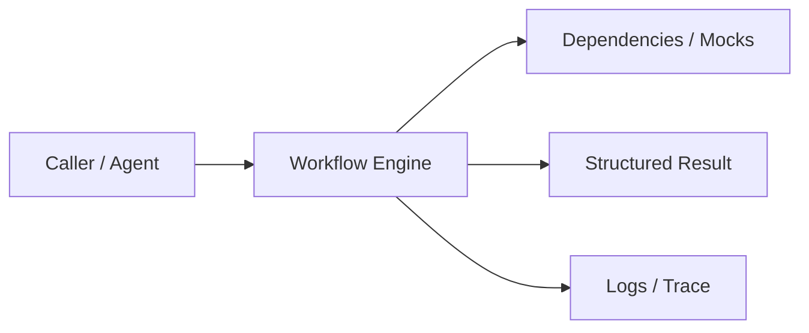
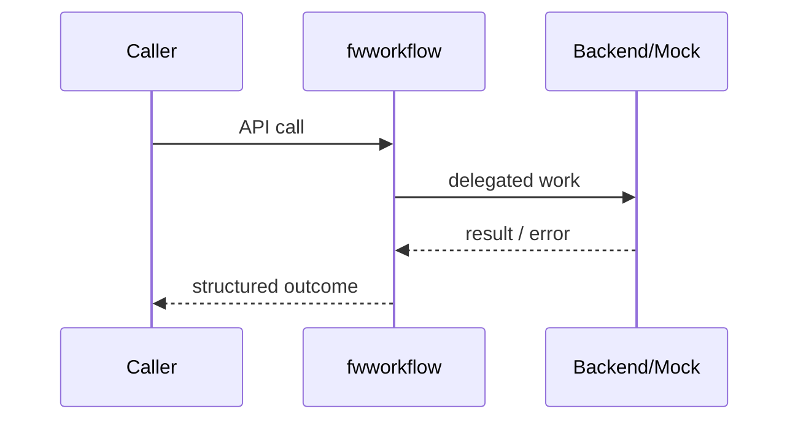
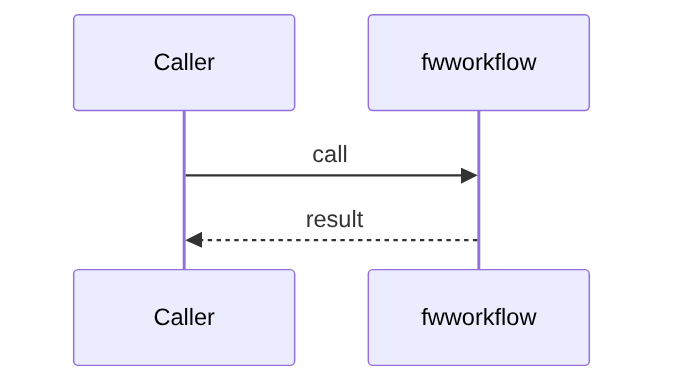
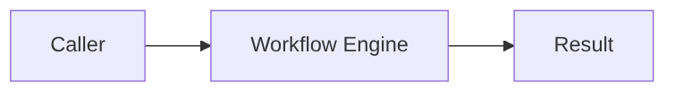

# Chapter 74: Workflow Engine

## Chapter Overview

Part VIII — **Build Your Own Framework** — implements **Workflow Engine** as package `fwworkflow`.

Deterministic multi-step pipelines need named steps, per-step retries, shared state, and ok/fail traces—distinct from free-form agent loops.

Earlier parts taught agents, retrieval, APIs, and production concerns using ad-hoc modules. Part VIII **owns the seams**: LLM I/O, prompts, tools, skills, planning, loops, memory, workflows, graphs, reflection, scheduling, harness, evaluation, and plugins. Chapter 74 focuses on **Workflow Engine** so you can replace vendor frameworks without losing control of behavior, tests, or safety.

**Code:** `code/chapter-074/fwworkflow/` (offline-testable). **Diagrams:** lifecycle and overview under `diagrams/png/chapter-074/`.

---

## Learning Objectives

After completing this chapter, you can:

- Explain why **Workflow Engine** is a first-class framework boundary
- Use and extend the `fwworkflow` package offline
- Wire workflow engine into adjacent Part VIII modules
- Apply production concerns: failure modes, budgets, observability
- Compare this design to popular frameworks without vendor lock-in
- Debug common integration failures with structured traces
- Describe security defaults (deny-by-default, validation, isolation)
- Complete the mini project and exercises with tests green

---

## Prerequisites

- Parts I–VII (platform, agents, systems, APIs, production engineering)
- Earlier Part VIII chapters when `n > 67` (especially client, tools, and loop concepts)
- Comfort with Python protocols, dataclasses, and pytest

---

## Motivation

Business flows (ingest → enrich → notify) are coded as nested try/except spaghetti with no step trace.

Shipping “just call the SDK” works in a demo and collapses under multi-provider needs, CI, multi-tenant safety, and incident response. Framework modules exist so **product teams share one correct implementation** of retries, registries, budgets, and gates—then compose them into agents (Part IX).

---

## First Principles

### 1. Steps are pure-ish functions of state

`fn(state) -> partial state update`.

### 2. Per-step retries

Transient failures do not fail the whole flow immediately.

### 3. Trace every attempt

Observability built in.

### 4. Fail returns partial state

Operators see where it stopped.

### 5. Workflow ≠ agent loop

Fixed graph of business steps vs open-ended decide/act.

---

## Mental Model

Workflow engine = assembly line — ordered steps with retry policy and a trace.



| Piece | Responsibility |
|---|---|
| Public API | Stable types other chapters import |
| Policy | Retries, permissions, budgets, gates |
| Adapters | Mocks in CI; real backends in prod |
| Observability | Attempts, steps, scores, plugin names |

---

## Core Theory

### Model

`Step(name, fn, retries)` + `WorkflowEngine.add` + `run(ctx)`.

On exception: retry until attempts > retries, then return `{ok: false, failed, error, trace, state}`.

Success: `{ok: true, state, trace}`.

Use workflows for ETL-like agent prep; use loops (Ch 72) for conversational tool use.

### Failure cases

Expect partial failure as normal: timeouts, forbidden tools, max steps, failed gates. Prefer structured outcomes over ambient exceptions across agent boundaries.

### Performance implications

Every extra LLM hop multiplies latency and cost. Framework defaults should make budgets obvious (`max_retries`, `max_steps`, `gate`).

### Security implications

Side effects and extensibility are the danger zones (tools, plugins, memory). Validate inputs; allowlist capabilities; never execute model-authored code.

---

## Architecture

```text
code/chapter-074/
  fwworkflow/           # framework module
  tests/           # offline unit tests
  main.py          # demo entrypoint
  pyproject.toml
  README.md
```



Folder and lifecycle diagrams also render as PNGs in **Visual diagrams**.

---

## Internal Implementation

```bash
cd code/chapter-074 && pytest -q && python3 main.py
```

Inject a flaky step with retries=2; assert trace attempts.

Read the package source; prefer extending via new registrations and injected callables rather than editing core conditionals for each product.

---

## Production Implementation

- **Scaling:** Stateless module instances behind request workers; shared stores for memory/schedules
- **Caching:** Prompt renders, embeddings, and idempotent tool results where safe
- **Monitoring:** Counters for retries, forbidden tools, max_steps, eval pass rate
- **Configuration:** max_retries, max_steps, gates, allowlists via env/config
- **Retries:** Transient-only at LLM and HTTP edges
- **Security:** Tenant isolation, secret redaction, plugin allowlists
- **Cost:** Token accounting from client usage fields; budget middleware
- **Concurrency:** Safe registries (locks) if hot-reloading plugins

---

## Framework Implementation

Temporal, Prefect, Airflow, LangGraph linear graphs. Your teaching engine is the contract; production may host on Temporal.

Do not treat any single framework as universally best. Own interfaces; adopt vendor runtimes when they reduce undifferentiated heavy lifting.

---

## Trade-offs

| Option A | Option B / notes |
|---|---|
| Linear workflow vs graph | Linear is clear; branching needs Ch 75. |
| In-process vs durable orchestration | In-process dies with process; durable survives. |

---

## Debugging

Common issues:

- Infinite retry misconfig → retries too high + always failing fn
- State keys overwritten → naming collisions
- Silent success with empty steps → forgot add()

**Workflow:** reproduce offline with mocks → assert structured fields → add one log line per policy decision → fix at the boundary (schema, allowlist, budget) not with prompt superstition.

---

## Performance

Parallelize independent steps only with explicit fan-out design. Retries amplify tail latency.

Track p95 latency and cost per successful task, not only happy-path demos.

---

## Security

Steps that call tools need the same permission checks. Do not pass raw secrets through state logs.

Threat model always includes prompt injection driving tool/plugin misuse. Defense is registry policy + harness isolation + eval gates—not model promises.

---

## Best Practices

1. Keep `fwworkflow` interfaces stable; swap internals freely
2. Test offline with mocks at every I/O boundary
3. Log structured events (step, tool, plan version)
4. Budget steps, tokens, and wall time
5. Default deny on tools, plugins, and memory tenants
6. Gate releases with evaluators before promoting prompts

---

## Anti-Patterns

- **God module** — One file owns client, tools, memory, and HTTP
- **Hidden retries** — Call sites each invent backoff
- **Stringly tools** — Model output executed without registry
- **Unversioned prompts** — No rollback when quality drops
- **Infinite loops** — No max_steps / max_replans
- **Trustful plugins** — Load arbitrary code from disk/URL

---

## Hands-on Exercise

1. Open `code/chapter-074/` and run `pytest -q`.
2. Modify one policy knob (retry, permission, max_steps, gate, allowlist—whichever fits this module).
3. Add or adjust a unit test that fails before the change and passes after.
4. Run `python3 main.py` and note the structured JSON/fields in output.
5. Write three bullets: what would break in multi-tenant production if this module vanished.

---

## Mini Project

Ship a small demo that composes **Workflow Engine** with at least one adjacent concept (client, tools, loop, or eval). Keep it offline-testable. Document the composition in five lines in your notes.

---

## Visual diagrams





---

## Chapter Deliverables

| Artifact | Location |
|---|---|
| Manuscript | `book/chapter-074.md` |
| Package | `code/chapter-074/fwworkflow/` |
| Tests | `code/chapter-074/tests/` |
| Diagrams | `diagrams/mermaid/chapter-074/` |

---

## Interview Questions

1. Workflow engine vs agent execution loop?
2. How do you make workflows durable across restarts?

---

## Quiz

1. When steps raise past retries, engine returns:
   A) ok true B) ok false with failed step C) Nothing D) Reboot
   **Answer:** B

2. Trace is for:
   A) GPU B) Observability of attempts C) Embeddings D) DNS
   **Answer:** B

---

## Cheat Sheet

- `Step(name, fn, retries)`
- `engine.run(ctx) -> ok/state/trace`
- Use for deterministic pipelines

---

## Curated Free Resources

- [Temporal docs](https://docs.temporal.io/)

---

## Chapter Summary

**Workflow Engine** (`fwworkflow`) is a Part VIII framework building block: explicit interfaces, offline tests, and production policy hooks. Master it in isolation, then compose with the rest of the harness to build replaceable agent platforms.

---

## What's Next

**Chapter 75: Graph Engine.** Chapter 75 generalizes linear workflows into directed graphs with shared state.
