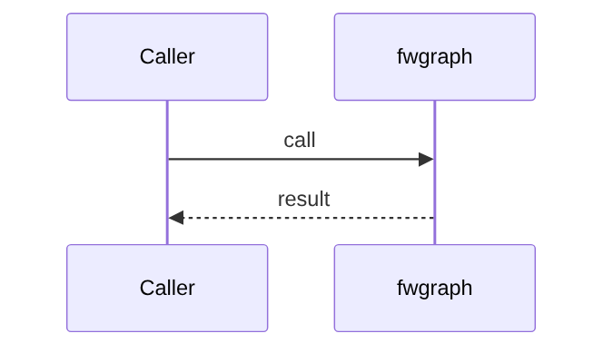
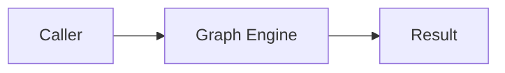

# Chapter 75: Graph Engine

## Chapter Overview

Part VIII framework module **Graph Engine** in `fwgraph`.

## Learning Objectives

- Implement/use `fwgraph`
- Test offline
- Compose with adjacent modules

## Prerequisites

Earlier Part VIII chapters.

## Architecture

`code/chapter-075/fwgraph/`

## Internal Implementation

```bash
cd code/chapter-075 && pytest -q && python3 main.py
```

## Mini Project

Graph Engine module.

## Visual diagrams






## Chapter Deliverables

| Artifact | Location |
|---|---|
| Manuscript | `book/chapter-075.md` |
| Package | `code/chapter-075/fwgraph/` |

## Chapter Summary

Graph Engine as a framework building block.

## What's Next

**Chapter 76** continues Part VIII.
