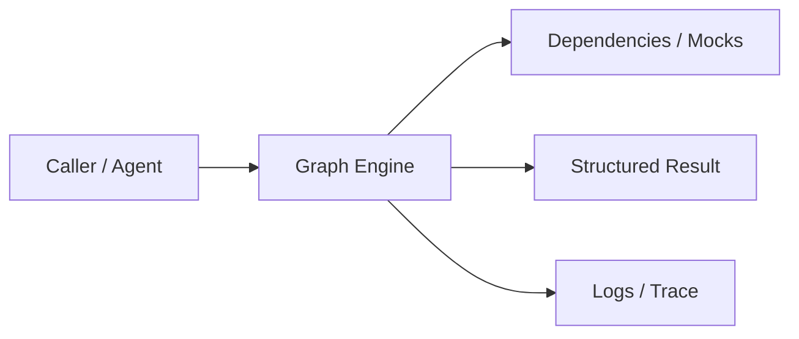
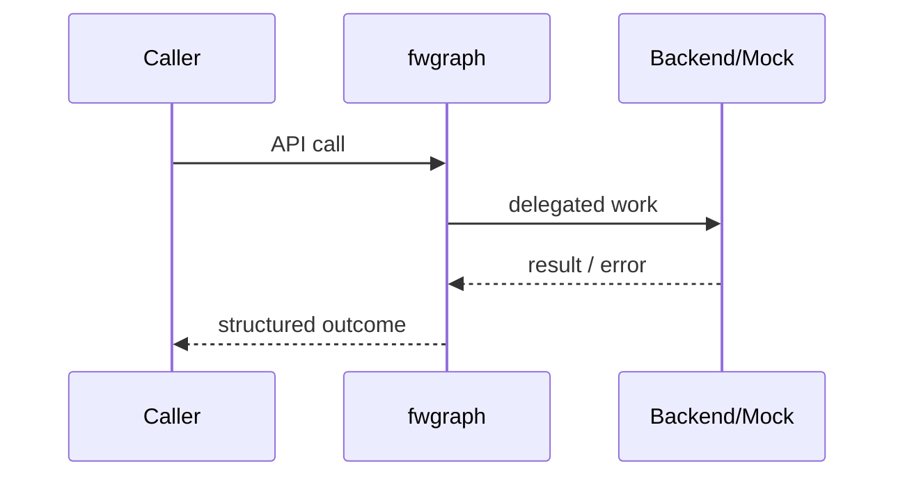

# Chapter 75: Graph Engine

## Chapter Overview

Part VIII — **Build Your Own Framework** — implements **Graph Engine** as package `fwgraph`.

Graphs make control flow explicit: nodes, edges, shared state, start, end, max_steps safety.

Earlier parts taught agents, retrieval, APIs, and production concerns using ad-hoc modules. Part VIII **owns the seams**: LLM I/O, prompts, tools, skills, planning, loops, memory, workflows, graphs, reflection, scheduling, harness, evaluation, and plugins. Chapter 75 focuses on **Graph Engine** so you can replace vendor frameworks without losing control of behavior, tests, or safety.

**Code:** `code/chapter-075/fwgraph/` (offline-testable). **Diagrams:** lifecycle and overview under `diagrams/png/chapter-075/`.

---

## Learning Objectives

After completing this chapter, you can:

- Explain why **Graph Engine** is a first-class framework boundary
- Use and extend the `fwgraph` package offline
- Wire graph engine into adjacent Part VIII modules
- Apply production concerns: failure modes, budgets, observability
- Compare this design to popular frameworks without vendor lock-in
- Debug common integration failures with structured traces
- Describe security defaults (deny-by-default, validation, isolation)
- Complete the mini project and exercises with tests green

---

## Prerequisites

- Parts I–VII (platform, agents, systems, APIs, production engineering)
- Earlier Part VIII chapters when `n > 67` (especially client, tools, and loop concepts)
- Comfort with Python protocols, dataclasses, and pytest

---

## Motivation

Linear workflows cannot branch (approve vs reject) without nested if-ladders copied everywhere.

Shipping “just call the SDK” works in a demo and collapses under multi-provider needs, CI, multi-tenant safety, and incident response. Framework modules exist so **product teams share one correct implementation** of retries, registries, budgets, and gates—then compose them into agents (Part IX).

---

## First Principles

### 1. Nodes update state

Pure functions `state -> delta`.

### 2. Edges are routing

Teaching engine uses fixed next; production adds conditional edges.

### 3. max_steps prevents cycles

Even with simple edges, guard loops.

### 4. path in state

Audit which nodes ran.

### 5. end / __end__ terminals

Clear completion markers.

---

## Mental Model

Graph engine = subway map — nodes do work, edges choose the next station, state is the passenger bag.



| Piece | Responsibility |
|---|---|
| Public API | Stable types other chapters import |
| Policy | Retries, permissions, budgets, gates |
| Adapters | Mocks in CI; real backends in prod |
| Observability | Attempts, steps, scores, plugin names |

---

## Core Theory

### API

- `add_node(name, fn)`
- `add_edge(a, b)`
- `run(state, max_steps=20)` from `start`

Each step: run node, append to path, follow edge or `end`.

Conditional routing (production): edge functions or router nodes that set `state["next"]`.

LangGraph popularized this model; own a minimal graph so you understand checkpoints and reducers later.

### Failure cases

Expect partial failure as normal: timeouts, forbidden tools, max steps, failed gates. Prefer structured outcomes over ambient exceptions across agent boundaries.

### Performance implications

Every extra LLM hop multiplies latency and cost. Framework defaults should make budgets obvious (`max_retries`, `max_steps`, `gate`).

### Security implications

Side effects and extensibility are the danger zones (tools, plugins, memory). Validate inputs; allowlist capabilities; never execute model-authored code.

---

## Architecture

```text
code/chapter-075/
  fwgraph/           # framework module
  tests/           # offline unit tests
  main.py          # demo entrypoint
  pyproject.toml
  README.md
```



Folder and lifecycle diagrams also render as PNGs in **Visual diagrams**.

---

## Internal Implementation

```bash
cd code/chapter-075 && pytest -q && python3 main.py
```

Build start→work→end; assert path order.

Read the package source; prefer extending via new registrations and injected callables rather than editing core conditionals for each product.

---

## Production Implementation

- **Scaling:** Stateless module instances behind request workers; shared stores for memory/schedules
- **Caching:** Prompt renders, embeddings, and idempotent tool results where safe
- **Monitoring:** Counters for retries, forbidden tools, max_steps, eval pass rate
- **Configuration:** max_retries, max_steps, gates, allowlists via env/config
- **Retries:** Transient-only at LLM and HTTP edges
- **Security:** Tenant isolation, secret redaction, plugin allowlists
- **Cost:** Token accounting from client usage fields; budget middleware
- **Concurrency:** Safe registries (locks) if hot-reloading plugins

---

## Framework Implementation

LangGraph, Prefect flows, Airflow DAGs, custom state machines (Ch 41). Compare checkpointing and human-in-the-loop interrupts.

Do not treat any single framework as universally best. Own interfaces; adopt vendor runtimes when they reduce undifferentiated heavy lifting.

---

## Trade-offs

| Option A | Option B / notes |
|---|---|
| Fixed edges vs conditional | Fixed is testable; conditional is expressive. |
| Graph vs loop | Graphs document structure; loops are fewer abstractions for tiny agents. |

---

## Debugging

Common issues:

- KeyError node → edge points to missing node
- max_steps hit → accidental cycle
- State clobber → nodes write same keys differently

**Workflow:** reproduce offline with mocks → assert structured fields → add one log line per policy decision → fix at the boundary (schema, allowlist, budget) not with prompt superstition.

---

## Performance

Keep nodes small. Fan-out/fan-in needs explicit parallel support (future extension).

Track p95 latency and cost per successful task, not only happy-path demos.

---

## Security

Router nodes must not accept unvalidated next-node names from users (`open redirect` for graphs).

Threat model always includes prompt injection driving tool/plugin misuse. Defense is registry policy + harness isolation + eval gates—not model promises.

---

## Best Practices

1. Keep `fwgraph` interfaces stable; swap internals freely
2. Test offline with mocks at every I/O boundary
3. Log structured events (step, tool, plan version)
4. Budget steps, tokens, and wall time
5. Default deny on tools, plugins, and memory tenants
6. Gate releases with evaluators before promoting prompts

---

## Anti-Patterns

- **God module** — One file owns client, tools, memory, and HTTP
- **Hidden retries** — Call sites each invent backoff
- **Stringly tools** — Model output executed without registry
- **Unversioned prompts** — No rollback when quality drops
- **Infinite loops** — No max_steps / max_replans
- **Trustful plugins** — Load arbitrary code from disk/URL

---

## Hands-on Exercise

1. Open `code/chapter-075/` and run `pytest -q`.
2. Modify one policy knob (retry, permission, max_steps, gate, allowlist—whichever fits this module).
3. Add or adjust a unit test that fails before the change and passes after.
4. Run `python3 main.py` and note the structured JSON/fields in output.
5. Write three bullets: what would break in multi-tenant production if this module vanished.

---

## Mini Project

Ship a small demo that composes **Graph Engine** with at least one adjacent concept (client, tools, loop, or eval). Keep it offline-testable. Document the composition in five lines in your notes.

---

## Visual diagrams


---

## Chapter Deliverables

| Artifact | Location |
|---|---|
| Manuscript | `book/chapter-075.md` |
| Package | `code/chapter-075/fwgraph/` |
| Tests | `code/chapter-075/tests/` |
| Diagrams | `diagrams/mermaid/chapter-075/` |

---

## Interview Questions

1. When is a graph better than a linear workflow?
2. How do you prevent infinite cycles in agent graphs?

---

## Quiz

1. path in state records:
   A) Tokens B) Nodes executed C) GPUs D) DNS
   **Answer:** B

2. max_steps protects against:
   A) Disk full B) Cycles C) TLS D) JSON
   **Answer:** B

---

## Cheat Sheet

- `add_node`, `add_edge`, `run`
- Terminals: end / __end__
- Guard with max_steps

---

## Curated Free Resources

- [LangGraph conceptual guide](https://langchain-ai.github.io/langgraph/)

---

## Chapter Summary

**Graph Engine** (`fwgraph`) is a Part VIII framework building block: explicit interfaces, offline tests, and production policy hooks. Master it in isolation, then compose with the rest of the harness to build replaceable agent platforms.

---

## What's Next

**Chapter 76: Reflection Engine.** Chapter 76 adds reflection/critique nodes to improve answers before finishing.
