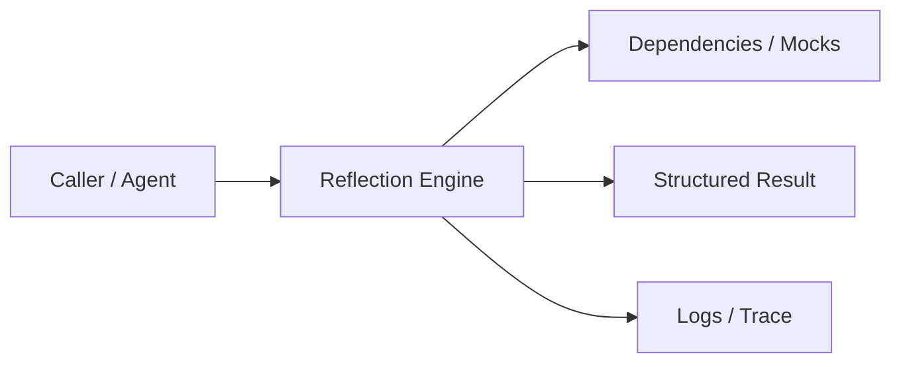
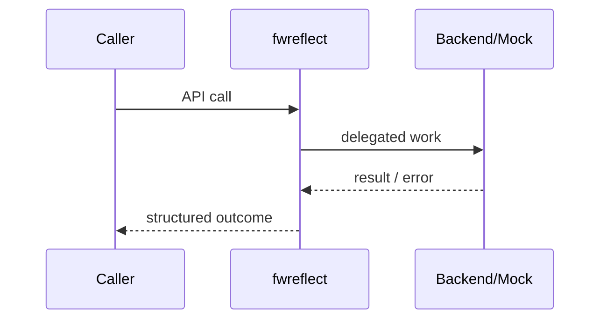
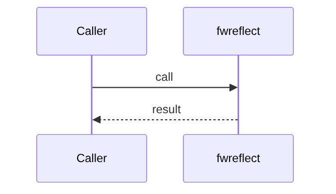
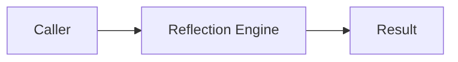

# Chapter 76: Reflection Engine

## Chapter Overview

Part VIII — **Build Your Own Framework** — implements **Reflection Engine** as package `fwreflect`.

Reflection/critique is a deliberate quality stage: issues list, confidence, revised text, accept/reject threshold.

Earlier parts taught agents, retrieval, APIs, and production concerns using ad-hoc modules. Part VIII **owns the seams**: LLM I/O, prompts, tools, skills, planning, loops, memory, workflows, graphs, reflection, scheduling, harness, evaluation, and plugins. Chapter 76 focuses on **Reflection Engine** so you can replace vendor frameworks without losing control of behavior, tests, or safety.

**Code:** `code/chapter-076/fwreflect/` (offline-testable). **Diagrams:** lifecycle and overview under `diagrams/png/chapter-076/`.

---

## Learning Objectives

After completing this chapter, you can:

- Explain why **Reflection Engine** is a first-class framework boundary
- Use and extend the `fwreflect` package offline
- Wire reflection engine into adjacent Part VIII modules
- Apply production concerns: failure modes, budgets, observability
- Compare this design to popular frameworks without vendor lock-in
- Debug common integration failures with structured traces
- Describe security defaults (deny-by-default, validation, isolation)
- Complete the mini project and exercises with tests green

---

## Prerequisites

- Parts I–VII (platform, agents, systems, APIs, production engineering)
- Earlier Part VIII chapters when `n > 67` (especially client, tools, and loop concepts)
- Comfort with Python protocols, dataclasses, and pytest

---

## Motivation

Agents emit short or ungrounded answers and ship them. No second pass checks quality before the user sees them.

Shipping “just call the SDK” works in a demo and collapses under multi-provider needs, CI, multi-tenant safety, and incident response. Framework modules exist so **product teams share one correct implementation** of retries, registries, budgets, and gates—then compose them into agents (Part IX).

---

## First Principles

### 1. Critique is structured

Issues codes beat free-form grumbling.

### 2. Evidence check

Optional grounding against provided evidence string.

### 3. Confidence heuristic

Teaching: decays with issue count; production: learned or LLM judge.

### 4. Revise when possible

Auto-expand short answers; attach evidence snippets.

### 5. accepted gate

Downstream only ships if confidence ≥ threshold.

---

## Mental Model

Reflection = code review for model output — critique, score confidence, optionally revise.



| Piece | Responsibility |
|---|---|
| Public API | Stable types other chapters import |
| Policy | Retries, permissions, budgets, gates |
| Adapters | Mocks in CI; real backends in prod |
| Observability | Attempts, steps, scores, plugin names |

---

## Core Theory

### critique(answer, evidence="")

Issues:

- `too_short` if below `min_len`
- `ungrounded` if evidence tokens absent from answer

Returns `{issues, confidence, revised, accepted}`.

Place reflection after act and before final user response in loops/graphs. Combine with Ch 79 evaluators for offline gates; reflection is online.

### Failure cases

Expect partial failure as normal: timeouts, forbidden tools, max steps, failed gates. Prefer structured outcomes over ambient exceptions across agent boundaries.

### Performance implications

Every extra LLM hop multiplies latency and cost. Framework defaults should make budgets obvious (`max_retries`, `max_steps`, `gate`).

### Security implications

Side effects and extensibility are the danger zones (tools, plugins, memory). Validate inputs; allowlist capabilities; never execute model-authored code.

---

## Architecture

```text
code/chapter-076/
  fwreflect/           # framework module
  tests/           # offline unit tests
  main.py          # demo entrypoint
  pyproject.toml
  README.md
```



Folder and lifecycle diagrams also render as PNGs in **Visual diagrams**.

---

## Internal Implementation

```bash
cd code/chapter-076 && pytest -q && python3 main.py
```

Feed short answer; assert too_short and revised longer.

Read the package source; prefer extending via new registrations and injected callables rather than editing core conditionals for each product.

---

## Production Implementation

- **Scaling:** Stateless module instances behind request workers; shared stores for memory/schedules
- **Caching:** Prompt renders, embeddings, and idempotent tool results where safe
- **Monitoring:** Counters for retries, forbidden tools, max_steps, eval pass rate
- **Configuration:** max_retries, max_steps, gates, allowlists via env/config
- **Retries:** Transient-only at LLM and HTTP edges
- **Security:** Tenant isolation, secret redaction, plugin allowlists
- **Cost:** Token accounting from client usage fields; budget middleware
- **Concurrency:** Safe registries (locks) if hot-reloading plugins

---

## Framework Implementation

Reflexion papers, critic agents in AutoGen/CrewAI, LLM-as-judge. Separate **online reflection** from **offline eval suites**.

Do not treat any single framework as universally best. Own interfaces; adopt vendor runtimes when they reduce undifferentiated heavy lifting.

---

## Trade-offs

| Option A | Option B / notes |
|---|---|
| Always reflect vs sample | Always costs latency; sample by risk. |
| Heuristic vs LLM critic | Heuristic free/offline; LLM critic smarter/costly. |

---

## Debugging

Common issues:

- Always ungrounded → evidence tokenization too strict
- accepted never true → threshold vs heuristic mismatch
- Infinite revise loops → no max reflect rounds

**Workflow:** reproduce offline with mocks → assert structured fields → add one log line per policy decision → fix at the boundary (schema, allowlist, budget) not with prompt superstition.

---

## Performance

Reflection can double LLM cost. Use cheap heuristics first; escalate to LLM critic on failures.

Track p95 latency and cost per successful task, not only happy-path demos.

---

## Security

Critic prompts can leak system instructions if logs are naive. Do not trust revised text more than policy allows.

Threat model always includes prompt injection driving tool/plugin misuse. Defense is registry policy + harness isolation + eval gates—not model promises.

---

## Best Practices

1. Keep `fwreflect` interfaces stable; swap internals freely
2. Test offline with mocks at every I/O boundary
3. Log structured events (step, tool, plan version)
4. Budget steps, tokens, and wall time
5. Default deny on tools, plugins, and memory tenants
6. Gate releases with evaluators before promoting prompts

---

## Anti-Patterns

- **God module** — One file owns client, tools, memory, and HTTP
- **Hidden retries** — Call sites each invent backoff
- **Stringly tools** — Model output executed without registry
- **Unversioned prompts** — No rollback when quality drops
- **Infinite loops** — No max_steps / max_replans
- **Trustful plugins** — Load arbitrary code from disk/URL

---

## Hands-on Exercise

1. Open `code/chapter-076/` and run `pytest -q`.
2. Modify one policy knob (retry, permission, max_steps, gate, allowlist—whichever fits this module).
3. Add or adjust a unit test that fails before the change and passes after.
4. Run `python3 main.py` and note the structured JSON/fields in output.
5. Write three bullets: what would break in multi-tenant production if this module vanished.

---

## Mini Project

Ship a small demo that composes **Reflection Engine** with at least one adjacent concept (client, tools, loop, or eval). Keep it offline-testable. Document the composition in five lines in your notes.

---

## Visual diagrams





---

## Chapter Deliverables

| Artifact | Location |
|---|---|
| Manuscript | `book/chapter-076.md` |
| Package | `code/chapter-076/fwreflect/` |
| Tests | `code/chapter-076/tests/` |
| Diagrams | `diagrams/mermaid/chapter-076/` |

---

## Interview Questions

1. Online reflection vs offline evaluation?
2. How do you bound cost of critic agents?

---

## Quiz

1. accepted true means:
   A) Deployed to k8s B) confidence ≥ threshold C) Tool ran D) Embed ok
   **Answer:** B

2. too_short triggers when:
   A) GPU hot B) answer below min_len C) DNS fail D) JSON invalid
   **Answer:** B

---

## Cheat Sheet

- `critique(answer, evidence=...)`
- issues → confidence → revised → accepted
- Bound reflection rounds

---

## Curated Free Resources

- [Reflexion paper](https://arxiv.org/abs/2303.11366)

---

## Chapter Summary

**Reflection Engine** (`fwreflect`) is a Part VIII framework building block: explicit interfaces, offline tests, and production policy hooks. Master it in isolation, then compose with the rest of the harness to build replaceable agent platforms.

---

## What's Next

**Chapter 77: Scheduler.** Chapter 77 schedules deferred/repeated jobs—reflection batches can run async.
