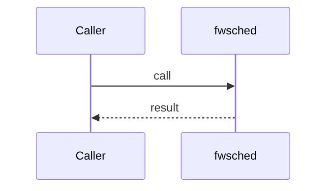

# Chapter 77: Scheduler

## Chapter Overview

Part VIII framework module **Scheduler** in `fwsched`.

## Learning Objectives

- Implement/use `fwsched`
- Test offline
- Compose with adjacent modules

## Prerequisites

Earlier Part VIII chapters.

## Architecture

`code/chapter-077/fwsched/`

## Internal Implementation

```bash
cd code/chapter-077 && pytest -q && python3 main.py
```

## Mini Project

Scheduler module.

## Visual diagrams




## Chapter Deliverables

| Artifact | Location |
|---|---|
| Manuscript | `book/chapter-077.md` |
| Package | `code/chapter-077/fwsched/` |

## Chapter Summary

Scheduler as a framework building block.

## What's Next

**Chapter 78** continues Part VIII.
