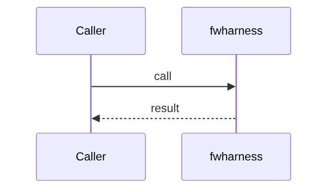
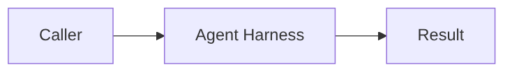

# Chapter 78: Agent Harness

## Chapter Overview

Part VIII framework module **Agent Harness** in `fwharness`.

## Learning Objectives

- Implement/use `fwharness`
- Test offline
- Compose with adjacent modules

## Prerequisites

Earlier Part VIII chapters.

## Architecture

`code/chapter-078/fwharness/`

## Internal Implementation

```bash
cd code/chapter-078 && pytest -q && python3 main.py
```

## Mini Project

Agent Harness module.

## Visual diagrams






## Chapter Deliverables

| Artifact | Location |
|---|---|
| Manuscript | `book/chapter-078.md` |
| Package | `code/chapter-078/fwharness/` |

## Chapter Summary

Agent Harness as a framework building block.

## What's Next

**Chapter 79** continues Part VIII.
