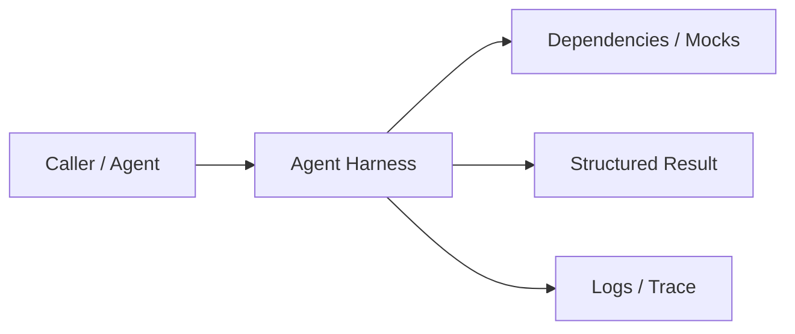
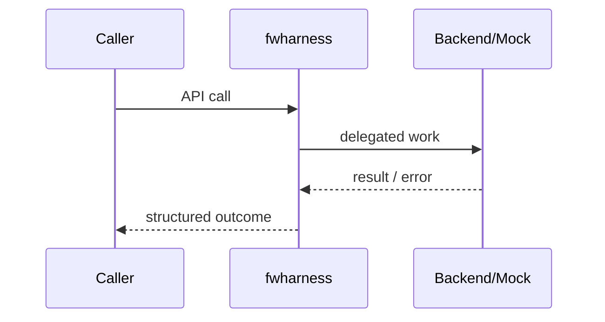

# Chapter 78: Agent Harness

## Chapter Overview

Part VIII — **Build Your Own Framework** — implements **Agent Harness** as package `fwharness`.

A harness standardizes how any agent function is run: step counter, context, hooks, lifecycle labels (`succeeded` | `max_steps`).

Earlier parts taught agents, retrieval, APIs, and production concerns using ad-hoc modules. Part VIII **owns the seams**: LLM I/O, prompts, tools, skills, planning, loops, memory, workflows, graphs, reflection, scheduling, harness, evaluation, and plugins. Chapter 78 focuses on **Agent Harness** so you can replace vendor frameworks without losing control of behavior, tests, or safety.

**Code:** `code/chapter-078/fwharness/` (offline-testable). **Diagrams:** lifecycle and overview under `diagrams/png/chapter-078/`.

---

## Learning Objectives

After completing this chapter, you can:

- Explain why **Agent Harness** is a first-class framework boundary
- Use and extend the `fwharness` package offline
- Wire agent harness into adjacent Part VIII modules
- Apply production concerns: failure modes, budgets, observability
- Compare this design to popular frameworks without vendor lock-in
- Debug common integration failures with structured traces
- Describe security defaults (deny-by-default, validation, isolation)
- Complete the mini project and exercises with tests green

---

## Prerequisites

- Parts I–VII (platform, agents, systems, APIs, production engineering)
- Earlier Part VIII chapters when `n > 67` (especially client, tools, and loop concepts)
- Comfort with Python protocols, dataclasses, and pytest

---

## Motivation

Agents are called raw; no shared lifecycle, no hooks for logging/metrics, no isolation context, no uniform success/max_steps outcome.

Shipping “just call the SDK” works in a demo and collapses under multi-provider needs, CI, multi-tenant safety, and incident response. Framework modules exist so **product teams share one correct implementation** of retries, registries, budgets, and gates—then compose them into agents (Part IX).

---

## First Principles

### 1. Agent is a function

`(goal, ctx) -> {done?, result?, state?}`.

### 2. Harness owns lifecycle

Callers do not reimplement step loops differently each time.

### 3. Hooks observe

Metrics/tracing without modifying agent core.

### 4. Isolation flag

Teaching ctx marks isolated runs; prod adds sandboxes.

### 5. Uniform return shape

ok, result, history, lifecycle.

---

## Mental Model

Harness = test rig / runtime cage — lifecycle, isolation flags, hooks around the agent function.



| Piece | Responsibility |
|---|---|
| Public API | Stable types other chapters import |
| Policy | Retries, permissions, budgets, gates |
| Adapters | Mocks in CI; real backends in prod |
| Observability | Attempts, steps, scores, plugin names |

---

## Core Theory

### run(goal)

```text
ctx = {isolated: true, goal}
for step in 1..max_steps:
  out = agent(goal, ctx+step)
  history.append(out)
  hooks(out)
  ctx.update(out.state)
  if out.done: return succeeded
return max_steps failure
```

Compose with loop (Ch 72) inside the agent function, or keep harness as the outer budget.

### Failure cases

Expect partial failure as normal: timeouts, forbidden tools, max steps, failed gates. Prefer structured outcomes over ambient exceptions across agent boundaries.

### Performance implications

Every extra LLM hop multiplies latency and cost. Framework defaults should make budgets obvious (`max_retries`, `max_steps`, `gate`).

### Security implications

Side effects and extensibility are the danger zones (tools, plugins, memory). Validate inputs; allowlist capabilities; never execute model-authored code.

---

## Architecture

```text
code/chapter-078/
  fwharness/           # framework module
  tests/           # offline unit tests
  main.py          # demo entrypoint
  pyproject.toml
  README.md
```



Folder and lifecycle diagrams also render as PNGs in **Visual diagrams**.

---

## Internal Implementation

```bash
cd code/chapter-078 && pytest -q && python3 main.py
```

Attach a hook that records steps; assert lifecycle succeeded.

Read the package source; prefer extending via new registrations and injected callables rather than editing core conditionals for each product.

---

## Production Implementation

- **Scaling:** Stateless module instances behind request workers; shared stores for memory/schedules
- **Caching:** Prompt renders, embeddings, and idempotent tool results where safe
- **Monitoring:** Counters for retries, forbidden tools, max_steps, eval pass rate
- **Configuration:** max_retries, max_steps, gates, allowlists via env/config
- **Retries:** Transient-only at LLM and HTTP edges
- **Security:** Tenant isolation, secret redaction, plugin allowlists
- **Cost:** Token accounting from client usage fields; budget middleware
- **Concurrency:** Safe registries (locks) if hot-reloading plugins

---

## Framework Implementation

OpenAI Agents runner, LangSmith tracing wrappers, Temporal activities. Harness is your façade for ops cross-cutting concerns.

Do not treat any single framework as universally best. Own interfaces; adopt vendor runtimes when they reduce undifferentiated heavy lifting.

---

## Trade-offs

| Option A | Option B / notes |
|---|---|
| Harness loop vs inner ExecutionLoop | Avoid double budgets—pick one owner for max_steps. |
| Hooks sync vs async | Sync simple; async must not drop spans. |

---

## Debugging

Common issues:

- lifecycle always max_steps → agent never sets done
- hooks throw → swallow or isolate hook errors in prod
- state not persisting → agent forgot state key

**Workflow:** reproduce offline with mocks → assert structured fields → add one log line per policy decision → fix at the boundary (schema, allowlist, budget) not with prompt superstition.

---

## Performance

Hooks add overhead—keep them O(1). Sample traces if volume is high.

Track p95 latency and cost per successful task, not only happy-path demos.

---

## Security

Isolation must be real in prod (containers, network policies), not only a boolean. Hooks should redact secrets.

Threat model always includes prompt injection driving tool/plugin misuse. Defense is registry policy + harness isolation + eval gates—not model promises.

---

## Best Practices

1. Keep `fwharness` interfaces stable; swap internals freely
2. Test offline with mocks at every I/O boundary
3. Log structured events (step, tool, plan version)
4. Budget steps, tokens, and wall time
5. Default deny on tools, plugins, and memory tenants
6. Gate releases with evaluators before promoting prompts

---

## Anti-Patterns

- **God module** — One file owns client, tools, memory, and HTTP
- **Hidden retries** — Call sites each invent backoff
- **Stringly tools** — Model output executed without registry
- **Unversioned prompts** — No rollback when quality drops
- **Infinite loops** — No max_steps / max_replans
- **Trustful plugins** — Load arbitrary code from disk/URL

---

## Hands-on Exercise

1. Open `code/chapter-078/` and run `pytest -q`.
2. Modify one policy knob (retry, permission, max_steps, gate, allowlist—whichever fits this module).
3. Add or adjust a unit test that fails before the change and passes after.
4. Run `python3 main.py` and note the structured JSON/fields in output.
5. Write three bullets: what would break in multi-tenant production if this module vanished.

---

## Mini Project

Ship a small demo that composes **Agent Harness** with at least one adjacent concept (client, tools, loop, or eval). Keep it offline-testable. Document the composition in five lines in your notes.

---

## Visual diagrams


---

## Chapter Deliverables

| Artifact | Location |
|---|---|
| Manuscript | `book/chapter-078.md` |
| Package | `code/chapter-078/fwharness/` |
| Tests | `code/chapter-078/tests/` |
| Diagrams | `diagrams/mermaid/chapter-078/` |

---

## Interview Questions

1. What belongs in an agent harness vs the agent itself?
2. How do you enforce isolation for tool-using agents?

---

## Quiz

1. Harness hooks are for:
   A) Training weights B) Observability side effects C) DNS D) CSS
   **Answer:** B

2. lifecycle max_steps means:
   A) Success B) Budget exhausted C) Auth fail D) OOM always
   **Answer:** B

---

## Cheat Sheet

- `Harness(agent, max_steps, hooks)`
- Return ok/result/history/lifecycle
- One budget owner

---

## Curated Free Resources

- [OpenTelemetry concepts](https://opentelemetry.io/docs/concepts/)

---

## Chapter Summary

**Agent Harness** (`fwharness`) is a Part VIII framework building block: explicit interfaces, offline tests, and production policy hooks. Master it in isolation, then compose with the rest of the harness to build replaceable agent platforms.

---

## What's Next

**Chapter 79: Evaluator.** Chapter 79 evaluates agent outputs offline so harness changes can be gated.
