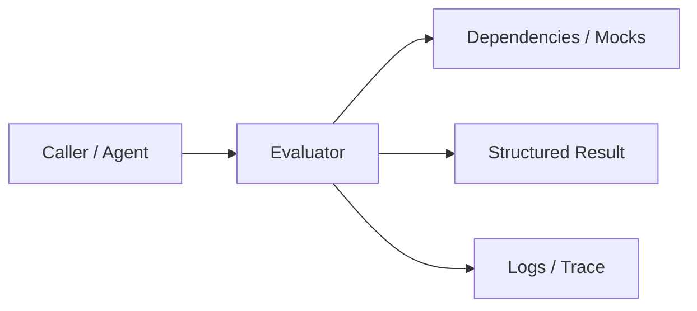
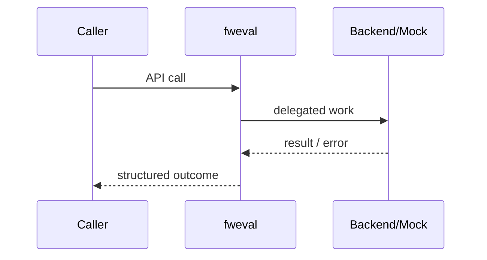
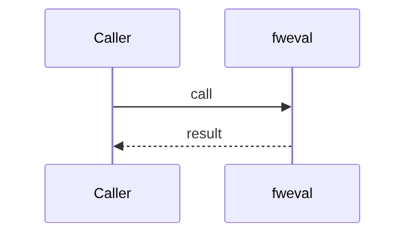
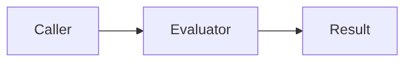

# Chapter 79: Evaluator

## Chapter Overview

Part VIII — **Build Your Own Framework** — implements **Evaluator** as package `fweval`.

Offline evaluation with fixed examples, scorers, and average thresholds is how agent platforms ship safely.

Earlier parts taught agents, retrieval, APIs, and production concerns using ad-hoc modules. Part VIII **owns the seams**: LLM I/O, prompts, tools, skills, planning, loops, memory, workflows, graphs, reflection, scheduling, harness, evaluation, and plugins. Chapter 79 focuses on **Evaluator** so you can replace vendor frameworks without losing control of behavior, tests, or safety.

**Code:** `code/chapter-079/fweval/` (offline-testable). **Diagrams:** lifecycle and overview under `diagrams/png/chapter-079/`.

---

## Learning Objectives

After completing this chapter, you can:

- Explain why **Evaluator** is a first-class framework boundary
- Use and extend the `fweval` package offline
- Wire evaluator into adjacent Part VIII modules
- Apply production concerns: failure modes, budgets, observability
- Compare this design to popular frameworks without vendor lock-in
- Debug common integration failures with structured traces
- Describe security defaults (deny-by-default, validation, isolation)
- Complete the mini project and exercises with tests green

---

## Prerequisites

- Parts I–VII (platform, agents, systems, APIs, production engineering)
- Earlier Part VIII chapters when `n > 67` (especially client, tools, and loop concepts)
- Comfort with Python protocols, dataclasses, and pytest

---

## Motivation

You change a prompt and “it feels better.” Production regresses silently. No release gate.

Shipping “just call the SDK” works in a demo and collapses under multi-provider needs, CI, multi-tenant safety, and incident response. Framework modules exist so **product teams share one correct implementation** of retries, registries, budgets, and gates—then compose them into agents (Part IX).

---

## First Principles

### 1. Dataset of Examples

id, input, gold.

### 2. Scorer is pluggable

exact match teaching; F1/LLM-judge later.

### 3. Gate threshold

avg_score >= gate → pass.

### 4. Row-level detail

Debug which cases failed.

### 5. predict is injected

Evaluate any callable agent slice.

---

## Mental Model

Evaluator = unit tests for model behavior — dataset, scorer, gate, pass/fail report.



| Piece | Responsibility |
|---|---|
| Public API | Stable types other chapters import |
| Policy | Retries, permissions, budgets, gates |
| Adapters | Mocks in CI; real backends in prod |
| Observability | Attempts, steps, scores, plugin names |

---

## Core Theory

### evaluate(predict, dataset)

For each example: pred = predict(input); score = scorer(pred, gold).  
Return `{n, avg_score, pass, rows}`.

`exact_scorer` is strict equality on normalized strings—harsh but deterministic.

Production: golden sets + rubric scorers + canary traffic. Tie template versions (Ch 68) to eval reports.

### Failure cases

Expect partial failure as normal: timeouts, forbidden tools, max steps, failed gates. Prefer structured outcomes over ambient exceptions across agent boundaries.

### Performance implications

Every extra LLM hop multiplies latency and cost. Framework defaults should make budgets obvious (`max_retries`, `max_steps`, `gate`).

### Security implications

Side effects and extensibility are the danger zones (tools, plugins, memory). Validate inputs; allowlist capabilities; never execute model-authored code.

---

## Architecture

```text
code/chapter-079/
  fweval/           # framework module
  tests/           # offline unit tests
  main.py          # demo entrypoint
  pyproject.toml
  README.md
```



Folder and lifecycle diagrams also render as PNGs in **Visual diagrams**.

---

## Internal Implementation

```bash
cd code/chapter-079 && pytest -q && python3 main.py
```

Build a 3-example set; assert gate fail then pass after fixing predict.

Read the package source; prefer extending via new registrations and injected callables rather than editing core conditionals for each product.

---

## Production Implementation

- **Scaling:** Stateless module instances behind request workers; shared stores for memory/schedules
- **Caching:** Prompt renders, embeddings, and idempotent tool results where safe
- **Monitoring:** Counters for retries, forbidden tools, max_steps, eval pass rate
- **Configuration:** max_retries, max_steps, gates, allowlists via env/config
- **Retries:** Transient-only at LLM and HTTP edges
- **Security:** Tenant isolation, secret redaction, plugin allowlists
- **Cost:** Token accounting from client usage fields; budget middleware
- **Concurrency:** Safe registries (locks) if hot-reloading plugins

---

## Framework Implementation

RAGAS, promptfoo, LangSmith datasets, DeepEval. Your Evaluator interface stays stable while scorers grow.

Do not treat any single framework as universally best. Own interfaces; adopt vendor runtimes when they reduce undifferentiated heavy lifting.

---

## Trade-offs

| Option A | Option B / notes |
|---|---|
| Exact match vs semantic scorers | Exact is stable; semantic needs judges and variance control. |
| Offline vs online eval | Offline gates releases; online catches drift. |

---

## Debugging

Common issues:

- Always fail → gold mismatch whitespace
- Flaky LLM judge → temperature 0 + caching
- Gate too low → shipping junk

**Workflow:** reproduce offline with mocks → assert structured fields → add one log line per policy decision → fix at the boundary (schema, allowlist, budget) not with prompt superstition.

---

## Performance

Batch predict. Cache LLM judge results by hash(pred,gold,rubric_version).

Track p95 latency and cost per successful task, not only happy-path demos.

---

## Security

Datasets may contain PII—secure storage. Judges should not exfiltrate prompts to shadow vendors without review.

Threat model always includes prompt injection driving tool/plugin misuse. Defense is registry policy + harness isolation + eval gates—not model promises.

---

## Best Practices

1. Keep `fweval` interfaces stable; swap internals freely
2. Test offline with mocks at every I/O boundary
3. Log structured events (step, tool, plan version)
4. Budget steps, tokens, and wall time
5. Default deny on tools, plugins, and memory tenants
6. Gate releases with evaluators before promoting prompts

---

## Anti-Patterns

- **God module** — One file owns client, tools, memory, and HTTP
- **Hidden retries** — Call sites each invent backoff
- **Stringly tools** — Model output executed without registry
- **Unversioned prompts** — No rollback when quality drops
- **Infinite loops** — No max_steps / max_replans
- **Trustful plugins** — Load arbitrary code from disk/URL

---

## Hands-on Exercise

1. Open `code/chapter-079/` and run `pytest -q`.
2. Modify one policy knob (retry, permission, max_steps, gate, allowlist—whichever fits this module).
3. Add or adjust a unit test that fails before the change and passes after.
4. Run `python3 main.py` and note the structured JSON/fields in output.
5. Write three bullets: what would break in multi-tenant production if this module vanished.

---

## Mini Project

Ship a small demo that composes **Evaluator** with at least one adjacent concept (client, tools, loop, or eval). Keep it offline-testable. Document the composition in five lines in your notes.

---

## Visual diagrams





---

## Chapter Deliverables

| Artifact | Location |
|---|---|
| Manuscript | `book/chapter-079.md` |
| Package | `code/chapter-079/fweval/` |
| Tests | `code/chapter-079/tests/` |
| Diagrams | `diagrams/mermaid/chapter-079/` |

---

## Interview Questions

1. How do you gate an agent release?
2. Exact match vs LLM-as-judge trade-offs?

---

## Quiz

1. gate 0.8 with avg 0.5 yields pass:
   A) true B) false C) maybe D) error always
   **Answer:** B

2. Example contains:
   A) only pred B) id/input/gold C) GPU id D) Dockerfile
   **Answer:** B

---

## Cheat Sheet

- `Example(id, input, gold)`
- `Evaluator(scorer, gate).evaluate(predict, dataset)`
- Pin dataset + scorer versions in CI

---

## Curated Free Resources

- [HELM / eval thinking](https://crfm.stanford.edu/helm/)
- [promptfoo](https://www.promptfoo.dev/)

---

## Chapter Summary

**Evaluator** (`fweval`) is a Part VIII framework building block: explicit interfaces, offline tests, and production policy hooks. Master it in isolation, then compose with the rest of the harness to build replaceable agent platforms.

---

## What's Next

**Chapter 80: Plugin System.** Chapter 80 adds plugins so eval scorers and other extensions load safely via allowlists.
