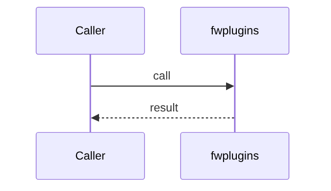

# Chapter 80: Plugin System

## Chapter Overview

Part VIII framework module **Plugin System** in `fwplugins`.

## Learning Objectives

- Implement/use `fwplugins`
- Test offline
- Compose with adjacent modules

## Prerequisites

Earlier Part VIII chapters.

## Architecture

`code/chapter-080/fwplugins/`

## Internal Implementation

```bash
cd code/chapter-080 && pytest -q && python3 main.py
```

## Mini Project

Plugin System module.

## Visual diagrams




## Chapter Deliverables

| Artifact | Location |
|---|---|
| Manuscript | `book/chapter-080.md` |
| Package | `code/chapter-080/fwplugins/` |

## Chapter Summary

Plugin System as a framework building block.

## What's Next

**Part IX — Real Projects** builds full applications on this framework.
