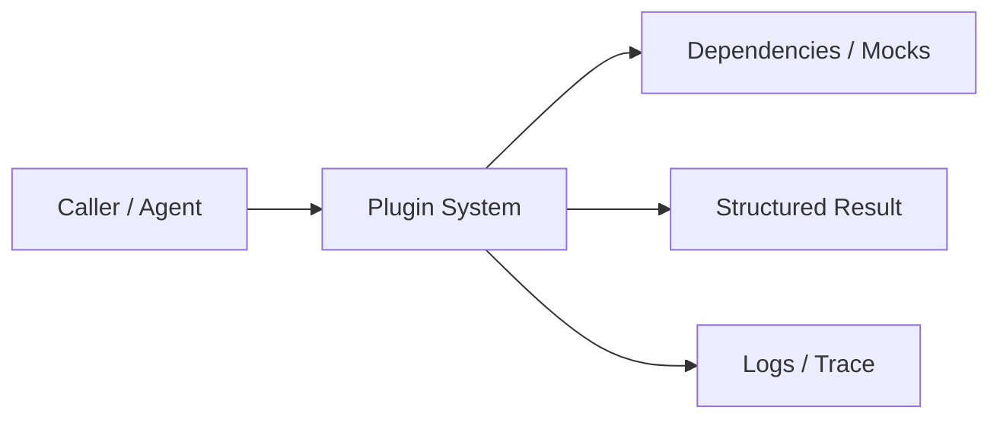
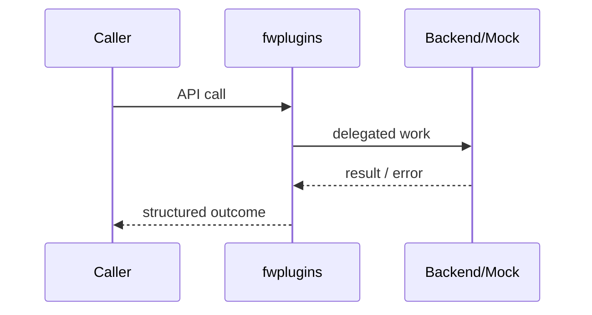

# Chapter 80: Plugin System

## Chapter Overview

Part VIII — **Build Your Own Framework** — implements **Plugin System** as package `fwplugins`.

Safe extensibility needs named extension points, allowlists (or trusted flag), and invoke fan-out—not arbitrary pickle/exec.

Earlier parts taught agents, retrieval, APIs, and production concerns using ad-hoc modules. Part VIII **owns the seams**: LLM I/O, prompts, tools, skills, planning, loops, memory, workflows, graphs, reflection, scheduling, harness, evaluation, and plugins. Chapter 80 focuses on **Plugin System** so you can replace vendor frameworks without losing control of behavior, tests, or safety.

**Code:** `code/chapter-080/fwplugins/` (offline-testable). **Diagrams:** lifecycle and overview under `diagrams/png/chapter-080/`.

---

## Learning Objectives

After completing this chapter, you can:

- Explain why **Plugin System** is a first-class framework boundary
- Use and extend the `fwplugins` package offline
- Wire plugin system into adjacent Part VIII modules
- Apply production concerns: failure modes, budgets, observability
- Compare this design to popular frameworks without vendor lock-in
- Debug common integration failures with structured traces
- Describe security defaults (deny-by-default, validation, isolation)
- Complete the mini project and exercises with tests green

---

## Prerequisites

- Parts I–VII (platform, agents, systems, APIs, production engineering)
- Earlier Part VIII chapters when `n > 67` (especially client, tools, and loop concepts)
- Comfort with Python protocols, dataclasses, and pytest

---

## Motivation

Teams `import` random code into the agent process to “just hook logs.” Supply-chain and stability die.

Shipping “just call the SDK” works in a demo and collapses under multi-provider needs, CI, multi-tenant safety, and incident response. Framework modules exist so **product teams share one correct implementation** of retries, registries, budgets, and gates—then compose them into agents (Part IX).

---

## First Principles

### 1. Extension points are strings

`on_message`, `on_tool_result`, …

### 2. Allowlist by default

register without trusted requires prior allow(name).

### 3. No code loading from strings

Handlers are callables provided by trusted packages.

### 4. Invoke returns all results

Multi-plugin fan-out with names.

### 5. Version field

Track plugin compatibility.

---

## Mental Model

Plugin system = power strip with a lock — extension points fire only allowlisted plugs.



| Piece | Responsibility |
|---|---|
| Public API | Stable types other chapters import |
| Policy | Retries, permissions, budgets, gates |
| Adapters | Mocks in CI; real backends in prod |
| Observability | Attempts, steps, scores, plugin names |

---

## Core Theory

### Plugin

`Plugin(name, extension_point, handler, version)`.

### PluginManager

- `allow(name)`
- `register(plugin, trusted=False)`
- `invoke(extension_point, *args, **kwargs) -> list[{plugin, result}]`

Trusted path is for first-party modules during bootstrap; third-party must be allowlisted.

This closes Part VIII: a framework others can extend without forking core.

### Failure cases

Expect partial failure as normal: timeouts, forbidden tools, max steps, failed gates. Prefer structured outcomes over ambient exceptions across agent boundaries.

### Performance implications

Every extra LLM hop multiplies latency and cost. Framework defaults should make budgets obvious (`max_retries`, `max_steps`, `gate`).

### Security implications

Side effects and extensibility are the danger zones (tools, plugins, memory). Validate inputs; allowlist capabilities; never execute model-authored code.

---

## Architecture

```text
code/chapter-080/
  fwplugins/           # framework module
  tests/           # offline unit tests
  main.py          # demo entrypoint
  pyproject.toml
  README.md
```



Folder and lifecycle diagrams also render as PNGs in **Visual diagrams**.

---

## Internal Implementation

```bash
cd code/chapter-080 && pytest -q && python3 main.py
```

Assert PermissionError without allowlist; success after allow.

Read the package source; prefer extending via new registrations and injected callables rather than editing core conditionals for each product.

---

## Production Implementation

- **Scaling:** Stateless module instances behind request workers; shared stores for memory/schedules
- **Caching:** Prompt renders, embeddings, and idempotent tool results where safe
- **Monitoring:** Counters for retries, forbidden tools, max_steps, eval pass rate
- **Configuration:** max_retries, max_steps, gates, allowlists via env/config
- **Retries:** Transient-only at LLM and HTTP edges
- **Security:** Tenant isolation, secret redaction, plugin allowlists
- **Cost:** Token accounting from client usage fields; budget middleware
- **Concurrency:** Safe registries (locks) if hot-reloading plugins

---

## Framework Implementation

pytest plugins, stevedore/entry points, browser extensions—same allowlist lessons. Never `eval` plugin source from users.

Do not treat any single framework as universally best. Own interfaces; adopt vendor runtimes when they reduce undifferentiated heavy lifting.

---

## Trade-offs

| Option A | Option B / notes |
|---|---|
| Allowlist vs capability sandbox | Allowlist is simple; WASM/seccomp is stronger isolation. |
| In-process plugins vs sidecars | In-process fast; sidecars isolate crashes/security. |

---

## Debugging

Common issues:

- PermissionError → forgot allow()
- Plugin not firing → wrong extension_point string
- Order dependence → document invoke order (registration order)

**Workflow:** reproduce offline with mocks → assert structured fields → add one log line per policy decision → fix at the boundary (schema, allowlist, budget) not with prompt superstition.

---

## Performance

Keep handlers tiny on hot paths. Async queue for heavy plugins.

Track p95 latency and cost per successful task, not only happy-path demos.

---

## Security

Treat plugins as full code execution in-process. Sign packages, pin versions, review allowlist changes like IAM.

Threat model always includes prompt injection driving tool/plugin misuse. Defense is registry policy + harness isolation + eval gates—not model promises.

---

## Best Practices

1. Keep `fwplugins` interfaces stable; swap internals freely
2. Test offline with mocks at every I/O boundary
3. Log structured events (step, tool, plan version)
4. Budget steps, tokens, and wall time
5. Default deny on tools, plugins, and memory tenants
6. Gate releases with evaluators before promoting prompts

---

## Anti-Patterns

- **God module** — One file owns client, tools, memory, and HTTP
- **Hidden retries** — Call sites each invent backoff
- **Stringly tools** — Model output executed without registry
- **Unversioned prompts** — No rollback when quality drops
- **Infinite loops** — No max_steps / max_replans
- **Trustful plugins** — Load arbitrary code from disk/URL

---

## Hands-on Exercise

1. Open `code/chapter-080/` and run `pytest -q`.
2. Modify one policy knob (retry, permission, max_steps, gate, allowlist—whichever fits this module).
3. Add or adjust a unit test that fails before the change and passes after.
4. Run `python3 main.py` and note the structured JSON/fields in output.
5. Write three bullets: what would break in multi-tenant production if this module vanished.

---

## Mini Project

Ship a small demo that composes **Plugin System** with at least one adjacent concept (client, tools, loop, or eval). Keep it offline-testable. Document the composition in five lines in your notes.

---

## Visual diagrams


---

## Chapter Deliverables

| Artifact | Location |
|---|---|
| Manuscript | `book/chapter-080.md` |
| Package | `code/chapter-080/fwplugins/` |
| Tests | `code/chapter-080/tests/` |
| Diagrams | `diagrams/mermaid/chapter-080/` |

---

## Interview Questions

1. How do you design safe plugin loading for an agent platform?
2. In-process plugins vs microservice extensions?

---

## Quiz

1. register without allowlist and trusted=False:
   A) succeeds B) PermissionError C) silent drop D) reboot
   **Answer:** B

2. extension_point identifies:
   A) GPU B) hook channel C) Docker image D) DNS record
   **Answer:** B

---

## Cheat Sheet

- `allow` then `register`
- `invoke(extension_point, ...)`
- Prefer allowlists over arbitrary code load

---

## Curated Free Resources

- [Python entry points](https://packaging.python.org/en/latest/specifications/entry-points/)
- [OWASP plugin risks](https://owasp.org/)

---

## Chapter Summary

**Plugin System** (`fwplugins`) is a Part VIII framework building block: explicit interfaces, offline tests, and production policy hooks. Master it in isolation, then compose with the rest of the harness to build replaceable agent platforms.

---

## What's Next

Part IX builds real applications on these framework modules (chatbot, RAG, research, multi-agent, …).
