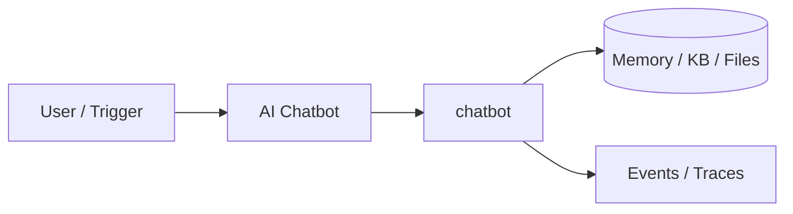

# Chapter 81: AI Chatbot

## Chapter Overview

Part IX — Real Projects — **AI Chatbot** — package `chatbot`.

`ChatBot` + `ChatSession` window memory, `MockLLM`, and `EventLog` for session/message events — the baseline HTTP product from Part VII.

Part IX ships **production-shaped projects** you can demo and extend. Chapter 81 builds **AI Chatbot** in `chatbot/` with tests, CLI, and architecture aligned to Parts IV–VIII and VII ops.

**Code:** `code/chapter-081/chatbot/`. This chapter includes a **Dockerfile** under `code/chapter-081/` — containerize for staging after local pytest passes.

---

## Learning Objectives

After completing this chapter, you can:

- Explain **AI Chatbot** architecture and data flow
- Run `chatbot` offline with pytest and CLI
- Identify production gaps (auth, scale, eval, deploy) honestly
- Map the project to earlier book modules (tools, RAG, harness, API)
- Complete exercises and extend the mini project safely
- Containerize and describe a staging deploy path

---

## Prerequisites

- Parts IV–VIII (agents, systems, frameworks, your framework modules)
- Part VII (API, workers, Docker, persistence, observability) recommended
- Prior Part IX chapters when `n > 81` (through Chapter 80)

---

## Motivation

Stateful products need isolated sessions, pinned system prompts, and audit logs—not one-off completions. Chapter 81 is the Part IX **baseline HTTP-shaped chat product** you later wrap with the Part VII API (Ch 56), workers (Ch 57), and Redis sessions (Ch 60).

---

## First Principles

### 1. Sessions are isolated

session_id keys separate conversations.

### 2. System prompt pinned

Kept when trimming window.

### 3. Windowed history

max_turns caps user+assistant pairs.

### 4. Events for observability

session_start, user_message, assistant_message.

---

## Mental Model

Chatbot = front desk with memory — remembers recent conversation, logs every turn for audit.



---

## Core Theory

### Flow

`new_session()` → system message → `chat(session_id, text)` → LLM complete on message dicts → assistant reply.

### MockLLM

Echoes prefixed response for offline tests.

### Trimming

When messages exceed budget, retain system + last N turns.

### Part VII bridge

Expose sessions via Ch 56 `POST /v1/chat`; persist `ChatSession` JSON in Redis (Ch 60); attach trace id from Ch 66 on each turn.
### Failure cases

Unknown `session_id` → KeyError; LLM exception → empty or error turn—log in `EventLog`, never silent drop.

### Performance implications

Window `max_turns` before every completion; optional map-reduce summarize for long threads.

### Security implications

Auth binds user to session; rate-limit chat; scrub emails/phones from logged message bodies.
### Staging checklist (Part VII)

Before calling this project production-shaped, wire at least one ops seam: expose a handler via the Ch 56 API pattern, enqueue long runs on Ch 57 workers, smoke-test the chapter Dockerfile (Ch 58), persist state if the agent needs it (Ch 59–60), and attach request/trace ids (Ch 64–66). Add one eval case (Ch 44 mindset) that must pass before you demo to stakeholders.

### Portfolio and interview angle

For Ch 93 scoring, lead README with problem, architecture diagram, quickstart, and pytest proof. In Ch 91 design reviews, state order-of-magnitude QPS, an LLM latency slice, and **this agent's** failure modes—not generic cloud trivia.

---

## Architecture

```text
code/chapter-081/
  chatbot/
  tests/
  main.py
  pyproject.toml
  README.md
```

---

## Internal Implementation

```bash
cd code/chapter-081 && pytest -q && python3 main.py
```

Dockerfile present — wire to FastAPI `/v1/chat` (Ch 56) in production notes.

---

## Production Implementation

Deploy behind API gateway; persist sessions in Redis (Ch 60); stream tokens via `/v1/chat/stream` pattern; correlate logs (Ch 65).

---

## Framework Implementation

OpenAI Chat Completions, Anthropic Messages — swap MockLLM; keep EventLog hooks.

---

## Trade-offs

| Option A | Option B / notes |
|---|---|
| In-memory sessions | Tests; Redis/DB in prod. |
| Full history | Better context; higher cost. |
| Window trim | Cheaper; may drop early facts. |

---

## Debugging

- KeyError session → unknown id
- Empty reply → LLM exception
- Lost system prompt → trim bug

---

## Performance

Trim aggressively; summarize old turns for long chats.

---

## Security

Auth per session; rate limit; sanitize user input in logs.

---

## Best Practices

1. Run `pytest -q` before every demo
2. Emit structured events/traces for debugging
3. Document architecture and failure modes in README
4. Connect project to Part VII API/workers when deploying
5. Add eval cases (Ch 44 mindset) for agent behaviors
6. Keep secrets out of repos and Docker layers

---

## Anti-Patterns

- **Demo without tests** — Regressions invisible
- **Live keys in CI** — Credential leaks
- **Unbounded agent loops** — Cost and safety incidents
- **Skipping escalation/HITL on risky tools** — Trust and compliance failures
- **Portfolio README empty** — Hiring signal lost
- **Learning without milestones** — Skill gaps never close

---

## Hands-on Exercise

1. `cd code/chapter-081 && pytest -q`
2. Create two sessions; verify messages do not leak across `session_id`
3. Trim test: exceed `max_turns` and assert system prompt remains first message
4. Add a test that `EventLog` records `user_message` and `assistant_message`
5. List three upgrades to reach production (Redis, streaming SSE, eval on tone)

---

## Mini Project

**Multi-turn chatbot with windowed memory and event log.** Harden one path (auth, eval, or deploy) and document gaps vs full prod spec.

---

## Visual diagrams


---

## Chapter Deliverables

| Artifact | Location |
|---|---|
| Manuscript | `book/chapter-081.md` |
| Package | `code/chapter-081/chatbot/` |
| Tests | `code/chapter-081/tests/` |

---

## Interview Questions

1. Session storage options?
2. Context window management?
3. Multi-tenant chat isolation?

---

## Quiz

1. ChatSession keeps system when trimming:
   A) yes B) never C) GPU D) DNS
   **Answer:** A

2. EventLog records:
   A) typed events B) GPU only C) DNS D) none
   **Answer:** A

3. MockLLM used for:
   A) offline tests B) prod only C) DNS D) never
   **Answer:** A

---

## Cheat Sheet

- `ChatBot.new_session/chat`
- `ChatSession.max_turns`
- EventLog.emit

---

## Curated Free Resources

- [OpenAI chat](https://platform.openai.com/docs/guides/chat)
- [Session security OWASP](https://cheatsheetseries.owasp.org/)

---

## Chapter Summary

**AI Chatbot** — Multi-turn chatbot with windowed memory and event log. Runnable offline core; This chapter includes a **Dockerfile** under `code/chapter-081/` — containerize for staging after local pytest passes.

---

## What's Next

**Chapter 82: PDF Chat.** Chapter 82 adds document grounding and citations.
