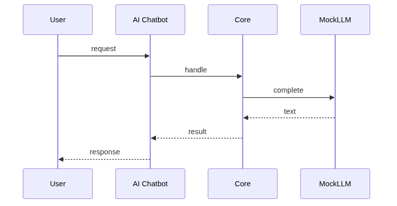
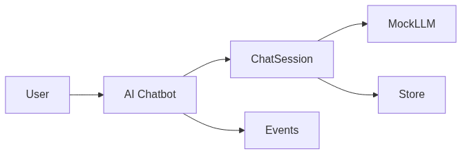

# Chapter 81: AI Chatbot

## Chapter Overview

Part IX **Real Projects** — full application **AI Chatbot** implemented as package `chatbot`.

Readers assemble platform modules from earlier parts into a deployable product slice: architecture, offline-testable core, Docker image, observability hooks, and scaling notes.

## Learning Objectives

- Design end-to-end architecture for a **AI Chatbot**
- Implement a production-shaped core with pure interfaces and offline mocks
- Add tests, Docker packaging, and basic observability
- Discuss deployment, scaling, and future improvements

## Prerequisites

Parts I–VIII (platform foundation, agents, systems, APIs, framework modules).

## Motivation

Theory without shipped products leaves a gap. This chapter is a complete, reviewable application you can run offline in CI and extend with real providers later.

## Architecture

```text
code/chapter-081/
  chatbot/           # domain package
  tests/           # offline unit tests
  main.py          # demo entrypoint
  Dockerfile       # container image
  pyproject.toml
  README.md
```

Core design:

1. **Ports** — LLM, storage, tools behind protocols / callables
2. **Domain service** — orchestrates turns / jobs without network I/O in tests
3. **Observability** — structured event log (JSON-friendly dicts)
4. **Packaging** — Docker + `main.py` smoke path

## Internal Implementation

```bash
cd code/chapter-081 && pytest -q && python3 main.py
```

## Production Implementation

- Swap mock LLM for real providers (OpenAI / Anthropic / gateway)
- Add auth, rate limits, persistence (Postgres / Redis)
- Wire OpenTelemetry traces and metrics exporters
- Harden with policy gates from earlier chapters

## Mini Project

Ship **AI Chatbot** as an offline-verified package with tests and Docker.

## Deployment

```bash
docker build -t ch081-chatbot code/chapter-081
docker run --rm ch081-chatbot
```

Typical prod path: container → orchestrator (K8s / Cloud Run) → managed secrets → async workers if long-running.

## Observability

The package emits structured events (`type`, `ts` optional, payload). Export to your log stack; attach `trace_id` in production.

## Scaling Discussion

- Stateless request path scales horizontally behind a load balancer
- Session / memory state needs shared store (Redis / DB)
- Tool and LLM calls are the cost bottleneck — cache, batch, queue

## Future Improvements

- Streaming UX, multi-tenant isolation, evaluation harness, canary prompts
- Human-in-the-loop for high-risk actions
- Cost budgets and automatic model routing

## Visual diagrams





## Chapter Deliverables

| Artifact | Location |
|---|---|
| Manuscript | `book/chapter-081.md` |
| Package | `code/chapter-081/chatbot/` |
| Tests | `code/chapter-081/tests/` |
| Docker | `code/chapter-081/Dockerfile` |

## Chapter Summary

AI Chatbot delivers multi-turn sessions, windowed memory, and structured events in an offline-testable package.

## What's Next

**Chapter 82** builds PDF Chat — document-grounded Q&A.
