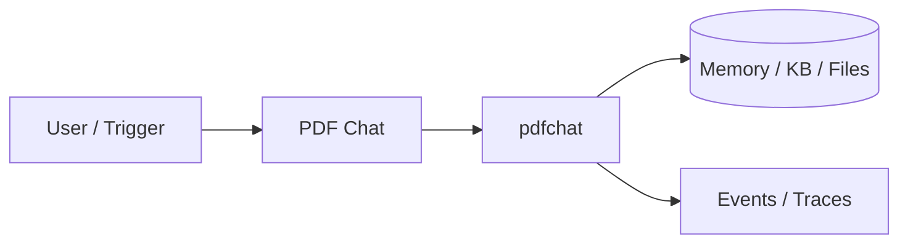
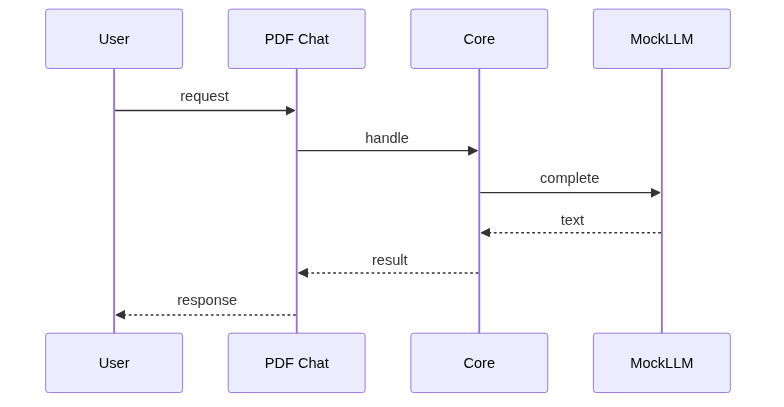
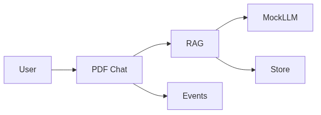

# Chapter 82: PDF Chat

## Chapter Overview

Part IX — Real Projects — **PDF Chat** — package `pdfchat`.

`PdfChat` chunks docs, `InMemoryIndex` Jaccard search, packs context with `[doc#p/c]` citations, `MockLLM` grounded answer marker.

Part IX ships **production-shaped projects** you can demo and extend. Chapter 82 builds **PDF Chat** in `pdfchat/` with tests, CLI, and architecture aligned to Parts IV–VIII and VII ops.

**Code:** `code/chapter-082/pdfchat/`. This chapter includes a **Dockerfile** under `code/chapter-082/` — containerize for staging after local pytest passes.

---

## Learning Objectives

After completing this chapter, you can:

- Explain **PDF Chat** architecture and data flow
- Run `pdfchat` offline with pytest and CLI
- Identify production gaps (auth, scale, eval, deploy) honestly
- Map the project to earlier book modules (tools, RAG, harness, API)
- Complete exercises and extend the mini project safely
- Containerize and describe a staging deploy path

---

## Prerequisites

- Parts IV–VIII (agents, systems, frameworks, your framework modules)
- Part VII (API, workers, Docker, persistence, observability) recommended
- Prior Part IX chapters when `n > 81` (through Chapter 81)

---

## Motivation

Users ask questions about contracts and handbooks; plain chat **hallucinates** policy details. This project is the minimal **grounded Q&A** loop you will extend with hybrid retrieval (Ch 26) and eval harnesses (Ch 44).

---

## First Principles

### 1. Ingest before ask

Chunk + index per doc_id/page.

### 2. Retrieval then generate

Separate search scores from LLM.

### 3. Citations in output

Return citation list alongside answer.

### 4. Events on ingest/ask

Audit trail for RAG ops.

---

## Mental Model

PDF chat = open-book exam — answers must cite page/chunk, not invent from parametric memory alone.



---

## Core Theory

### Pipeline

ingest(doc_id, text) → simple_chunk overlap → search(query, k) → prompt with Context + Question → answer + citations + scores.

### Eval mindset

Treat faithfulness like Ch 44: if citations are empty, the answer should refuse or ask to ingest—not invent policy text.
### Failure cases

Zero retrieval hits → answer may hallucinate unless you gate on min score; wrong chunk boundaries → misleading citations.

### Performance implications

Pre-index at ingest; cache chunk embeddings when you swap in dense search (Ch 26); cap `k` in prompt.

### Security implications

ACL per `doc_id`; strip secrets before ingest; log ingest/ask events without leaking full document bodies.
### Staging checklist (Part VII)

Before calling this project production-shaped, wire at least one ops seam: expose a handler via the Ch 56 API pattern, enqueue long runs on Ch 57 workers, smoke-test the chapter Dockerfile (Ch 58), persist state if the agent needs it (Ch 59–60), and attach request/trace ids (Ch 64–66). Add one eval case (Ch 44 mindset) that must pass before you demo to stakeholders.

### Portfolio and interview angle

For Ch 93 scoring, lead README with problem, architecture diagram, quickstart, and pytest proof. In Ch 91 design reviews, state order-of-magnitude QPS, an LLM latency slice, and **this agent's** failure modes—not generic cloud trivia.

---

## Architecture

```text
code/chapter-082/
  pdfchat/
  tests/
  main.py
  pyproject.toml
  README.md
```

---

## Internal Implementation

```bash
cd code/chapter-082 && pytest -q && python3 main.py
```

Ingest sample policy text; ask paraphrase question; assert citations non-empty.

---

## Production Implementation

Replace index with hybrid search (Ch 26); PDF parser upstream; eval faithfulness (Ch 44).

---

## Framework Implementation

LlamaIndex PDF loaders, LangChain retrievers — same ingest/ask seam.

---

## Trade-offs

| Option A | Option B / notes |
|---|---|
| Lexical Jaccard | Offline simple; weaker paraphrase. |
| Dense + BM25 hybrid | Production recall; more infra. |

---

## Debugging

- Empty hits → query tokens disjoint
- Wrong citation → chunk boundaries

---

## Performance

Pre-index corpus; cache embeddings; limit k.

---

## Security

ACL per doc_id; strip secrets from chunks indexed.

---

## Best Practices

1. Run `pytest -q` before every demo
2. Emit structured events/traces for debugging
3. Document architecture and failure modes in README
4. Connect project to Part VII API/workers when deploying
5. Add eval cases (Ch 44 mindset) for agent behaviors
6. Keep secrets out of repos and Docker layers

---

## Anti-Patterns

- **Demo without tests** — Regressions invisible
- **Live keys in CI** — Credential leaks
- **Unbounded agent loops** — Cost and safety incidents
- **Skipping escalation/HITL on risky tools** — Trust and compliance failures
- **Portfolio README empty** — Hiring signal lost
- **Learning without milestones** — Skill gaps never close

---

## Hands-on Exercise

1. `cd code/chapter-082 && pytest -q && python3 main.py`
2. Ingest two doc_ids; ask a question that requires the second doc—assert citation doc_id
3. Add a test for empty corpus search returning no citations
4. Document chunk size trade-off in README (one paragraph)
5. Sketch upgrade path: PDF parser → embeddings → eval faithfulness suite

---

## Mini Project

**Document Q&A with lexical retrieval and citations.** Harden one path (auth, eval, or deploy) and document gaps vs full prod spec.

---

## Visual diagrams





---

## Chapter Deliverables

| Artifact | Location |
|---|---|
| Manuscript | `book/chapter-082.md` |
| Package | `code/chapter-082/pdfchat/` |
| Tests | `code/chapter-082/tests/` |

---

## Interview Questions

1. Chunk size trade-offs?
2. Citation-only answers?
3. Eval for groundedness?

---

## Quiz

1. PdfChat.ask returns:
   A) answer+citations B) GPU C) DNS D) none
   **Answer:** A

2. ingest creates:
   A) chunks B) GPU only C) DNS D) nothing
   **Answer:** A

3. Index search uses:
   A) token overlap B) GPS C) DNS D) MAC
   **Answer:** A

---

## Cheat Sheet

- `PdfChat.ingest/ask`
- Chunk.citation
- InMemoryIndex.search

---

## Curated Free Resources

- [RAG patterns](https://arxiv.org/abs/2312.10997)
- [Citation best practices](https://platform.openai.com/docs/guides/evals)

---

## Chapter Summary

**PDF Chat** — Document Q&A with lexical retrieval and citations. Runnable offline core; This chapter includes a **Dockerfile** under `code/chapter-082/` — containerize for staging after local pytest passes.

---

## What's Next

**Chapter 83: Research Agent.** Chapter 83 multi-step research over search backend.
