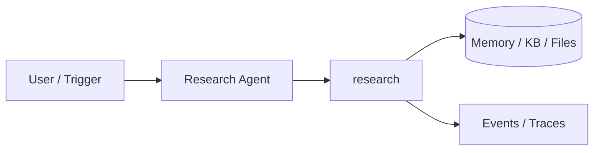
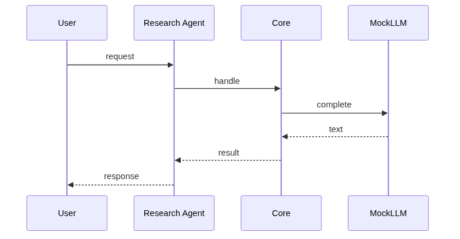
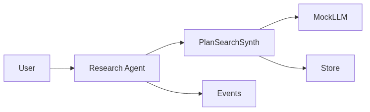

# Chapter 83: Research Agent

## Chapter Overview

Part IX — Real Projects — **Research Agent** — package `research`.

`ResearchAgent.run(topic)` → PLAN subquestions → search each → dedupe sources → SYNTH synthesis with event trace.

Part IX ships **production-shaped projects** you can demo and extend. Chapter 83 builds **Research Agent** in `research/` with tests, CLI, and architecture aligned to Parts IV–VIII and VII ops.

**Code:** `code/chapter-083/research/`. This chapter includes a **Dockerfile** under `code/chapter-083/` — containerize for staging after local pytest passes.

---

## Learning Objectives

After completing this chapter, you can:

- Explain **Research Agent** architecture and data flow
- Run `research` offline with pytest and CLI
- Identify production gaps (auth, scale, eval, deploy) honestly
- Map the project to earlier book modules (tools, RAG, harness, API)
- Complete exercises and extend the mini project safely
- Containerize and describe a staging deploy path

---

## Prerequisites

- Parts IV–VIII (agents, systems, frameworks, your framework modules)
- Part VII (API, workers, Docker, persistence, observability) recommended
- Prior Part IX chapters when `n > 81` (through Chapter 82)

---

## Motivation

Single search queries miss angles; stakeholders want **sourced memos**, not paragraph summaries. This agent practices plan→search→synthesize—the same shape as deep research features in production copilots.

---

## First Principles

### 1. Plan before search

LLM emits subquestions (mock PLAN: prefix).

### 2. Dedupe sources

url/title key in seen set.

### 3. max_subqs cap

Cost control.

### 4. ResearchReport artifact

topic, subquestions, sources, synthesis, events.

---

## Mental Model

Research agent = junior analyst — plan subquestions, search sources, synthesize memo.



---

## Core Theory

### MockSearch scores corpus title+snippet token overlap.

### MockLLM branches on PLAN: vs SYNTH: prompts.

### Report artifact

`ResearchReport` bundles topic, subquestions, sources, synthesis, and events—use it as the unit of eval (coverage, dedupe quality).
### Failure cases

Empty sources when corpus lacks overlap; duplicate sources if dedupe key wrong; runaway subquestions if `max_subqs` unset.

### Performance implications

Parallelize subquestion searches when you add real APIs; cap sources per subquestion.

### Security implications

Sanitize fetched HTML; block SSRF to internal URLs; do not log full page HTML in events.
### Staging checklist (Part VII)

Before calling this project production-shaped, wire at least one ops seam: expose a handler via the Ch 56 API pattern, enqueue long runs on Ch 57 workers, smoke-test the chapter Dockerfile (Ch 58), persist state if the agent needs it (Ch 59–60), and attach request/trace ids (Ch 64–66). Add one eval case (Ch 44 mindset) that must pass before you demo to stakeholders.

### Portfolio and interview angle

For Ch 93 scoring, lead README with problem, architecture diagram, quickstart, and pytest proof. In Ch 91 design reviews, state order-of-magnitude QPS, an LLM latency slice, and **this agent's** failure modes—not generic cloud trivia.

---

## Architecture

```text
code/chapter-083/
  research/
  tests/
  main.py
  pyproject.toml
  README.md
```

---

## Internal Implementation

```bash
cd code/chapter-083 && pytest -q && python3 main.py
```

---

## Production Implementation

Real web search API + caching; human review for high-stakes memos; eval on citation coverage.

---

## Framework Implementation

Perplexity-style agents, LangGraph research graphs.

---

## Trade-offs

| Option A | Option B / notes |
|---|---|
| Sequential subquestions | Clear trace; higher latency. |
| Parallel search | Faster; harder merge/dedupe. |

---

## Debugging

- Empty sources → corpus mismatch
- Duplicate sources → dedupe key

---

## Performance

Parallelize subquestion searches; cap sources.

---

## Security

Sanitize fetched HTML; block internal URLs.

---

## Best Practices

1. Run `pytest -q` before every demo
2. Emit structured events/traces for debugging
3. Document architecture and failure modes in README
4. Connect project to Part VII API/workers when deploying
5. Add eval cases (Ch 44 mindset) for agent behaviors
6. Keep secrets out of repos and Docker layers

---

## Anti-Patterns

- **Demo without tests** — Regressions invisible
- **Live keys in CI** — Credential leaks
- **Unbounded agent loops** — Cost and safety incidents
- **Skipping escalation/HITL on risky tools** — Trust and compliance failures
- **Portfolio README empty** — Hiring signal lost
- **Learning without milestones** — Skill gaps never close

---

## Hands-on Exercise

1. `cd code/chapter-083 && pytest -q`
2. Run on a topic that hits multiple corpus entries; assert `len(sources) >= 2` after dedupe
3. Force `max_subqs=1` and compare synthesis quality in notes
4. Add test: PLAN step emits at least one subquestion string
5. Map which Ch 26 retrieval upgrades would replace MockSearch

---

## Mini Project

**Plan→search→synthesize research pipeline.** Harden one path (auth, eval, or deploy) and document gaps vs full prod spec.

---

## Visual diagrams





---

## Chapter Deliverables

| Artifact | Location |
|---|---|
| Manuscript | `book/chapter-083.md` |
| Package | `code/chapter-083/research/` |
| Tests | `code/chapter-083/tests/` |

---

## Interview Questions

1. Research eval metrics?
2. When require human review?
3. Source attribution?

---

## Quiz

1. ResearchAgent dedupes by:
   A) url/title key B) GPU C) DNS D) random
   **Answer:** A

2. plan step produces:
   A) subquestions B) GPU C) DNS D) none
   **Answer:** A

3. events track:
   A) pipeline phases B) cookies only C) GPU D) none
   **Answer:** A

---

## Cheat Sheet

- `ResearchAgent.run(topic)`
- ResearchReport fields

---

## Curated Free Resources

- [Research agent surveys](https://arxiv.org/list/cs.AI/recent)

---

## Chapter Summary

**Research Agent** — Plan→search→synthesize research pipeline. Runnable offline core; This chapter includes a **Dockerfile** under `code/chapter-083/` — containerize for staging after local pytest passes.

---

## What's Next

**Chapter 84: Browser Agent.** Chapter 84 automates mock browser navigation.
