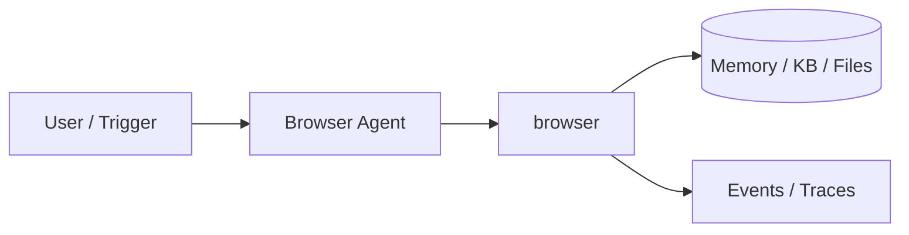
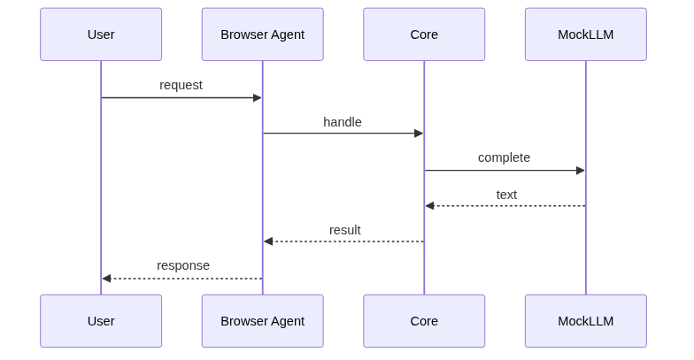
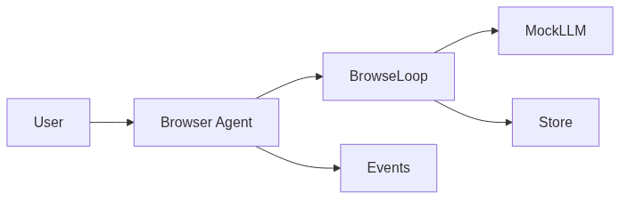

# Chapter 84: Browser Agent

## Chapter Overview

Part IX — Real Projects — **Browser Agent** — package `browser`.

`MockBrowser` page graph, `BrowserAgent` loop with `MockLLM.decide` → goto/click/extract/done, event trace.

Part IX ships **production-shaped projects** you can demo and extend. Chapter 84 builds **Browser Agent** in `browser/` with tests, CLI, and architecture aligned to Parts IV–VIII and VII ops.

**Code:** `code/chapter-084/browser/`. This chapter includes a **Dockerfile** under `code/chapter-084/` — containerize for staging after local pytest passes.

---

## Learning Objectives

After completing this chapter, you can:

- Explain **Browser Agent** architecture and data flow
- Run `browser` offline with pytest and CLI
- Identify production gaps (auth, scale, eval, deploy) honestly
- Map the project to earlier book modules (tools, RAG, harness, API)
- Complete exercises and extend the mini project safely
- Containerize and describe a staging deploy path

---

## Prerequisites

- Parts IV–VIII (agents, systems, frameworks, your framework modules)
- Part VII (API, workers, Docker, persistence, observability) recommended
- Prior Part IX chapters when `n > 81` (through Chapter 83)

---

## Motivation

LLMs cannot fetch live pricing or portal state without a **tool loop** over page observations. This chapter teaches the observe→decide→act pattern used by browser automation agents—offline first, Playwright later.

---

## First Principles

### 1. Observations include url/title/text/links

Structured decide input.

### 2. max_steps budget

Prevent infinite navigation.

### 3. No real network in tests

Mock pages dict.

### 4. Done action returns answer snippet

Terminate explicitly.

---

## Mental Model

Browser agent = intern browsing a site map — goto, click, extract until goal satisfied.



---

## Core Theory

### Actions

goto, click(label), extract(selector), done(answer).

MockLLM heuristic navigates toward pricing goal.

### Observation contract

Each step returns url, title, text snippet, and link labels—keep observations bounded before sending to the model (Ch 46 injection awareness).
### Failure cases

404 on goto; infinite loop if policy never emits `done`; extract on missing selector → empty text.

### Performance implications

Truncate DOM text in observations; cache static pages; enforce `max_steps` every run.

### Security implications

Domain allowlist; never include password fields in obs; HITL before checkout or send actions.
### Staging checklist (Part VII)

Before calling this project production-shaped, wire at least one ops seam: expose a handler via the Ch 56 API pattern, enqueue long runs on Ch 57 workers, smoke-test the chapter Dockerfile (Ch 58), persist state if the agent needs it (Ch 59–60), and attach request/trace ids (Ch 64–66). Add one eval case (Ch 44 mindset) that must pass before you demo to stakeholders.

### Portfolio and interview angle

For Ch 93 scoring, lead README with problem, architecture diagram, quickstart, and pytest proof. In Ch 91 design reviews, state order-of-magnitude QPS, an LLM latency slice, and **this agent's** failure modes—not generic cloud trivia.

---

## Architecture

```text
code/chapter-084/
  browser/
  tests/
  main.py
  pyproject.toml
  README.md
```

---

## Internal Implementation

```bash
cd code/chapter-084 && pytest -q && python3 main.py
```

---

## Production Implementation

Playwright/Puppeteer tool; allowlist domains; snapshot accessibility tree; HITL on purchases.

---

## Framework Implementation

Browser-use libraries, OpenAI computer use — same observe→decide loop.

---

## Trade-offs

| Option A | Option B / notes |
|---|---|
| Mock page graph | Deterministic CI. |
| Real browser automation | Realistic; flaky without sandbox. |

---

## Debugging

- 404 goto → bad url
- Stuck loop → policy never done

---

## Performance

Limit DOM size in observations; cache pages.

---

## Security

Domain allowlist; no credential fields in obs logs.

---

## Best Practices

1. Run `pytest -q` before every demo
2. Emit structured events/traces for debugging
3. Document architecture and failure modes in README
4. Connect project to Part VII API/workers when deploying
5. Add eval cases (Ch 44 mindset) for agent behaviors
6. Keep secrets out of repos and Docker layers

---

## Anti-Patterns

- **Demo without tests** — Regressions invisible
- **Live keys in CI** — Credential leaks
- **Unbounded agent loops** — Cost and safety incidents
- **Skipping escalation/HITL on risky tools** — Trust and compliance failures
- **Portfolio README empty** — Hiring signal lost
- **Learning without milestones** — Skill gaps never close

---

## Hands-on Exercise

1. `cd code/chapter-084 && pytest -q && python3 main.py`
2. Add a mock page; write a test goal that requires two clicks
3. Assert `max_steps` stops a deliberate infinite navigation test double
4. Document allowlist strategy for production domains in README
5. Compare observation size to Ch 68 tool registry schemas

---

## Mini Project

**Goal-directed browser automation (mock pages).** Harden one path (auth, eval, or deploy) and document gaps vs full prod spec.

---

## Visual diagrams





---

## Chapter Deliverables

| Artifact | Location |
|---|---|
| Manuscript | `book/chapter-084.md` |
| Package | `code/chapter-084/browser/` |
| Tests | `code/chapter-084/tests/` |

---

## Interview Questions

1. Browser agent safety?
2. Observation size limits?
3. Deterministic tests?

---

## Quiz

1. BrowserAgent max_steps prevents:
   A) infinite loop B) GPU heat C) DNS D) TLS
   **Answer:** A

2. click uses:
   A) link label B) GPU C) DNS D) MAC
   **Answer:** A

3. MockBrowser pages keyed by:
   A) url B) random C) GPU D) none
   **Answer:** A

---

## Cheat Sheet

- `BrowserAgent.run(start_url, goal)`
- actions: goto|click|extract|done

---

## Curated Free Resources

- [Playwright](https://playwright.dev/)
- [OWASP web agents](https://owasp.org/)

---

## Chapter Summary

**Browser Agent** — Goal-directed browser automation (mock pages). Runnable offline core; This chapter includes a **Dockerfile** under `code/chapter-084/` — containerize for staging after local pytest passes.

---

## What's Next

**Chapter 85: SQL Agent.** Chapter 85 NL→SQL with read-only guards.
