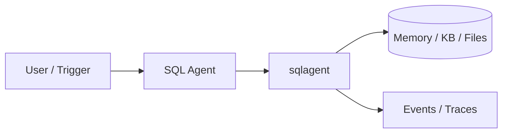
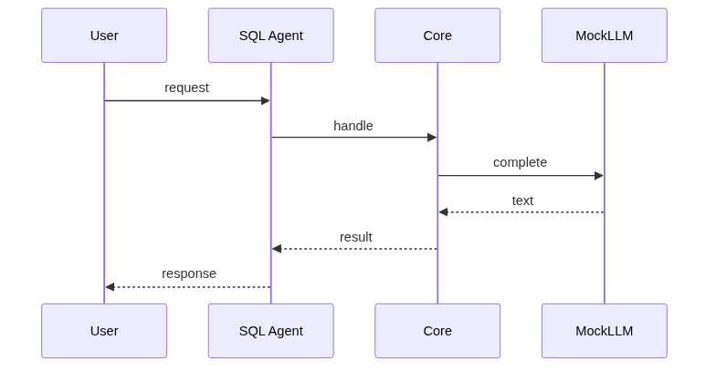
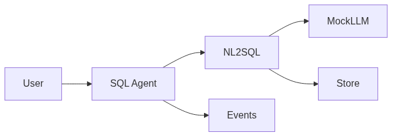

# Chapter 85: SQL Agent

## Chapter Overview

Part IX — Real Projects — **SQL Agent** — package `sqlagent`.

`SQLAgent.ask` generates SQL via LLM, blocks FORBIDDEN keywords, allowlists tables, `MockDB.execute_readonly` tiny SELECT parser.

Part IX ships **production-shaped projects** you can demo and extend. Chapter 85 builds **SQL Agent** in `sqlagent/` with tests, CLI, and architecture aligned to Parts IV–VIII and VII ops.

**Code:** `code/chapter-085/sqlagent/`. This chapter includes a **Dockerfile** under `code/chapter-085/` — containerize for staging after local pytest passes.

---

## Learning Objectives

After completing this chapter, you can:

- Explain **SQL Agent** architecture and data flow
- Run `sqlagent` offline with pytest and CLI
- Identify production gaps (auth, scale, eval, deploy) honestly
- Map the project to earlier book modules (tools, RAG, harness, API)
- Complete exercises and extend the mini project safely
- Containerize and describe a staging deploy path

---

## Prerequisites

- Parts IV–VIII (agents, systems, frameworks, your framework modules)
- Part VII (API, workers, Docker, persistence, observability) recommended
- Prior Part IX chapters when `n > 81` (through Chapter 84)

---

## Motivation

NL→SQL without guards enables destructive statements from model mistakes or injection. This project shows **defense in depth** you will reuse for analytics copilots and internal BI agents.

---

## First Principles

### 1. FORBIDDEN regex on SQL

INSERT/UPDATE/DROP/… blocked.

### 2. Table allowlist

FROM table must exist in schema.

### 3. Schema in prompt context

ddl_summary for nl_to_sql.

### 4. Events log sql_generated/executed/blocked

Audit.

---

## Mental Model

SQL agent = read-only analyst — may query spreadsheets, never drop tables.



---

## Core Theory

### MockDB parser

Supports SELECT cols FROM table [WHERE col = 'val'] — teaching subset.

### Guard layers

FORBIDDEN keyword scan → table allowlist → readonly DB role in production (never rely on regex alone).
### Failure cases

Parser mismatch on complex SQL → unsupported error; table not allowlisted → PermissionError; model emits DML despite prompt → blocked at guard.

### Performance implications

Add LIMIT; timeout queries; avoid shipping full table schemas when wide.

### Security implications

Read-only DB user; parameterize values; log `sql_generated` without row-level PII.
### Staging checklist (Part VII)

Before calling this project production-shaped, wire at least one ops seam: expose a handler via the Ch 56 API pattern, enqueue long runs on Ch 57 workers, smoke-test the chapter Dockerfile (Ch 58), persist state if the agent needs it (Ch 59–60), and attach request/trace ids (Ch 64–66). Add one eval case (Ch 44 mindset) that must pass before you demo to stakeholders.

### Portfolio and interview angle

For Ch 93 scoring, lead README with problem, architecture diagram, quickstart, and pytest proof. In Ch 91 design reviews, state order-of-magnitude QPS, an LLM latency slice, and **this agent's** failure modes—not generic cloud trivia.

---

## Architecture

```text
code/chapter-085/
  sqlagent/
  tests/
  main.py
  pyproject.toml
  README.md
```

---

## Internal Implementation

```bash
cd code/chapter-085 && pytest -q && python3 main.py
```

Attempt DROP; expect PermissionError.

---

## Production Implementation

Read-only DB role; SQL parser/validator service; row limits; query timeouts.

---

## Framework Implementation

Text-to-SQL with guardrails, LangChain SQLDatabase with limits.

---

## Trade-offs

| Option A | Option B / notes |
|---|---|
| Regex SQL guards | Fast to ship. |
| AST SQL validator | Stronger guarantees. |

---

## Debugging

- unsupported SQL → parser mismatch
- table not allowlisted → PermissionError

---

## Performance

LIMIT clauses; index-aware schemas in prompt.

---

## Security

Never use admin DB user; parameterize values.

---

## Best Practices

1. Run `pytest -q` before every demo
2. Emit structured events/traces for debugging
3. Document architecture and failure modes in README
4. Connect project to Part VII API/workers when deploying
5. Add eval cases (Ch 44 mindset) for agent behaviors
6. Keep secrets out of repos and Docker layers

---

## Anti-Patterns

- **Demo without tests** — Regressions invisible
- **Live keys in CI** — Credential leaks
- **Unbounded agent loops** — Cost and safety incidents
- **Skipping escalation/HITL on risky tools** — Trust and compliance failures
- **Portfolio README empty** — Hiring signal lost
- **Learning without milestones** — Skill gaps never close

---

## Hands-on Exercise

1. `cd code/chapter-085 && pytest -q`
2. Attempt DROP via `ask`; expect block with auditable event
3. Add test: SELECT from disallowed table fails allowlist
4. Paste `Schema.ddl_summary` into README and explain prompt injection risk
5. List upgrade path: AST validator + warehouse role + row limits

---

## Mini Project

**NL→SQL with read-only enforcement.** Harden one path (auth, eval, or deploy) and document gaps vs full prod spec.

---

## Visual diagrams





---

## Chapter Deliverables

| Artifact | Location |
|---|---|
| Manuscript | `book/chapter-085.md` |
| Package | `code/chapter-085/sqlagent/` |
| Tests | `code/chapter-085/tests/` |

---

## Interview Questions

1. Text-to-SQL safety layers?
2. Explain allowlist vs role?
3. Eval SQL agent?

---

## Quiz

1. FORBIDDEN blocks:
   A) DROP/INSERT B) SELECT only C) nothing D) GPU
   **Answer:** A

2. SQLAgent logs:
   A) sql events B) GPU temp C) DNS D) none
   **Answer:** A

3. MockDB is:
   A) readonly executor B) write always C) GPU D) DNS
   **Answer:** A

---

## Cheat Sheet

- `SQLAgent.ask`
- FORBIDDEN pattern
- Schema.ddl_summary

---

## Curated Free Resources

- [OWASP SQL injection](https://owasp.org/www-community/attacks/SQL_Injection)

---

## Chapter Summary

**SQL Agent** — NL→SQL with read-only enforcement. Runnable offline core; This chapter includes a **Dockerfile** under `code/chapter-085/` — containerize for staging after local pytest passes.

---

## What's Next

**Chapter 86: Email Agent.** Chapter 86 email triage and drafts.
