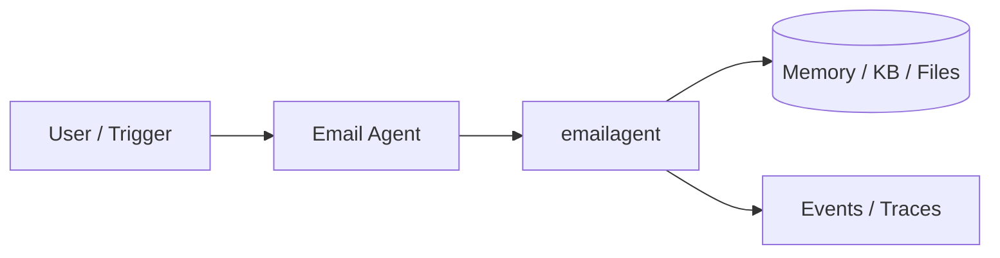
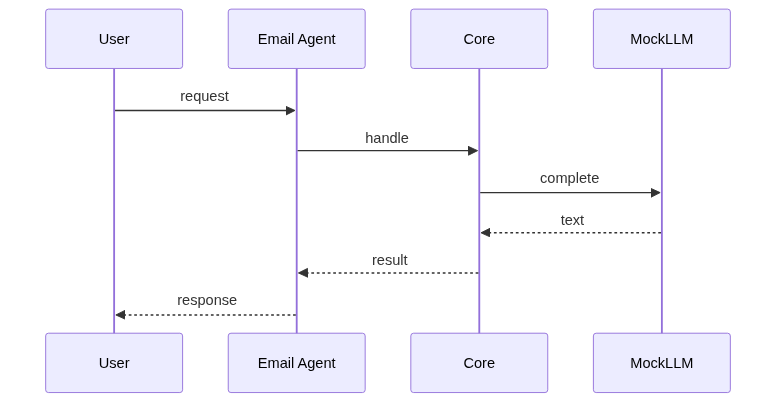
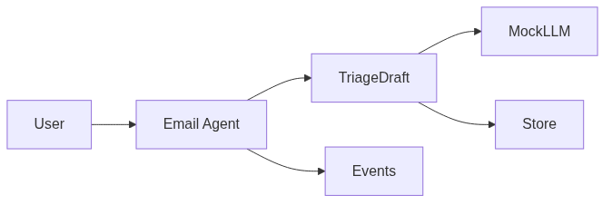

# Chapter 86: Email Agent

## Chapter Overview

Part IX — Real Projects — **Email Agent** — package `emailagent`.

`EmailAgent.triage` classifies priority/category/spam; `draft_reply` skips spam; optional `auto_send` with events.

Part IX ships **production-shaped projects** you can demo and extend. Chapter 86 builds **Email Agent** in `emailagent/` with tests, CLI, and architecture aligned to Parts IV–VIII and VII ops.

**Code:** `code/chapter-086/emailagent/`. This chapter includes a **Dockerfile** under `code/chapter-086/` — containerize for staging after local pytest passes.

---

## Learning Objectives

After completing this chapter, you can:

- Explain **Email Agent** architecture and data flow
- Run `emailagent` offline with pytest and CLI
- Identify production gaps (auth, scale, eval, deploy) honestly
- Map the project to earlier book modules (tools, RAG, harness, API)
- Complete exercises and extend the mini project safely
- Containerize and describe a staging deploy path

---

## Prerequisites

- Parts IV–VIII (agents, systems, frameworks, your framework modules)
- Part VII (API, workers, Docker, persistence, observability) recommended
- Prior Part IX chapters when `n > 81` (through Chapter 85)

---

## Motivation

Support inboxes overflow; manual reply drafting does not scale. This agent practices **classify → draft → optional send** with safe defaults— the same workflow as modern email copilots, offline with MockLLM.

---

## First Principles

### 1. Classify before draft

Run triage for priority, category, and spam before spending tokens on drafts.

### 2. Spam skipped

No draft for spam—reduces abuse surface and mistaken auto-replies.

### 3. auto_send off by default

Human approval (Ch 43 HITL) before outbound mail in production.

### 4. reply_policy injected into draft

Brand tone and legal disclaimers stay consistent across templates.

---

## Mental Model

Email agent = triage nurse — classify urgency, draft empathetic reply, never auto-send spam responses.



---

## Core Theory

### Triage → draft pipeline

`EmailAgent.triage(messages)` assigns priority/category/spam flags per message. `draft_reply` skips spam, injects `reply_policy` into the MockLLM prompt, and returns draft text plus events (`triage`, `draft`, optional `auto_send`).

### MockLLM classify

Keyword heuristics for billing/support/intro/spam; draft template includes policy string for brand consistency.

### Production shape

Batch triage in a worker (Ch 57); queue drafts for human review; never train on private mail without consent.
### Failure cases

False spam → customer ignored; wrong category → SLA miss; auto_send True in prod → reputational harm.

### Performance implications

Batch triage; async draft generation; cap concurrent LLM calls per mailbox.

### Security implications

Scoped OAuth (Gmail/Graph); redact PII in logs; separate dev mailboxes from prod tokens.
### Staging checklist (Part VII)

Before calling this project production-shaped, wire at least one ops seam: expose a handler via the Ch 56 API pattern, enqueue long runs on Ch 57 workers, smoke-test the chapter Dockerfile (Ch 58), persist state if the agent needs it (Ch 59–60), and attach request/trace ids (Ch 64–66). Add one eval case (Ch 44 mindset) that must pass before you demo to stakeholders.

### Portfolio and interview angle

For Ch 93 scoring, lead README with problem, architecture diagram, quickstart, and pytest proof. In Ch 91 design reviews, state order-of-magnitude QPS, an LLM latency slice, and **this agent's** failure modes—not generic cloud trivia.

---

## Architecture

```text
code/chapter-086/
  emailagent/
  tests/
  main.py
  pyproject.toml
  README.md
```

---

## Internal Implementation

```bash
cd code/chapter-086 && pytest -q && python3 main.py
```

---

## Production Implementation

OAuth to Gmail/Graph; HITL approve send (Ch 43); PII redaction in logs.

---

## Framework Implementation

Microsoft Graph mail, Gmail API — same triage/draft ports.

---

## Trade-offs

| Option A | Option B / notes |
|---|---|
| Heuristic classify | Testable offline. |
| LLM classify | Better nuance; needs eval. |

---

## Debugging

- Wrong category → keywords
- Draft missing → spam flag

---

## Performance

Batch triage; async draft generation.

---

## Security

Scoped OAuth; never train on private mail without consent.

---

## Best Practices

1. Run `pytest -q` before every demo
2. Emit structured events/traces for debugging
3. Document architecture and failure modes in README
4. Connect project to Part VII API/workers when deploying
5. Add eval cases (Ch 44 mindset) for agent behaviors
6. Keep secrets out of repos and Docker layers

---

## Anti-Patterns

- **Demo without tests** — Regressions invisible
- **Live keys in CI** — Credential leaks
- **Unbounded agent loops** — Cost and safety incidents
- **Skipping escalation/HITL on risky tools** — Trust and compliance failures
- **Portfolio README empty** — Hiring signal lost
- **Learning without milestones** — Skill gaps never close

---

## Hands-on Exercise

1. `cd code/chapter-086 && pytest -q && python3 main.py`
2. Feed a spam-like subject; assert `draft_reply` returns no draft
3. Set `auto_send=False`; verify events still record triage
4. Add test for billing keyword → category billing
5. Document HITL send path tying to Ch 43 in README

---

## Mini Project

**Inbox triage and reply drafting.** Harden one path (auth, eval, or deploy) and document gaps vs full prod spec.

---

## Visual diagrams





---

## Chapter Deliverables

| Artifact | Location |
|---|---|
| Manuscript | `book/chapter-086.md` |
| Package | `code/chapter-086/emailagent/` |
| Tests | `code/chapter-086/tests/` |

---

## Interview Questions

1. Auto-send policies?
2. Spam false positives?
3. Email agent eval?

---

## Quiz

1. spam emails:
   A) skip draft B) always send C) GPU D) DNS
   **Answer:** A

2. triage sorts by:
   A) priority B) random C) GPU D) MAC
   **Answer:** A

3. auto_send default:
   A) false B) true C) GPU D) DNS
   **Answer:** A

---

## Cheat Sheet

- `EmailAgent.triage/draft_reply`
- MockMailbox

---

## Curated Free Resources

- [Gmail API](https://developers.google.com/gmail/api)

---

## Chapter Summary

**Email Agent** — Inbox triage and reply drafting. Runnable offline core; This chapter includes a **Dockerfile** under `code/chapter-086/` — containerize for staging after local pytest passes.

---

## What's Next

**Chapter 87: Meeting Assistant.** Chapter 87 meeting notes extraction.
