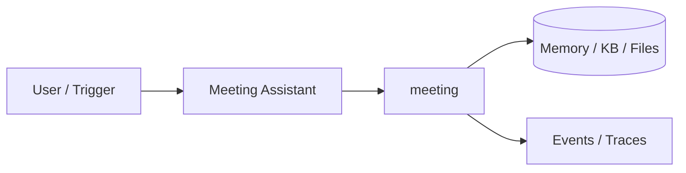
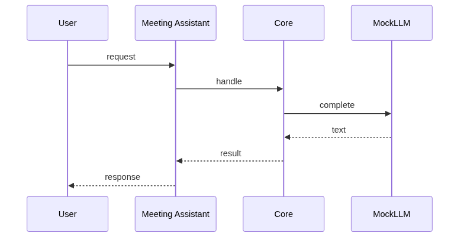
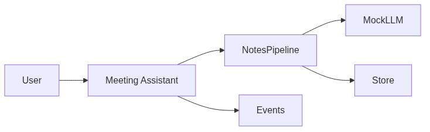

# Chapter 87: Meeting Assistant

## Chapter Overview

Part IX — Real Projects — **Meeting Assistant** — package `meeting`.

`MeetingAssistant.process(Transcript)` → summarize, extract ActionItems (regex will/ ACTION:), decisions lines.

Part IX ships **production-shaped projects** you can demo and extend. Chapter 87 builds **Meeting Assistant** in `meeting/` with tests, CLI, and architecture aligned to Parts IV–VIII and VII ops.

**Code:** `code/chapter-087/meeting/`. This chapter includes a **Dockerfile** under `code/chapter-087/` — containerize for staging after local pytest passes.

---

## Learning Objectives

After completing this chapter, you can:

- Explain **Meeting Assistant** architecture and data flow
- Run `meeting` offline with pytest and CLI
- Identify production gaps (auth, scale, eval, deploy) honestly
- Map the project to earlier book modules (tools, RAG, harness, API)
- Complete exercises and extend the mini project safely
- Containerize and describe a staging deploy path

---

## Prerequisites

- Parts IV–VIII (agents, systems, frameworks, your framework modules)
- Part VII (API, workers, Docker, persistence, observability) recommended
- Prior Part IX chapters when `n > 81` (through Chapter 86)

---

## Motivation

Teams lose decisions in long transcripts; action items never reach task trackers. This assistant turns **raw notes into structured artifacts** you can wire to calendar and PM tools after adding ASR upstream.

---

## First Principles

### 1. Structured report output

MeetingReport: summary, decisions, action_items with owners.

### 2. Speaker lines preserved in transcript

Use `Speaker: text` lines for diarization-ready input.

### 3. MockLLM deterministic extractors

Offline CI without ASR dependencies.

### 4. Events on start/done

Pipeline observability for long transcripts.

---

## Mental Model

Meeting assistant = court stenographer + chief of staff — summary, decisions, action items with owners.



---

## Core Theory

### process(Transcript)

Summarize narrative, extract `ActionItem` rows (owner, task, optional due) via regex on lines containing `will` or `ACTION:`, and collect decision lines (agreed/decided).

### Long transcript strategy

Chunk → map-reduce summarize when ASR output exceeds context; merge action lists with dedupe by owner+task.
### Failure cases

No actions when transcript lacks patterns; empty summary on blank input; wrong owner if speaker labels missing.

### Performance implications

Chunk long transcripts; parallel summarize shards; cap tokens per chunk.

### Security implications

Meeting content is sensitive—encrypt at rest; restrict API access; redact customer names in logs.
### Staging checklist (Part VII)

Before calling this project production-shaped, wire at least one ops seam: expose a handler via the Ch 56 API pattern, enqueue long runs on Ch 57 workers, smoke-test the chapter Dockerfile (Ch 58), persist state if the agent needs it (Ch 59–60), and attach request/trace ids (Ch 64–66). Add one eval case (Ch 44 mindset) that must pass before you demo to stakeholders.

### Portfolio and interview angle

For Ch 93 scoring, lead README with problem, architecture diagram, quickstart, and pytest proof. In Ch 91 design reviews, state order-of-magnitude QPS, an LLM latency slice, and **this agent's** failure modes—not generic cloud trivia.

---

## Architecture

```text
code/chapter-087/
  meeting/
  tests/
  main.py
  pyproject.toml
  README.md
```

---

## Internal Implementation

```bash
cd code/chapter-087 && pytest -q && python3 main.py
```

---

## Production Implementation

ASR pipeline upstream; diarization; integrate calendar/task tools.

---

## Framework Implementation

Whisper + LLM extract; Zoom/Meet APIs.

---

## Trade-offs

| Option A | Option B / notes |
|---|---|
| Regex action extract | Works on formatted notes. |
| LLM extract | Flexible; needs validation. |

---

## Debugging

- No actions → transcript lacks patterns
- Empty summary → empty lines

---

## Performance

Chunk long transcripts; map-reduce summarize.

---

## Security

Meeting content sensitive — encrypt at rest.

---

## Best Practices

1. Run `pytest -q` before every demo
2. Emit structured events/traces for debugging
3. Document architecture and failure modes in README
4. Connect project to Part VII API/workers when deploying
5. Add eval cases (Ch 44 mindset) for agent behaviors
6. Keep secrets out of repos and Docker layers

---

## Anti-Patterns

- **Demo without tests** — Regressions invisible
- **Live keys in CI** — Credential leaks
- **Unbounded agent loops** — Cost and safety incidents
- **Skipping escalation/HITL on risky tools** — Trust and compliance failures
- **Portfolio README empty** — Hiring signal lost
- **Learning without milestones** — Skill gaps never close

---

## Hands-on Exercise

1. `cd code/chapter-087 && pytest -q && python3 main.py`
2. Add transcript lines with `ACTION:` and assert action_items length
3. Test empty transcript returns safe empty report fields
4. Add one decision line pattern your team uses; extend extractor test
5. Sketch Whisper + diarization upstream in README

---

## Mini Project

**Meeting notes: summary, decisions, actions.** Harden one path (auth, eval, or deploy) and document gaps vs full prod spec.

---

## Visual diagrams





---

## Chapter Deliverables

| Artifact | Location |
|---|---|
| Manuscript | `book/chapter-087.md` |
| Package | `code/chapter-087/meeting/` |
| Tests | `code/chapter-087/tests/` |

---

## Interview Questions

1. Action item quality eval?
2. Diarization errors?
3. Integrations?

---

## Quiz

1. process returns action_items as:
   A) list of dicts B) GPU C) DNS D) none
   **Answer:** A

2. Transcript lines format:
   A) Speaker: text B) GPU only C) DNS D) random
   **Answer:** A

3. decisions from lines with:
   A) agreed/decided B) GPU C) DNS D) TLS
   **Answer:** A

---

## Cheat Sheet

- `MeetingAssistant.process`
- Transcript / ActionItem

---

## Curated Free Resources

- [Meeting summarization UX](https://www.nngroup.com/articles/)

---

## Chapter Summary

**Meeting Assistant** — Meeting notes: summary, decisions, actions. Runnable offline core; This chapter includes a **Dockerfile** under `code/chapter-087/` — containerize for staging after local pytest passes.

---

## What's Next

**Chapter 88: Customer Support Agent.** Chapter 88 support tickets with KB + escalation.
