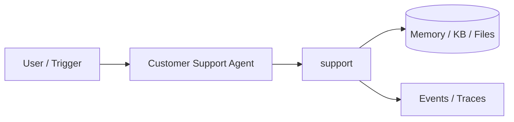
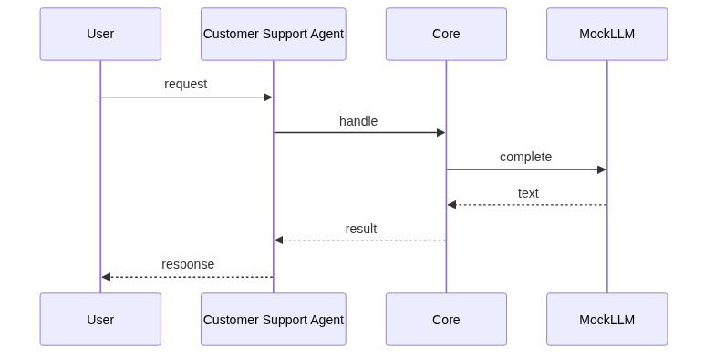
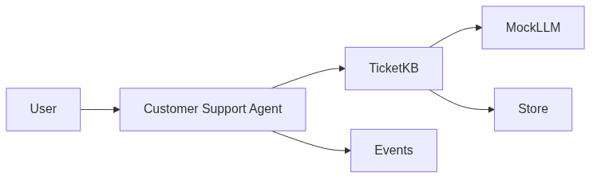

# Chapter 88: Customer Support Agent

## Chapter Overview

Part IX — Real Projects — **Customer Support Agent** — package `support`.

`SupportAgent` tickets + `KnowledgeBase.search`, `MockLLM.reply/needs_escalation`, status resolved/escalated.

Part IX ships **production-shaped projects** you can demo and extend. Chapter 88 builds **Customer Support Agent** in `support/` with tests, CLI, and architecture aligned to Parts IV–VIII and VII ops.

**Code:** `code/chapter-088/support/`. This chapter includes a **Dockerfile** under `code/chapter-088/` — containerize for staging after local pytest passes.

---

## Learning Objectives

After completing this chapter, you can:

- Explain **Customer Support Agent** architecture and data flow
- Run `support` offline with pytest and CLI
- Identify production gaps (auth, scale, eval, deploy) honestly
- Map the project to earlier book modules (tools, RAG, harness, API)
- Complete exercises and extend the mini project safely
- Containerize and describe a staging deploy path

---

## Prerequisites

- Parts IV–VIII (agents, systems, frameworks, your framework modules)
- Part VII (API, workers, Docker, persistence, observability) recommended
- Prior Part IX chapters when `n > 81` (through Chapter 87)

---

## Motivation

Generic chatbots ignore playbooks; angry customers need **escalation paths**. This project combines ticket state, KB grounding, and keyword escalation—the tier-1 support agent pattern reused in Ch 90 `support` skill routing.

---

## First Principles

### 1. Ticket lifecycle

open → resolved|escalated with auditable status.

### 2. KB search before LLM reply

Ground answers in `KnowledgeBase.search` hits.

### 3. Escalation keywords hard stop

lawyer, chargeback, human—no auto reply.

### 4. Priority from message urgency

urgent/down/outage bumps queue priority.

---

## Mental Model

Support agent = tier-1 rep with playbook — search KB, reply, escalate on legal/manager keywords.



---

## Core Theory

### handle(ticket_id)

If `needs_escalation(message)` → status escalated, no auto reply. Else KB hits → LLM reply with article context; no hits → escalate.

### Metrics that matter

KB hit rate, escalation rate, p95 time-to-first-response, CSAT after resolution—pair with Ch 44 eval cases on reply tone and policy adherence.
### Failure cases

False escalate on benign keyword; empty KB → always escalate; KB stale → wrong policy answers.

### Performance implications

Cache top articles; route urgent queue; async handle via worker.

### Security implications

PII in tickets; tenant-scoped KB rows; role-based article visibility.
### Staging checklist (Part VII)

Before calling this project production-shaped, wire at least one ops seam: expose a handler via the Ch 56 API pattern, enqueue long runs on Ch 57 workers, smoke-test the chapter Dockerfile (Ch 58), persist state if the agent needs it (Ch 59–60), and attach request/trace ids (Ch 64–66). Add one eval case (Ch 44 mindset) that must pass before you demo to stakeholders.

### Portfolio and interview angle

For Ch 93 scoring, lead README with problem, architecture diagram, quickstart, and pytest proof. In Ch 91 design reviews, state order-of-magnitude QPS, an LLM latency slice, and **this agent's** failure modes—not generic cloud trivia.

---

## Architecture

```text
code/chapter-088/
  support/
  tests/
  main.py
  pyproject.toml
  README.md
```

---

## Internal Implementation

```bash
cd code/chapter-088 && pytest -q && python3 main.py
```

---

## Production Implementation

Zendesk/Intercom integration; eval on KB hit rate; CSAT loop.

---

## Framework Implementation

RAG support bots, Ada, Forethought — same ticket+KB model.

---

## Trade-offs

| Option A | Option B / notes |
|---|---|
| Keyword escalation | Simple and auditable. |
| Classifier escalation | Nuanced; maintain labels. |

---

## Debugging

- False escalate → keyword in benign text
- Empty KB → always escalate

---

## Performance

Cache top articles; route high priority queue.

---

## Security

PII in tickets; role-based KB visibility.

---

## Best Practices

1. Run `pytest -q` before every demo
2. Emit structured events/traces for debugging
3. Document architecture and failure modes in README
4. Connect project to Part VII API/workers when deploying
5. Add eval cases (Ch 44 mindset) for agent behaviors
6. Keep secrets out of repos and Docker layers

---

## Anti-Patterns

- **Demo without tests** — Regressions invisible
- **Live keys in CI** — Credential leaks
- **Unbounded agent loops** — Cost and safety incidents
- **Skipping escalation/HITL on risky tools** — Trust and compliance failures
- **Portfolio README empty** — Hiring signal lost
- **Learning without milestones** — Skill gaps never close

---

## Hands-on Exercise

1. `cd code/chapter-088 && pytest -q && python3 main.py`
2. Open ticket with chargeback keyword; assert escalated without auto reply
3. Seed KB article; ask matching question; assert resolved with citation context
4. Add eval case row (Ch 44 style) for escalation keyword in README
5. Compare design to Ch 91 support-agent latency budget table

---

## Mini Project

**KB-grounded support with escalation rules.** Harden one path (auth, eval, or deploy) and document gaps vs full prod spec.

---

## Visual diagrams





---

## Chapter Deliverables

| Artifact | Location |
|---|---|
| Manuscript | `book/chapter-088.md` |
| Package | `code/chapter-088/support/` |
| Tests | `code/chapter-088/tests/` |

---

## Interview Questions

1. When escalate vs deflect?
2. KB freshness?
3. Support agent metrics?

---

## Quiz

1. needs_escalation on:
   A) lawyer/chargeback B) hello C) GPU D) DNS
   **Answer:** A

2. KB search returns:
   A) articles B) GPU C) DNS D) none
   **Answer:** A

3. no KB hits tends to:
   A) escalate B) ignore C) GPU D) reboot
   **Answer:** A

---

## Cheat Sheet

- `SupportAgent.open_ticket/handle`
- KnowledgeBase.search

---

## Curated Free Resources

- [Customer support AI](https://huggingface.co/blog/)

---

## Chapter Summary

**Customer Support Agent** — KB-grounded support with escalation rules. Runnable offline core; This chapter includes a **Dockerfile** under `code/chapter-088/` — containerize for staging after local pytest passes.

---

## What's Next

**Chapter 89: Coding Agent.** Chapter 89 coding agent with test loop.
