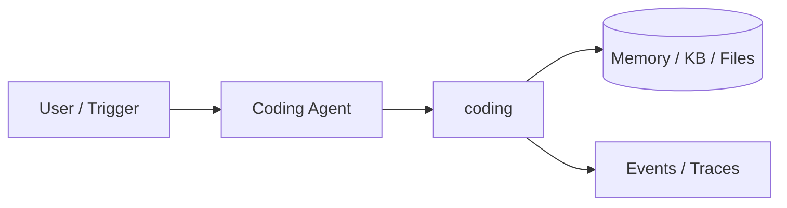
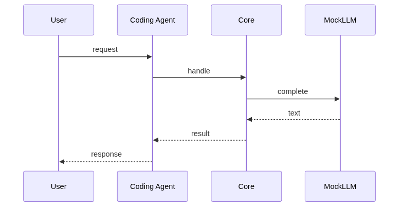
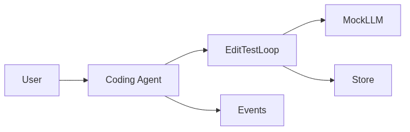

# Chapter 89: Coding Agent

## Chapter Overview

Part IX — Real Projects — **Coding Agent** — package `coding`.

`CodingAgent` plans write steps via MockLLM, `Workspace` files, `TestRunner` exec tests, max_iters loop.

Part IX ships **production-shaped projects** you can demo and extend. Chapter 89 builds **Coding Agent** in `coding/` with tests, CLI, and architecture aligned to Parts IV–VIII and VII ops.

**Code:** `code/chapter-089/coding/`. This chapter includes a **Dockerfile** under `code/chapter-089/` — containerize for staging after local pytest passes.

---

## Learning Objectives

After completing this chapter, you can:

- Explain **Coding Agent** architecture and data flow
- Run `coding` offline with pytest and CLI
- Identify production gaps (auth, scale, eval, deploy) honestly
- Map the project to earlier book modules (tools, RAG, harness, API)
- Complete exercises and extend the mini project safely
- Containerize and describe a staging deploy path

---

## Prerequisites

- Parts IV–VIII (agents, systems, frameworks, your framework modules)
- Part VII (API, workers, Docker, persistence, observability) recommended
- Prior Part IX chapters when `n > 81` (through Chapter 88)

---

## Motivation

One-shot code generation without test feedback ships broken utilities. This agent encodes **TDD-style iteration**—the same loop as coding copilots and SWE-bench agents, offline with MockLLM.

---

## First Principles

### 1. Plan → write → test loop

`max_iters` caps plan/write/test cycles.

### 2. Workspace isolation

In-memory files—swap for git worktree in advanced exercises.

### 3. TestRunner runs tests.py

Failures drive next plan iteration.

### 4. Events per plan/write/test

Trace for debugging and portfolio demos.

---

## Mental Model

Coding agent = pair programmer — edit files, run tests, iterate until green.



---

## Core Theory

### MockLLM plan

Returns write actions for `mathutil.py` + `tests.py` on add/fix goals.

### TestRunner

Executes compiled test module in teaching sandbox—**not** production safe; use containers (Ch 58) before arbitrary code exec.

### SWE-bench mindset

Goal string → plan → edit → test until green or `max_iters`; log every iteration for eval.
### Failure cases

Tests never pass when plan content wrong; FileNotFound on bad paths; infinite loop without max_iters.

### Performance implications

Limit files touched; keep test suite small; parallelize only in isolated sandboxes.

### Security implications

Never exec model code on host in prod; static analysis + human review before merge.
### Staging checklist (Part VII)

Before calling this project production-shaped, wire at least one ops seam: expose a handler via the Ch 56 API pattern, enqueue long runs on Ch 57 workers, smoke-test the chapter Dockerfile (Ch 58), persist state if the agent needs it (Ch 59–60), and attach request/trace ids (Ch 64–66). Add one eval case (Ch 44 mindset) that must pass before you demo to stakeholders.

### Portfolio and interview angle

For Ch 93 scoring, lead README with problem, architecture diagram, quickstart, and pytest proof. In Ch 91 design reviews, state order-of-magnitude QPS, an LLM latency slice, and **this agent's** failure modes—not generic cloud trivia.

---

## Architecture

```text
code/chapter-089/
  coding/
  tests/
  main.py
  pyproject.toml
  README.md
```

---

## Internal Implementation

```bash
cd code/chapter-089 && pytest -q && python3 main.py
```

---

## Production Implementation

Container sandbox; no arbitrary exec; static analysis; human review before merge.

---

## Framework Implementation

Cursor/Copilot agents, SWE-bench style loops — same test gate.

---

## Trade-offs

| Option A | Option B / notes |
|---|---|
| In-memory test exec | Demo only — not production safe. |
| Container sandbox | Safer code execution. |

---

## Debugging

- Tests never pass → plan content wrong
- FileNotFound → path typo

---

## Performance

Limit files touched; small test suite.

---

## Security

Never exec model code on host in prod; use isolated runner.

---

## Best Practices

1. Run `pytest -q` before every demo
2. Emit structured events/traces for debugging
3. Document architecture and failure modes in README
4. Connect project to Part VII API/workers when deploying
5. Add eval cases (Ch 44 mindset) for agent behaviors
6. Keep secrets out of repos and Docker layers

---

## Anti-Patterns

- **Demo without tests** — Regressions invisible
- **Live keys in CI** — Credential leaks
- **Unbounded agent loops** — Cost and safety incidents
- **Skipping escalation/HITL on risky tools** — Trust and compliance failures
- **Portfolio README empty** — Hiring signal lost
- **Learning without milestones** — Skill gaps never close

---

## Hands-on Exercise

1. `cd code/chapter-089 && pytest -q && python3 main.py`
2. Run goal that requires fix iteration; assert events include test failure then pass
3. Set `max_iters=1` on failing goal; assert graceful stop
4. Add test for Workspace file overwrite semantics
5. Document container sandbox upgrade in README

---

## Mini Project

**Iterative coding agent with test feedback.** Harden one path (auth, eval, or deploy) and document gaps vs full prod spec.

---

## Visual diagrams





---

## Chapter Deliverables

| Artifact | Location |
|---|---|
| Manuscript | `book/chapter-089.md` |
| Package | `code/chapter-089/coding/` |
| Tests | `code/chapter-089/tests/` |

---

## Interview Questions

1. Agent coding safety?
2. Test-driven agent loops?
3. Eval coding agents?

---

## Quiz

1. CodingAgent stops when:
   A) tests ok B) never C) GPU D) DNS
   **Answer:** A

2. Workspace.write:
   A) updates files B) deletes OS C) DNS D) none
   **Answer:** A

3. max_iters limits:
   A) loop B) RAM only C) DNS D) TLS
   **Answer:** A

---

## Cheat Sheet

- `CodingAgent.run(goal)`
- Workspace / TestRunner

---

## Curated Free Resources

- [SWE-bench](https://www.swebench.com/)

---

## Chapter Summary

**Coding Agent** — Iterative coding agent with test feedback. Runnable offline core; This chapter includes a **Dockerfile** under `code/chapter-089/` — containerize for staging after local pytest passes.

---

## What's Next

**Chapter 90: Multi-Agent Platform.** Chapter 90 orchestrates multiple skill agents on a bus.
