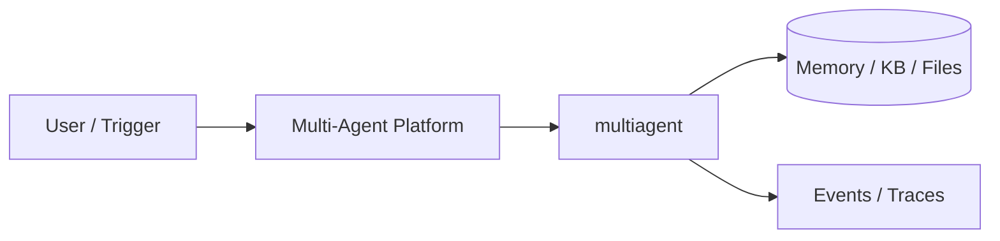
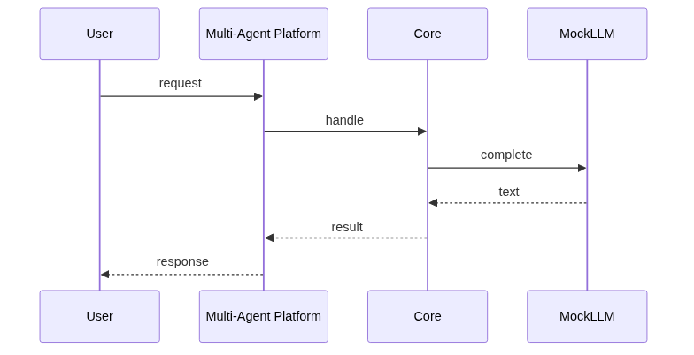
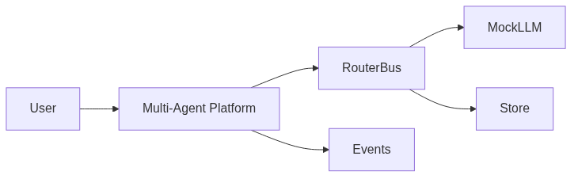

# Chapter 90: Multi-Agent Platform

## Chapter Overview

Part IX — Real Projects — **Multi-Agent Platform** — package `multiagent`.

`MultiAgentPlatform` Router by skills, `MessageBus`, fanout mode, `MockLLM.merge` for multi results.

Part IX ships **production-shaped projects** you can demo and extend. Chapter 90 builds **Multi-Agent Platform** in `multiagent/` with tests, CLI, and architecture aligned to Parts IV–VIII and VII ops.

**Code:** `code/chapter-090/multiagent/`. This chapter includes a **Dockerfile** under `code/chapter-090/` — containerize for staging after local pytest passes.

---

## Learning Objectives

After completing this chapter, you can:

- Explain **Multi-Agent Platform** architecture and data flow
- Run `multiagent` offline with pytest and CLI
- Identify production gaps (auth, scale, eval, deploy) honestly
- Map the project to earlier book modules (tools, RAG, harness, API)
- Complete exercises and extend the mini project safely
- Containerize and describe a staging deploy path

---

## Prerequisites

- Parts IV–VIII (agents, systems, frameworks, your framework modules)
- Part VII (API, workers, Docker, persistence, observability) recommended
- Prior Part IX chapters when `n > 81` (through Chapter 89)

---

## Motivation

Parts IV–IX gave you single-purpose agents. Real products **route** work to specialists, **log** handoffs, and **merge** partial results. Chapter 90 is the Part IX **capstone** orchestration spine to wrap with Part VII API, workers, and observability.

---

## First Principles

### 1. AgentSpec = contract

Each worker exposes name, skill tags, and handler(task, ctx) → str.

### 2. Router before LLM router

Skill overlap routing is testable; LLM router can sit behind same interface.

### 3. Message bus = audit trail

AgentMessage log is the contract for Kafka/EventBridge in production.

### 4. fanout vs single route

fanout=False picks best agent; fanout=True merges all outputs for ensemble demos.

---

## Mental Model

Platform = air traffic control — route tasks to skilled agents, log every message on the bus.



---

## Core Theory

### End-to-end `run(task, fanout=False)`

1. Allocate `run_id`; append `run_start` event.
2. **Select agents** — `Router.route(task)` or all agents if `fanout=True`.
3. For each agent: publish task on bus → invoke handler → publish result.
4. **Merge** — multiple results → `llm.merge(task, results)`; else return single string.
5. Return `{run_id, task, agents, result, bus_size, events}`.

### Wiring Part IX modules (conceptual map)

| Skill tag | Maps to chapter project |
|---|---|
| `chat` | Ch 81 ChatBot sessions |
| `research` | Ch 83 ResearchAgent |
| `support` | Ch 88 SupportAgent + KB |
| `code` | Ch 89 CodingAgent + tests |

Handlers in `main.py` can delegate to those packages offline; the platform file stays the **integration seam**.

### Production gaps (honest)

Unified auth, multi-tenant bus ACLs, durable queues, live LLM merge, and cross-agent eval gates are not shipped—document in README when demoing.
### Failure cases

No agents registered → RuntimeError; skill mismatch → fallback to first agent; unbounded fanout → cost explosion; merge without schema → hard to eval.

### Performance implications

Run independent handlers concurrently (Ch 48); truncate events in demos; export bus metrics.

### Security implications

Tenant-scoped bus payloads; authenticate orchestrator→agent calls; apply Ch 46 guards before routing to privileged skills.
### Staging checklist (Part VII)

Before calling this project production-shaped, wire at least one ops seam: expose a handler via the Ch 56 API pattern, enqueue long runs on Ch 57 workers, smoke-test the chapter Dockerfile (Ch 58), persist state if the agent needs it (Ch 59–60), and attach request/trace ids (Ch 64–66). Add one eval case (Ch 44 mindset) that must pass before you demo to stakeholders.

### Portfolio and interview angle

For Ch 93 scoring, lead README with problem, architecture diagram, quickstart, and pytest proof. In Ch 91 design reviews, state order-of-magnitude QPS, an LLM latency slice, and **this agent's** failure modes—not generic cloud trivia.

---

## Architecture

```text
code/chapter-090/
  multiagent/
  tests/
  main.py
  pyproject.toml
  README.md
```

---

## Internal Implementation

```bash
cd code/chapter-090 && pytest -q && python3 main.py
```

Inspect `MultiAgentPlatform.run` in `multiagent/platform.py`: register two agents with overlapping skills, run with `fanout=True`, assert `bus_size >= 2` and merge in `result`.

### Staging with Docker

The chapter **Dockerfile** runs the CLI entrypoint—use it only after tests pass. Wire env vars for future API keys; keep defaults offline-safe.

---

## Production Implementation

Deploy orchestrator + N workers; enqueue tasks (Ch 57); OTel across bus messages (Ch 66); eval on merged outputs (Ch 44); auth on `/v1/orchestrate` (Ch 56/61).

---

## Framework Implementation

CrewAI, AutoGen, LangGraph — platform is your thin orchestration layer.

---

## Trade-offs

| Option A | Option B / notes |
|---|---|
| Skill tag router | Simple and explainable. |
| LLM router | Flexible; harder to test. |

---

## Debugging

- No agents → RuntimeError
- Wrong agent → skill tags mismatch

---

## Performance

Parallel fanout; limit bus log size.

---

## Security

Authenticate inter-agent messages; no secret in bus content.

---

## Best Practices

1. Run `pytest -q` before every demo
2. Emit structured events/traces for debugging
3. Document architecture and failure modes in README
4. Connect project to Part VII API/workers when deploying
5. Add eval cases (Ch 44 mindset) for agent behaviors
6. Keep secrets out of repos and Docker layers

---

## Anti-Patterns

- **Demo without tests** — Regressions invisible
- **Live keys in CI** — Credential leaks
- **Unbounded agent loops** — Cost and safety incidents
- **Skipping escalation/HITL on risky tools** — Trust and compliance failures
- **Portfolio README empty** — Hiring signal lost
- **Learning without milestones** — Skill gaps never close

---

## Hands-on Exercise

1. `cd code/chapter-090 && pytest -q`
2. Register a third `AgentSpec` with skill `billing`; route task `"refund policy lookup"`
3. Run `fanout=False` vs `fanout=True`; compare `agents` list and `result` text
4. Sketch a sequence diagram: API → platform → two agents → merge (paste in README)
5. List three production items missing from this repo (auth, durable bus, eval gate)

---

## Mini Project

**Multi-agent orchestration with message bus.** Harden one path (auth, eval, or deploy) and document gaps vs full prod spec.

---

## Visual diagrams





---

## Chapter Deliverables

| Artifact | Location |
|---|---|
| Manuscript | `book/chapter-090.md` |
| Package | `code/chapter-090/multiagent/` |
| Tests | `code/chapter-090/tests/` |

---

## Interview Questions

1. Router vs LLM orchestrator?
2. Bus vs shared state?
3. Capstone architecture?

---

## Quiz

1. fanout=True runs:
   A) all agents B) none C) GPU D) DNS
   **Answer:** A

2. MessageBus stores:
   A) AgentMessage log B) cookies C) GPU D) none
   **Answer:** A

3. Router uses:
   A) skill tags B) GPS C) DNS D) MAC
   **Answer:** A

---

## Cheat Sheet

- `MultiAgentPlatform.run(task, fanout=...)`
- AgentSpec / Router

---

## Curated Free Resources

- [Multi-agent patterns](https://arxiv.org/list/cs.AI/recent)

---

## Chapter Summary

**Multi-Agent Platform** — Part IX capstone orchestrator with skill routing, message bus audit log, and merge step. Offline core is complete; production requires API auth, durable queues, observability, and eval gates from Part V/VII. Containerize via the chapter Dockerfile only after pytest is green.

---

## What's Next

**Chapter 91: AI System Design.** Part X — system design and interview prep (Chapter 91).
