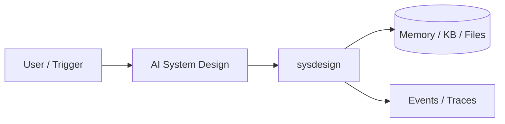

# Chapter 91: AI System Design

## Chapter Overview

Part X — Career — **AI System Design** — package `sysdesign`.

`estimate_capacity`, `LatencyBudget`, `DesignChecklist`, `SystemDesignKit.brief` compose interview-ready briefs.

Part X closes the book with **career engineering**. Chapter 91 uses `sysdesign/` as a practical toolkit — not a toy agent, but rubrics and planners you reuse while interviewing and shipping OSS.

**Code:** `code/chapter-091/sysdesign/`. Focus on offline core; containerize when integrating Part VII Docker patterns (Ch 58).

---

## Learning Objectives

After completing this chapter, you can:

- Use `sysdesign` for repeatable career and interview workflows
- Connect toolkit output to Part IX portfolio evidence
- Produce artifacts you can reuse in mocks and design reviews
- Run pytest and CLI offline without live API keys
- Identify gaps honestly (rubrics surface missing keywords or README flags)
- Apply exercises to your target role, startup idea, or pinned repos this week

---

## Prerequisites

- Completed or skimming Parts I–IX (especially Part IX projects for portfolio evidence)
- Prior Part X chapters when `n > 91` (through Chapter 90)

---

## Motivation

Interview and production reviews punish vague boxes-and-arrows. You need **numbers**, a **closing latency budget**, and a **checklist** for eval, security, and cost—`sysdesign` encodes that discipline in `SystemDesignKit.brief`.

---

## First Principles

### 1. Capacity is back-of-envelope first

peak_qps and storage GB/year catch wrong magnitude early.

### 2. Latency budget must close

Sum of parts ≤ total_ms—agent paths need retrieve, LLM, tools, merge slices.

### 3. Checklist beats charisma

DEFAULT_CHECKLIST ten topics force eval, security, cost, rollout.

### 4. Token spend ≠ request QPS

Budget LLM tokens separately from HTTP QPS.

---

## Mental Model

System design kit = architect's slide deck + calculator — capacity, latency budget, checklist.



---

## Core Theory

### estimate_capacity (worked example)

Inputs: `dau=50_000`, `requests_per_user_day=3`, `avg_payload_kb=8`, `retention_days=365`, `peak_multiplier=3`.

- Daily requests = 150_000 → avg QPS ≈ 1.74 → **design for peak ≈ 5.2 QPS**.
- Storage order-of-magnitude from daily payload × retention (see `CapacityEstimate.storage_gb_year` in code).

### LatencyBudget (support agent sketch)

| Part | ms | Notes |
|---|---:|---|
| API auth + routing | 20 | Ch 56/61 |
| Retrieve (hybrid) | 120 | Ch 26/88 |
| LLM generate | 800 | dominant |
| Tool call (optional) | 200 | policy lookup |
| Merge / format | 30 | |
| **Total** | **1170** | Budget `total_ms=1500` → slack for jitter |

### SystemDesignKit.brief

Combines capacity, latency dict, checklist progress, and `components_hint` (API gateway, orchestrator, tools, vector store, LLM gateway, eval).

### Walkthrough: multi-tenant support agent

1. Requirements — tenants, PII, SLO, LLM cap.
2. Scale — run `estimate_capacity`.
3. Architecture — API → orchestrator (Ch 90) → retrieve → LLM → tools → escalate (Ch 43).
4. Data — Postgres (Ch 59), Redis (Ch 60), tenant-filtered index.
5. Failure modes — retrieval miss → escalate; tool deny → structured error.
6. Observability + eval — traces (Ch 66), SLO (Ch 64), release gate (Ch 44/63).
7. Security — tenancy on KB; injection guards (Ch 46).
8. Rollout — canary (Ch 62).
### Failure cases

Budget does not close; missing eval/security; deferring tenancy—kit fails closed on invalid latency.

### Performance implications

Async workers for tool-heavy paths; cache FAQ retrieval; cap concurrent LLM calls per tenant.

### Security implications

Checklist tenancy and abuse; HITL for financial/legal intents (Ch 43/88).
### How this chapter fits Part X

Use output from this toolkit together with Part IX repos: Ch 91 briefs for design depth, Ch 92 rubric for mock loops, Ch 93 scorer for GitHub polish, Ch 94 roadmap for what to ship next quarter. Re-run exercises after you upgrade a Part IX project so artifacts stay honest.

---

## Architecture

```text
code/chapter-091/
  sysdesign/
  tests/
  main.py
  pyproject.toml
  README.md
```

---

## Internal Implementation

```bash
cd code/chapter-091 && pytest -q && python3 main.py
```

Build brief for support agent; mark checklist items done.

---

## Production Implementation

Use in internal design reviews before Part IX projects ship.

---

## Framework Implementation

Excalidraw/diagrams.net for visuals; this kit for numbers and checklist discipline.

---

## Trade-offs

| Option A | Option B / notes |
|---|---|
| Back-of-envelope capacity | Fast in interviews. |
| Detailed simulation | Slower; more accurate. |

---

## Debugging

- invalid latency → parts sum > total
- ValueError on negative inputs

---

## Performance

Design for peak QPS; async where possible.

---

## Security

Checklist item: tenancy and abuse.

---

## Best Practices

1. Run `pytest -q` before every demo
2. Emit structured events/traces for debugging
3. Document architecture and failure modes in README
4. Connect project to Part VII API/workers when deploying
5. Add eval cases (Ch 44 mindset) for agent behaviors
6. Keep secrets out of repos and Docker layers

---

## Anti-Patterns

- **Demo without tests** — Regressions invisible
- **Live keys in CI** — Credential leaks
- **Unbounded agent loops** — Cost and safety incidents
- **Skipping escalation/HITL on risky tools** — Trust and compliance failures
- **Portfolio README empty** — Hiring signal lost
- **Learning without milestones** — Skill gaps never close

---

## Hands-on Exercise

1. `cd code/chapter-091 && pytest -q`
2. Build a `LatencyBudget(total_ms=2000, parts={"api": 25, "retrieve": 150, "llm": 1200, "tools": 250})`; assert `valid()`
3. Run `estimate_capacity` with your portfolio project's guessed DAU; paste `CapacityEstimate.as_dict()` into notes
4. Create `SystemDesignKit("My Support Agent")`; mark three checklist items; call `brief(...)`
5. Compare output to Ch 90 capstone—which components reuse vs net-new?

---

## Mini Project

**Capacity estimates + latency budget + design checklist.** Apply the kit to your own target role or startup idea this week.

---

## Visual diagrams


---

## Chapter Deliverables

| Artifact | Location |
|---|---|
| Manuscript | `book/chapter-091.md` |
| Package | `code/chapter-091/sysdesign/` |
| Tests | `code/chapter-091/tests/` |

---

## Interview Questions

1. Walk through RAG agent design?
2. Latency budget example?
3. Error budget tie-in?

---

## Quiz

1. LatencyBudget.valid when:
   A) remaining>=0 B) GPU hot C) DNS fail D) never
   **Answer:** A

2. estimate_capacity uses:
   A) dau and requests/user B) GPU only C) DNS D) none
   **Answer:** A

3. checklist tracks:
   A) design depth B) cookies C) GPU D) TLS
   **Answer:** A

---

## Cheat Sheet

- `estimate_capacity(...)`
- `LatencyBudget`
- `SystemDesignKit.brief`

---

## Curated Free Resources

- [System design primer](https://github.com/donnemartin/system-design-primer)
- [Google SRE — SLO chapter](https://sre.google/sre-book/service-level-objectives/)
- [OpenAI latency/cost guides](https://platform.openai.com/docs/guides/production-best-practices)

---

## Chapter Summary

**AI System Design** — numeric capacity, closing latency budgets, and a ten-item checklist composed into `SystemDesignKit.brief`. Use it for interviews and before hardening Part IX/90 into a real service.

---

## What's Next

**Chapter 92: Technical Interviews.** Chapter 92 practices interview answers with rubric scoring.
